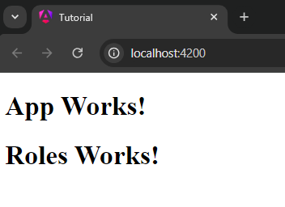
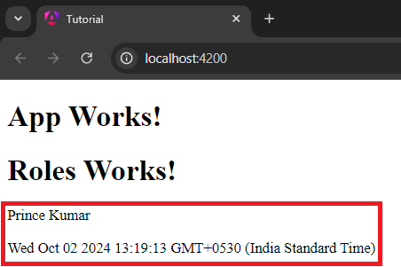
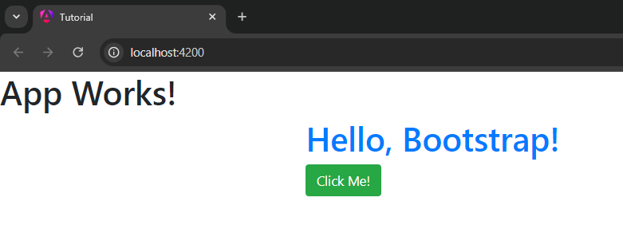
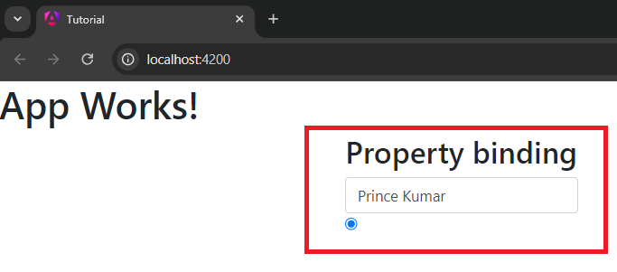
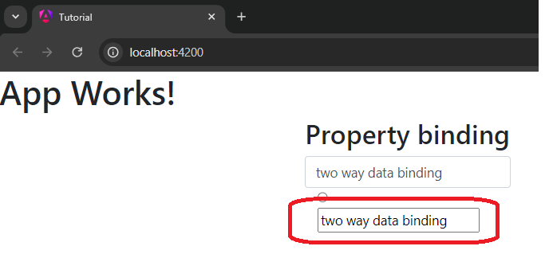
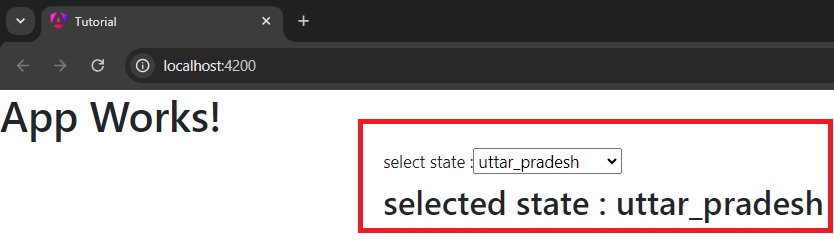
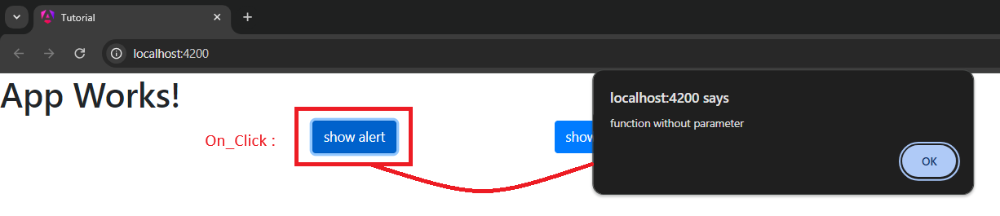
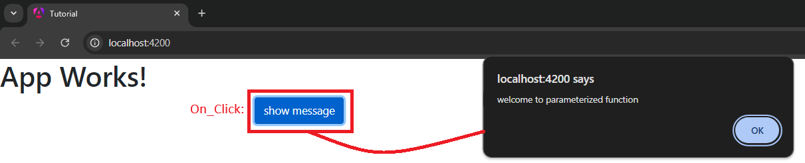
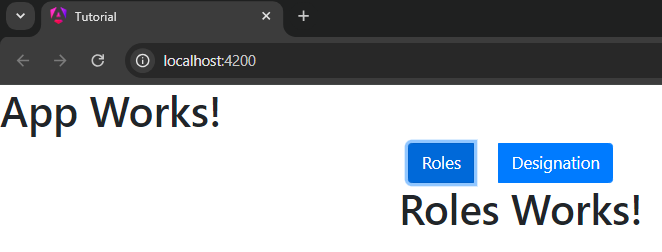
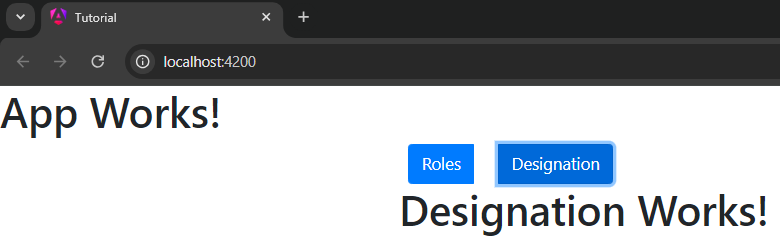

## Step to create project in angular

1. install node from Official website
2. Make folder in local system
3. open command prompt
4. run command **npm install -g @angular/cli**
5. Create project **ng new <project-name>**
6. open command prompt
7. redirect to project folder
8. run command **ng serve** to run the project.

## Folder structure

> package.json

- it contains all the package entries which we are going to use along with package name and version.

```json
{
  "name": "tutorial",
  "version": "0.0.0",
  "scripts": {
    "ng": "ng",
    "start": "ng serve",
    "build": "ng build",
    "watch": "ng build --watch --configuration development",
    "test": "ng test"
  },
  "private": true,
  "dependencies": {
    "@angular/animations": "^18.2.0",
    "@angular/common": "^18.2.0",
    "@angular/compiler": "^18.2.0",
    "@angular/core": "^18.2.0",
    "@angular/forms": "^18.2.0",
    "@angular/platform-browser": "^18.2.0",
    "@angular/platform-browser-dynamic": "^18.2.0",
    "@angular/router": "^18.2.0",
    "rxjs": "~7.8.0",
    "tslib": "^2.3.0",
    "zone.js": "~0.14.10"
  },
  "devDependencies": {
    "@angular-devkit/build-angular": "^18.2.6",
    "@angular/cli": "^18.2.6",
    "@angular/compiler-cli": "^18.2.0",
    "@types/jasmine": "~5.1.0",
    "jasmine-core": "~5.2.0",
    "karma": "~6.4.0",
    "karma-chrome-launcher": "~3.2.0",
    "karma-coverage": "~2.2.0",
    "karma-jasmine": "~5.1.0",
    "karma-jasmine-html-reporter": "~2.1.0",
    "typescript": "~5.5.2"
  }
}
```

> angular.json

- it is like a configuration file of our project. it contains all the configurations of our project.

```json
{
  "$schema": "./node_modules/@angular/cli/lib/config/schema.json",
  "version": 1,
  "newProjectRoot": "projects",
  "projects": {
    "tutorial": {
      "projectType": "application",
      "schematics": {},
      "root": "",
      "sourceRoot": "src",
      "prefix": "app",
      "architect": {
        "build": {
          "builder": "@angular-devkit/build-angular:application",
          "options": {
            "outputPath": "dist/tutorial",
            "index": "src/index.html",
            "browser": "src/main.ts",
            "polyfills": ["zone.js"],
            "tsConfig": "tsconfig.app.json",
            "assets": [
              {
                "glob": "**/*",
                "input": "public"
              }
            ],
            "styles": ["src/styles.css"],
            "scripts": []
          },
          "configurations": {
            "production": {
              "budgets": [
                {
                  "type": "initial",
                  "maximumWarning": "500kB",
                  "maximumError": "1MB"
                },
                {
                  "type": "anyComponentStyle",
                  "maximumWarning": "2kB",
                  "maximumError": "4kB"
                }
              ],
              "outputHashing": "all"
            },
            "development": {
              "optimization": false,
              "extractLicenses": false,
              "sourceMap": true
            }
          },
          "defaultConfiguration": "production"
        },
        "serve": {
          "builder": "@angular-devkit/build-angular:dev-server",
          "configurations": {
            "production": {
              "buildTarget": "tutorial:build:production"
            },
            "development": {
              "buildTarget": "tutorial:build:development"
            }
          },
          "defaultConfiguration": "development"
        },
        "extract-i18n": {
          "builder": "@angular-devkit/build-angular:extract-i18n"
        },
        "test": {
          "builder": "@angular-devkit/build-angular:karma",
          "options": {
            "polyfills": ["zone.js", "zone.js/testing"],
            "tsConfig": "tsconfig.spec.json",
            "assets": [
              {
                "glob": "**/*",
                "input": "public"
              }
            ],
            "styles": ["src/styles.css"],
            "scripts": []
          }
        }
      }
    }
  },
  "cli": {
    "analytics": false
  }
}
```

> Note - Angular is single page application for that we have a index.html file inside the src folder. and the reference of this file is available in angular.json file.

> main.ts

- it is a execution point of our application. this is the file which get first executed.

```typescript
import { bootstrapApplication } from "@angular/platform-browser";
import { appConfig } from "./app/app.config";
import { AppComponent } from "./app/app.component";

bootstrapApplication(AppComponent, appConfig).catch((err) =>
  console.error(err)
);
```

> tsconfig.json

- it is a configuration file of our typescript.
  > public folder
- you can any kind of assets inside this folder like images etc. previously we have assets folder now we have public folder.
  > styles.css
- this file is going to contain all kind of css class which we are going to use in our application.
  > index.html
- it is a single page application so here we have

```html
<!DOCTYPE html>
<html lang="en">
  <head>
    <meta charset="utf-8" />
    <title>Tutorial</title>
    <base href="/" />
    <meta name="viewport" content="width=device-width, initial-scale=1" />
    <link rel="icon" type="image/x-icon" href="favicon.ico" />
  </head>
  <body>
    <app-root></app-root>
  </body>
</html>
```

<app-root></app-root> - this directive is responsible for rendering our application.

> app folder

- whatever file we add regarding the new component code for our application will be placed inside this folder.
  > Component
- when we talk about component it will have

1. **.html**
2. **.css**
3. **.ts**

those are the mandatory file of our component, we have one more file **.spec.ts** this file is used to write the test cases

> app.config.ts

- previously we use to have app module now we have app.config.ts it is kind of replacement of app.module.ts but not everything it will do. it has some just the provider.

```typescript
import { ApplicationConfig, provideZoneChangeDetection } from "@angular/core";
import { provideRouter } from "@angular/router";

import { routes } from "./app.routes";

export const appConfig: ApplicationConfig = {
  providers: [
    provideZoneChangeDetection({ eventCoalescing: true }),
    provideRouter(routes),
  ],
};
```

> app.routes.ts

- this is file where we have all the routes of our application.

## Creating a new component

- first inside the src folder create a folder called components then with the help of right click open the folder inside the integrated terminal and run command **ng g c "component-name"**. or **ng generate component "component-name"**

- if you open the appComponent.ts file you saw a selector. selector is used to render the component inside the other component.
- i have to import the roles component in the appComponent.ts file.

```typescript
app.component.ts;

import { Component } from "@angular/core";
import { RouterOutlet } from "@angular/router";
import { RolesComponent } from "./components/roles/roles.component";

@Component({
  selector: "app-root",
  standalone: true,
  imports: [RouterOutlet, RolesComponent],
  templateUrl: "./app.component.html",
  styleUrl: "./app.component.css",
})
export class AppComponent {
  title = "tutorial";
}
```

- like i want to render the roles component inside the app Component in the appComponent.html file then i have to write **<app-roles></app-roles>** in the index.html file.

```html
app.component.html

<h1>Angular</h1>
<app-roles></app-roles>
```

- final output of the index.html file



## how to create different variables

```typescript
roles.component.ts;

import { Component } from "@angular/core";

@Component({
  selector: "app-roles",
  standalone: true,
  imports: [],
  templateUrl: "./roles.component.html",
  styleUrl: "./roles.component.css",
})
export class RolesComponent {
  name: string = "Prince Kumar"; // here we specify datatype of the variable
  firstName = "Prince"; // automatically take datatype as string
  version: number = 18; // we specify the datatype as number
  versionNo = 18; // automatically take datatype as number
  isActive: boolean = true; // we specify the datatype as boolean
  currentDate: Date = new Date(); // we specify the datatype as date
}
```

- so we can create the either specifying the datatype or not.

> accessing the variables in the html file

- interpolation is used to access the variables in the html file

```html
roles.component.html
<h1>Roles Works!</h1>
<p>{{name}}</p>
<p>{{currentDate}}</p>
```



## Adding Bootstrap in our application

1. visit npmjs.com and search for bootstrap
2. Open the integrated terminal of your application.
3. run command **npm i bootstrap** this will install the bootstrap package in your application.
4. now you can check your package.json file of your application inside the dependencies section. now you can see bootstrap package is added there.
5. now only addition of bootstrap is completed to use the bootstrap in your application we have to register all the external libraries inside the angular.json file of your application inside the styles section for bootstrap.

```json
angular.json

"styles": [
         "node_modules/bootstrap/dist/css/bootstrap.min.css",
         "src/styles.css"
       ],
```

> Note - during the learning of angular i applied this method but didn't work for me so i used alternate method adding all bootstrap cdn link file in inside the index.html file that works for me.

```html
index.html
<!DOCTYPE html>
<html lang="en">
  <head>
    <link
      rel="stylesheet"
      href="https://maxcdn.bootstrapcdn.com/bootstrap/4.5.2/css/bootstrap.min.css"
    />
    <meta charset="utf-8" />
    <title>Tutorial</title>
    <base href="/" />
    <meta name="viewport" content="width=device-width, initial-scale=1" />
    <link rel="icon" type="image/x-icon" href="favicon.ico" />
  </head>
  <body>
    <app-root></app-root>
  </body>
</html>
```



## Property binding

- if you want to apply property binding then you have to use **[]** in the html file.
- you can use **[property] = "expression"** in the html file.

```html
roles.component.html

<div class="container">
  <div class="row col-3">
    <h2>Property binding</h2>
    <input type="text" [value]="name" class="form-control" />
  </div>
  <div class="ccol-3">
    <input [type]="inputType" />
  </div>
</div>
```



> Both interpolation and property binding are onew way to bind the data in the html file.

## data binding with the help of directive

- in this method if we make any change inside input field then it will reflect in the variable as well. it is two way data binding.
  > step to use the two way data binding with the help of directive
- inside the component ts file we have to import the forms module inside the import section.

```typescript
import { Component } from "@angular/core";
import { FormsModule } from "@angular/forms";

@Component({
  selector: "app-roles",
  standalone: true,
  imports: [FormsModule], // for two way data binding
  templateUrl: "./roles.component.html",
  styleUrl: "./roles.component.css",
})
export class RolesComponent {
  name: string = "Prince Kumar"; // here we specify datatype of the variable
  firstName = "Prince"; // automatically take datatype as string
  version: number = 18; // we specify the datatype as number
  versionNo = 18; // automatically take datatype as number
  isActive: boolean = true; // we specify the datatype as boolean
  currentDate: Date = new Date(); // we specify the datatype as date
  inputType: string = "radio";
}
```

```html
<div class="container">
  <div class="row col-3">
    <h2>Property binding</h2>
    <input type="text" [value]="name" class="form-control" />
  </div>
  <div class="col-3">
    <input [type]="inputType" />
  </div>
  <div class="col-3">
    <input type="text" [(ngModel)]="name" />
  </div>
</div>
```



- if you make any change in the input it will also update the variable. and the content gets changed every time you make any change in the input field.
  > Lets see another example of two way data binding using ngModel
- create a dropdown make a selection and bind it with the variable.
- create a h2 tag and bind it with the variable to display the selected value in the h2 tag.

```html
roles.component.html

<div class="container">
  <div class="row">
    <div class="col-6">
      <label for="">select state : </label>
      <select (seeked)="0" [(ngModel)]="state">
        <option value="maharashtra">maharashtra</option>
        <option value="madhya_pradesh">madhya_pradesh</option>
        <option value="uttar_pradesh">uttar_pradesh</option>
      </select>
      <h2>selected state : {{state}}</h2>
    </div>
  </div>
</div>
```



> Note : two way data binding is only used inn the input element. not in the display element.

## Event binding

- if you want to apply event binding then you have to use **(event) = "expression"** in the html file.
- for example in js we use to do alert and for that we have to use **(click) = "alert('hello')** and popup things we use to do is **(input) = "onInput($event)"**

```typescript
roles.component.ts

import { Component } from '@angular/core';
import { FormsModule } from '@angular/forms';

@Component({
  selector: 'app-roles',
  standalone: true,
  imports: [FormsModule],
  templateUrl: './roles.component.html',
  styleUrl: './roles.component.css'
})
export class RolesComponent {
  showWelcomeAlert(){
    alert("function without parameter");   // this is normal function
  }

  showMessage( message  : string ){
    alert(message);       // this is parameterized function
  };
}
```
```html 
roles.component.html

<div class="container">
    <div class="row">
        <div class="col-3">
            <button class="btn btn-primary" (click)="showWelcomeAlert()">show alert</button>
        </div>
        <div class="col-3">
            <button class="btn btn-primary" (click)="showMessage('welcome to parameterized function')">show message</button>
        </div>
    </div>
</div>
```
> Non-Parameterized Function


> Parameterized Function



## Directives

- structural directives
    - the directive which is responsible for change the structure of the DOM.
    - ngIf, ngFor
- Attribute directives
    - the directive which is responsible for adding extra behaviour to the Existing Element.
    - ngClass, ngStyle
> ngIf 
- To use the ngIf we have to import the CommonModule from angular/common.
- here assume scenario we have two buttons one is Role and another is Designation, if we click on Roles the rolesComponent will render then when we click on designation designationComponent should render.
- i created a component called master inside the master i performed this functionality.
- for that i have to import both ( RolesComponent and DesignationComponent ) component inside the master component and app component.

- master.component.ts
```typescript
import { Component } from '@angular/core';
import { DesignationComponent } from '../designation/designation.component';
import { RolesComponent } from '../roles/roles.component';
import { CommonModule } from '@angular/common';

@Component({
  selector: 'app-master',
  standalone: true,
  imports: [DesignationComponent, RolesComponent, CommonModule],
  templateUrl: './master.component.html',
  styleUrl: './master.component.css'
})
export class MasterComponent {
  currentComponent : string = "Roles";
  changeTab (tabName : string) {
    this.currentComponent = tabName;
  }
}
```
- master.component.html
```html
<div class="container">
    <div class="row">
        <div class="col-12">
            <div class="btn-group" role="group" aria-label="Basic example">
                <button type="button" class="btn btn-primary ml-4 mr-4" (click)="changeTab('Roles')">Roles</button>
                <button type="button" class="btn btn-primary" (click)="changeTab('Designation')">Designation</button>
            </div>
        </div>
    </div>
    <div class="row">
        <div class="col-12" *ngIf="currentComponent == 'Roles'">
            <app-roles></app-roles>
        </div>
        <div class="col-12" *ngIf="currentComponent == 'Designation'">
            <app-designation></app-designation>
        </div>
    </div>
</div>
```


