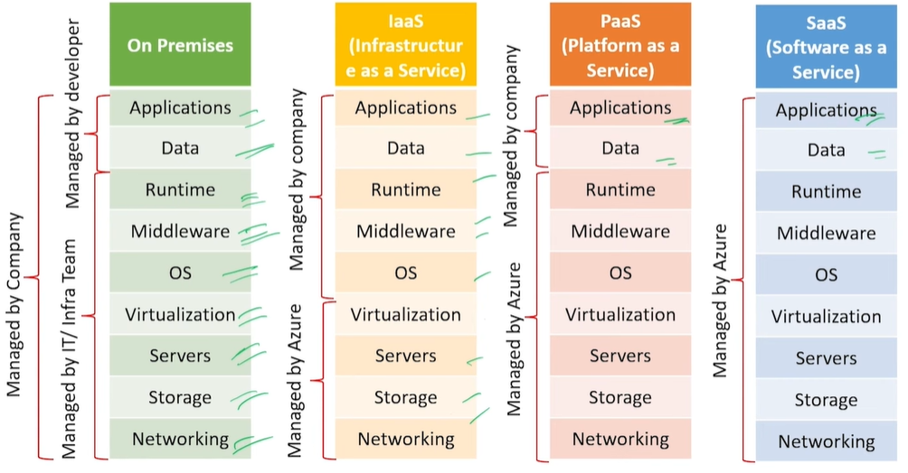
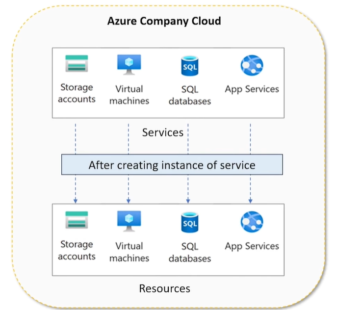

### 1. What are the main cloud service models? Difference between IaaS, PaaS, and SaaS.
- The three main cloud service models are IaaS, PaaS, and SaaS. They differ based on the level of control and responsibility between the user and the cloud provider.
> IaaS (Infrastructure as a Service)
- In this model, the cloud provider manages hardware and infrastructure, while the user manages OS, applications, and data.
- It gives maximum control and flexibility.
> PaaS (Platform as a Service)
- PaaS provides a platform to develop, run, and deploy applications without managing infrastructure.
- Here, the provider manages infrastructure, OS, and runtime, while the user focuses only on application code and data.
> SaaS (Software as a Service)
- SaaS delivers ready-to-use software over the internet.
- In this model, everything is managed by the provider, and the user just uses the application.

### 2. Your team wants to avoid purchasing server for a new app. what Azure model you would suggest.
- Recomend PaaS, because PaaS need to manage servers and allows team to focus on code while azure handle hosting, Scaling and Updates.
### 3. What is a Resource in Azure? What is differnce between service and resource?
- 
- resource is any individual cloud component that you create and use. Like:
    - Virtual Machine
    - SQL Database
    - Storage Account
    - App Service
- A service is the category or offering provided by Azure. Like: 
    - Virtual Machines (compute service)
    - Azure SQL (database service)
    - Storage (storage service)
    - App Service (web hosting service)

- A service in Azure is a cloud offering like compute or storage, while a resource is the actual instance of that service that we create and use.
    - Service = Restaurant menu item
    - Resource = Actual dish you ordered
### 4. What are Azure virtual machine? When you used them in a project?
- It is a cloud based virtual server that allow user to run application without needing physical hardware.
- A computer in the cloud just like a physical computer needs an OS, CPU, RAM, And Storage an Azure VM provides the same, But in the cloud.
### 5. What are Azure app service? For what purpose can you use them?
- Azure app services is a fully managed palteform as a service (PaaS) that enables developers to host web applications, APIs, And mobile backend without managing the underlying infrastructure.
### 6. What are Azure function.
- Azure Functions is a serverless compute service provided by Microsoft Azure that allows you to run small pieces of code (functions) without managing servers.
- Example Use Cases
    - Building lightweight APIs
    - Background jobs (e.g., sending emails)
    - File processing (when a file is uploaded)
    - Real-time data processing
    - When a user uploads a photo to storage → Function triggers to compress the size of the image → Processes the file automatically.
### 7. What is Azure storage 
-   Azure Storage is a cloud service provided by Microsoft that offers scalable, durable, and highly available storage for data like files, objects, messages, and structured data.
    - File storage
    - Backup & archival
    - Big data storage
    - Application data

### 8. How to Optimize Cost in Azure Storage
- To optimize cost in our fintech system, we used Azure Blob Storage with lifecycle management to automatically move old KYC documents from hot to cool and archive tiers. We also compressed files before upload, avoided duplicate storage, and used LRS redundancy for non-critical data. Additionally, we stored only file URLs in the database instead of actual files, which significantly reduced storage and database costs.
> Use Access Tiers Smartly (Biggest Cost Saver)
- Azure Blob Storage provides 3 tiers:
    - Hot Tier → Frequently accessed (costly storage, cheap access)
    - Cool Tier → Less frequent access (cheaper storage)
    - Archive Tier → Rare access (very cheap, slow retrieval)

- Real FinTech Strategy:
    - Recent KYC docs → Hot
    - 3–6 months old → Cool
    - Old compliance data → Archive
- **This alone can reduce cost by 50–80%**
> Life cycle management(Automation)
- Instead of manually moving data, use rules:
    - After 30 days → move to Cool
    - After 180 days → move to Archive
> Compress Files Before Upload
> Avoid Duplicate Storage
- Use hashing (MD5/SHA)
- Check if file already exists before uploading
> Use Blob Storage Instead of Database
- Storing files in SQL Server (expensive), Store files in Blob Storage + save URL in DB

### 9. What are the different type of storage?
- There are 4 main types
    - Blob Storage → Object storage (images, videos, documents)
    - File Storage → File shares (like network drive)
    - Queue Storage → Messaging between services
    - Table Storage → NoSQL structured data
### 10. What is Azure BLOB Storage?
- Azure Blob Storage is Microsoft Azure’s object storage service for storing large amounts of unstructured data in the cloud. like : Image, Video, Pdf, Logs etc.
> Structure of blob storage:

    Storage Account (Top level namespace)
        └── Container (Like a folder)
            └── Blob (actual file)
### 11. What are the component of blob storage?
- Blob Storage has three main components: Storage Account, Container, and Blob. Supporting components include blob types, metadata, access tiers, and security mechanisms like SAS.
### 12. What is storage account?
- A Storage Account in Azure is the top-level container (or namespace) that holds all your storage data and services like Blob Storage, File Storage, Queue Storage, and Table Storage.
- A Storage Account is a globally unique resource in Azure that provides a secure and scalable space to store and manage data, such as blobs, files, queues, and tables.
- Storage Account is like a “bank account,” containers are folders, and blobs are the actual files stored inside.
### 13. Types of Storage Accounts in Azure?
- The main types are GPv2, GPv1, Blob Storage, and Premium storage accounts like Block Blob and File Storage. GPv2 is the most recommended as it supports all features and access tiers.
### 14. Difference between GPv1 and GPv2
| Feature     | GPv1          | GPv2             |
| ----------- | ------------- | ---------------- |
| Pricing     | Higher        | Lower            |
| Features    | Limited       | Full features    |
| Access Tier | Not available | Hot/Cool/Archive |
| Recommended | ❌ No         | ✅ Yes          |

- GPv1 and GPv2 both support all storage services, but GPv2 is the latest and supports access tiers, lifecycle management, and better cost optimization. GPv1 is legacy and not recommended for new applications.
- GPv2 is always preferred

### 15. Difference between Blob, File, Queue, Table storage?
- Blob Storage is used for unstructured data like files, File Storage provides shared file systems, Queue Storage is used for asynchronous messaging, and Table Storage is a NoSQL store for structured data
- Real-Time Flow (FinTech Example)

        User uploads document
                ↓
        Blob Storage (store file)
                ↓
        Queue Storage (send processing message)
                ↓
        Background Service processes data
                ↓
        Table Storage (store metadata/result)
- 

### 16. What is container?
- A container is a logical grouping inside a storage account used to organize blobs and control access at a group level.
