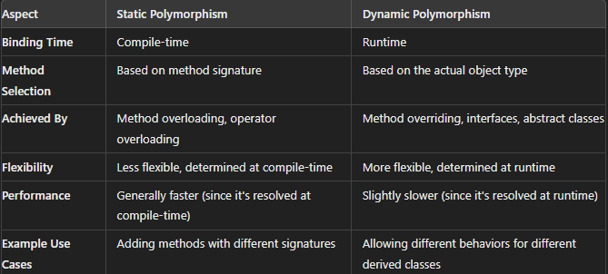

### Question :- Explain difference between .NET and C# ? 
- .NET is the framework/platform that provides the environment and tools to develop and run applications, and C# is a programming language used to write those applications within the .NET environment.

### Question :- .NET Framework vs .NET Core vs .NET 5.0
- .NET Framework is the legacy, Windows-only platform, .NET Core introduced cross-platform capabilities and modularity, and .NET 5.0 (and beyond) represents the future of .NET with a unified, cross-platform approach.

### Question :- What is IL ( Intermediate Language) Code ?
- It is partially compiled code, why partially compiled? Because we don’t know what kind of environment .NET code is going to be run and the configuration and security of the machine for that reason code is partially compiled and at run time the code is compiled to machine-specific instructions or you can say binary code based on underlying operation, CPU, Machine configuration, etc. by the CLR.
- which is later translated into machine code by the CLR's JIT compiler at runtime. This process enables the cross-platform capabilities and language interoperability of the .NET ecosystem.

### Question :- What is the use of JIT ( Just in time compiler) ?
- The JIT compiler reads each and every line of the IL code and converts it to machine-specific instructions (i.e., into binary format) which will be executed by the underlying Operating System. 
  
### Question :- Is it possible to view IL code ?
- Yes, you can view IL code using tools like ILDasm, ILSpy, Visual Studio, or DotPeek. These tools allow you to inspect the intermediate language code generated by the .NET compiler, providing insights into how your high-level code is translated before execution.
- Here is a example using IL Disassembler- 
```C#
public class Program
{
    public static void Main(string[] args)
    {
        int result = Add(5, 3);
    }

    public static int Add(int a, int b)
    {
        return a + b;
    }
}
```
- And here is the IL code
```C#
.method public hidebysig static int32 
        Add(int32 a, int32 b) cil managed
{
    .maxstack  2
    .locals init ([0] int32 V_0)
    IL_0000:  ldarg.0
    IL_0001:  ldarg.1
    IL_0002:  add
    IL_0003:  stloc.0
    IL_0004:  br.s       IL_0006
    IL_0006:  ldloc.0
    IL_0007:  ret
}
```
### Question :- What is the benefit of compiling in to IL code ?
- Cross-Platform Execution: IL code is platform-independent, meaning it can be run on any platform that has a compatible runtime (such as the Common Language Runtime (CLR) for .NET Framework, .NET Core, or .NET 5 and later). This allows developers to write code once and run it on multiple operating systems, including Windows, Linux, and macOS.
- Portability: Applications compiled to IL can be moved across different environments without modification, as the IL code will be compiled to platform-specific machine code by the Just-In-Time (JIT) compiler at runtime.
- Multiple Language Support: .NET supports multiple languages (like C#, VB.NET, F#, etc.), all of which compile down to the same IL code. This allows different languages to interoperate seamlessly. For example, you can write a class in C#, inherit it in VB.NET, and still maintain full functionality.
- Shared Runtime: Because all .NET languages compile to IL, they share the same runtime environment, which ensures consistency in execution regardless of the source language.
- JIT Compilation: At runtime, the JIT compiler translates IL code into native machine code, optimizing it for the specific hardware it’s running on. This allows for performance optimizations that take into account the exact environment where the application is being executed.
- Ahead-of-Time Compilation (AOT): In some cases, IL code can be precompiled into native code before deployment, improving startup time and performance in certain scenarios (e.g., through tools like ReadyToRun and NativeAOT).
- Code Verification: The CLR can verify IL code for type safety before execution. This process ensures that the code adheres to certain rules, preventing it from performing unsafe operations (e.g., buffer overflows, unauthorized memory access), which enhances the security of the application.
- Sand boxing: IL code can be executed in a restricted environment, allowing for more secure execution of potentially untrusted code. This is useful in scenarios like running plugins or scripts in a controlled manner.
- Rich Metadata: IL code is accompanied by rich metadata, which describes the types, members, and other aspects of the code in a standardized way. This metadata enables advanced debugging, reflection, and profiling capabilities, making it easier to inspect and manipulate the code during development and runtime.
- Reflection: The ability to inspect and invoke methods, access properties, and explore the structure of assemblies at runtime is made possible by IL code. This is particularly useful for frameworks that rely on dynamic behavior (e.g., dependency injection, serialization, and dynamic proxies).
- Assembly Versioning: IL code allows for strong versioning of assemblies, enabling side-by-side execution of different versions of the same assembly. This helps in managing dependencies and mitigating version conflicts.
- Modular Development: Because IL code is modular, different components of an application can be developed, tested, and deployed independently. This supports better software maintenance and continuous integration practices.

- Garbage Collection: The CLR manages memory for applications by performing automatic garbage collection. Since IL code is executed within the CLR, it benefits from efficient memory management, reducing the likelihood of memory leaks and other memory-related issues.
- Automatic Resource Management: IL code can take advantage of language features like using statements in C#, which help ensure that resources are properly disposed of, improving overall application reliability.
- Compiling to IL code provides platform independence, language interoperability (.NET supports multiple languages (like C#, VB.NET, F#, etc.), all of which compile down to the same IL code. This allows different languages to interoperate seamlessly. For example, you can write a class in C#, inherit it in VB.NET, and still maintain full functionality.), and optimization opportunities while enhancing security, debugging, and maintenance capabilities. These benefits make IL a key component of the .NET platform, enabling developers to build high-performance, cross-platform, and secure applications.

### Question :- What is CLR ( Common Language Runtime) ?
CLR (Common language runtime):


- First, the developer has to write the code using any dot net-supported programming languages such as C#, VB, J#, etc.
- Then the respective language compiler will compile the source code and generate something called Microsoft Intermediate Language (MSIL) or Intermediate Language (IL) code. For example, if the programming language is C#, then the compiler is CSC and if the programming language is VB, then the compiler will be VBC. 
- This Intermediate Language (IL) code is half-compiled code i.e., partially compiled code, and cannot be executed directly by the Operating System. 
- To execute this Microsoft Intermediate Language (MSIL) or Intermediate Language (IL) code on our machine.
- The .NET Framework provides something called Common Language Runtime (CLR) which takes the responsibility to execute our Microsoft Intermediate Language (MSIL) or Intermediate Language (IL) Code.
- The CLR takes the IL (Intermediate Language) code and gives it to something called the JIT (Just-in-Time) Compiler which is part of the CLR. 
- The JIT compiler reads each and every line of the IL code and converts it to machine-specific instructions (i.e., into binary format) which will be executed by the underlying Operating System. 
- The CLR in .NET Framework provides the runtime environment to execute the .NET Applications.
- IL code: 
- It is partially compiled code, why partially compiled? Because we don’t know what kind of environment .NET code is going to be run and the configuration and security of the machine for that reason code is partially compiled and at run time the code is compiled to machine-specific instructions or you can say binary code based on underlying operation, CPU, Machine configuration, etc. by the CLR.
### Question :- What is managed and unmanaged code ?
- The code that is managed by CLR is called managed code. Unmanaged code does not get managed by CLR. CLR’s interoperability helps to interact between managed and unmanaged code.

### Question :- Explain the importance of Garbage collector ?
- The Garbage Collector in .NET is a crucial component for managing memory automatically. It optimizes application performance by freeing up memory that is no longer in use, reducing memory leaks, and ensuring efficient memory utilization.

### Question :- Can garbage collector claim unmanaged objects ?
- The .NET Garbage Collector (GC) is specifically designed to manage the memory of managed objects—those created within the .NET environment using managed code (e.g., instances of classes in C#, VB.NET, F#). However, unmanaged objects—such as file handles, database connections, or memory allocated outside of the .NET runtime (e.g., using native APIs or through interop with unmanaged code)—are not directly managed by the GC.

### Question :- CTS ?
- The .NET Framework supports many programming languages such as C#, VB.NET, J#, F#, etc. Every programming language has its own data type. One programming language data type cannot be understood by other programming languages. But, there can be situations where we need to communicate between two different programming languages. For example, we need to write code in the VB.NET language and that code may be called from C# language. In order to ensure smooth communication between these languages, the most important thing is that they should have a Common Type System (CTS) which ensures that data types defined in two different languages get compiled to a common data type.

### Question :- What is the importance of CTS ?
- The Common Type System (CTS) is a fundamental component of the .NET framework that defines how types are declared, used, and managed across different .NET languages. It ensures that types are consistent and compatible, allowing for seamless interoperability between languages like C#, VB.NET, and F#. The CTS enables a unified type system where different languages can work together, share types, and ensure type safety.
- Because all .NET languages share the same underlying type system (CTS), they can interact with each other smoothly. For example, a class defined in C# can be used in a VB.NET project without any issues.

### Question :- Explain CLS ?
- Every programming language has its own syntactical rules for writing the code which is known as a language specification. One programming language’s syntactical rules (language specification) cannot be understood by other programming languages. But, there can be situations where we need to communicate between two different programming languages. In order to ensure smooth communication between different .NET Supported Programming Languages, the most important thing is that they should have Common Language Specifications which ensures that language specifications defined in two different languages get compiled into a Common Language Specification.
- CLS deals with different behaviour of the language. For Example: If I want to consume the VB.Net code inside the C#, here CLS came into picture. because C# is a case sensitive language while VB.Net is not a case sensitive language. For this CLS is set of guidelines that is used to reused the code in different programming language.
- It is a part of CLR, CLR in .NET Framework will execute all programming language code. This is possible because CLR has its own language specification (syntactical rules) which are common to all .NET Supported Programming Languages. At the time of compilation, every language compiler should follow this language specification of CLR and generate the MSIL code. This language specification of CLR is common for all programming languages and this is known as **Common Language Specifications (CLS).**

### Question :- What is Assembly ?
- Assembly is a unit if deployment like EXE or a DLL file.
- When you complete the coding a build teh solution the .Net Framework convert it into assembly which you can inside bin folder.
> Types of Assembly
1. private assembly
2. public(Shared) assembly
3. satellite assembly
### Question :- Difference between Stack vs Heap ?
> Stack 

- The stack is a region of memory that stores value types and local variables. Memory allocation on the stack is simple and follows the Last In, First Out (LIFO) principle.
When a function or method is called, a new block (or "stack frame") is created on the stack to store local variables and parameters.
- The stack automatically manages memory allocation and deallocation. When a function call completes, the corresponding stack frame is popped off, and the memory is reclaimed.
- The stack is a region of memory that stores value types and local variables. Memory allocation on the stack is simple and follows the Last In, First Out (LIFO) principle.
- When a function or method is called, a new block (or "stack frame") is created on the stack to store local variables and parameters.
- Local variables, method parameters, and value types (like int, float, struct) are typically stored on the stack.
> Heap
- The heap is a region of memory used for reference types, including objects and arrays. Memory allocation on the heap is more complex and involves dynamic memory allocation.
- Memory on the heap is allocated using the new keyword in C#.
- Memory on the heap is managed by the Garbage Collector (GC). The GC automatically de allocates memory that is no longer referenced by any part of the program, freeing up space on the heap.
- Data on the heap persists as long as it is referenced by any part of the program. Once there are no references to a block of memory on the heap, it becomes eligible for garbage collection.
- Objects, arrays, and reference types (like class instances) are stored on the heap.
### Question:- What is Tuple?
- Tuple is a data structure in C# there we can store fixed number of items of different types together in a single variable. It's like a container that groups related values into one unit. Think of it as a lightweight, simpler version of a class or a struct.
```C#
class Program
{
    static void Main()
    {
        // Create a tuple to store student data
        var student = ("Alice", 85, true);

        // Access tuple elements
        Console.WriteLine($"Name: {student.Item1}");   // Name : Alice
        Console.WriteLine($"Score: {student.Item2}");  // Score : 85
        Console.WriteLine($"Passed: {student.Item3}"); // Passed : True
    }
}
```
### Question :- What are Value types & Reference types?
>  Value types 
Memory Allocation:
- Value types store their data directly in the memory where the variable is allocated. This means that the actual value is stored in the stack (or inline in the case of fields within objects on the heap).
Copying:
- When a value type is assigned to another value type, a copy of the value is made. Each variable has its own copy of the data, and changes to one do not affect the other.

Storage:
- Value types are typically stored on the stack, but if they are part of a larger object, they may be stored on the heap.

Examples:
- Primitive data types like int, float, char, bool, and double.
- Structs (struct) and enumerations (enum).
> Reference Type:

Memory Allocation:
- Reference types store a reference (or address) to the actual data in memory rather than storing the data directly. The reference itself is stored on the stack, while the actual data is stored on the heap.

Copying:
- When a reference type is assigned to another reference type, only the reference (or memory address) is copied, not the actual data. Therefore, multiple variables can reference the same object, and changes to the object through one reference are reflected in all references.

Storage:
- The reference to the data is stored on the stack, but the actual data resides on the heap.

Examples:
- Classes (class), arrays, delegates, strings, and interfaces.
### Question :- Explain boxing and unboxing ?
> Boxing
- Boxing is the process of converting a value type (e.g., int, float, struct) into a reference type (object or any interface type implemented by the value type).

How Does Boxing Work?
- When a value type is boxed, the runtime allocates a new object on the heap, and the value type’s data is copied into this object. The value is then wrapped inside the object, and a reference to this object is returned.
- This process involves memory allocation on the heap and copying of the value type data, which can impact performance.
>UnBoxing
- Unboxing is the process of converting a reference type (that was previously boxed) back into a value type.

How Does Unboxing Work?

- When unboxing occurs, the reference type is cast back to the original value type. The runtime checks that the object being unboxed is actually a boxed value of the expected type, and if it is, the value is copied from the object on the heap back into a value type variable.
>Note: 
- Boxing and unboxing can be expensive because they involve memory allocation on the heap and copying of data. Frequent boxing and unboxing can lead to performance issues, especially in performance-critical code.
- Avoiding unnecessary boxing and unboxing is recommended. For example, if you know that a value type will need to be used as an object repeatedly, consider alternatives like using generic types or keeping the value in its boxed form.
### Question :- Explain casting, implicit casting and explicit casting ?
> Implicit casting 
- automatic type conversion performed by the C# compiler. It occurs when the conversion is safe and no data will be lost.
- This usually happens when converting from a smaller or less precise data type to a larger or more precise data type.
> Explicit casting
- Explicit casting is a manual type conversion, where the programmer specifies the conversion using a cast operator. This is necessary when the conversion could potentially result in data loss or when converting between incompatible types.
- To explicitly cast a variable, you place the target data type in parentheses before the variable you want to cast.
```C#
double d = 9.78;
int i = (int)d; // Explicit casting from double to int
```
### Question :- Differentiate between Array and ArrayList ?
Array
- Arrays are type-safe, meaning that they are strongly typed. When you declare an array, you must specify the type of elements it will hold, and it can only store elements of that type.
- Arrays offer better performance because they are type-specific and have fixed size, meaning there's no need for boxing/unboxing or dynamic resizing.
- Arrays have a fixed size. Once an array is created, its size cannot be changed. This can be limiting if you don't know the number of elements in advance.

ArrayList
- ArrayList is not type-safe because it stores elements as object. This means you can store any type of data (e.g., int, string, object) in an ArrayList, but you lose the benefit of compile-time type checking.
- The ArrayList in C# is a non-generic collection class that works like an array but provides the facilities such as dynamic resizing, adding, and deleting elements from the middle of a collection.  The ArrayList in C# can be used to add unknown data i.e. when we don’t know the types of data and size of the data, then we can use ArrayList. 

- It is used to create a dynamic array means the size of the array is increase or decreases automatically according to the requirement of our program. There is no need to specify the size of the ArrayList. In ArrayList, we can store elements of the same type and of different types.
### Question :- What are generic collections ?
- A generic in C# is a feature that allows you to create reusable classes, methods, or interfaces that work with any data type without specifying the exact type in advance. Generics provide type safety, meaning errors are caught at compile time rather than runtime, and improve performance by avoiding unnecessary type conversions or boxing/unboxing.
- Generic collections in C# are a set of collection classes that are strongly typed, meaning they enforce type safety at compile time. Unlike non-generic collections (such as ArrayList, Hashtable, etc.), which store items as object, generic collections allow you to specify the type of elements they can hold, eliminating the need for casting and reducing the risk of runtime errors.
```C#
List<int> numbers = new List<int>(); // List of integers
List<string> names = new List<string>(); // List of strings
```

The Generic Collection Classes are implemented under the System.Collections.Generic namespace. The classes which are present in this namespace are as follows.

- Stack<T>: It represents a variable size last-in-first-out (LIFO) collection of instances of the same specified type. 
- Queue<T>: It represents a first-in, first-out collection of objects. 
- HashSet<T>: It represents a set of values. It eliminates duplicate elements.
- SortedList<TKey, TValue>: It represents a collection of key/value pairs that are sorted by key based on the associated System.Collections.Generic.IComparer implementation. It automatically adds the elements in ascending order of key by default.
- List<T>: It represents a strongly typed list of objects that can be accessed by index. Provides methods to search, sort, and manipulate lists. It grows automatically as you add elements to it.
- Dictionary<TKey, Tvalue>: It represents a collection of keys and values.
- SortedSet<T>: It represents a collection of objects that are maintained in sorted order.
- SortedDictionary<TKey, TValue>: It represents a collection of key/value pairs that are sorted on the key.
- LinkedList<T>: It represents a doubly linked list.
### Question :- What is Auto Mapper in C# ?
- AutoMapper is a popular open-source library in C# that simplifies mapping data between different classes or objects. It helps eliminate repetitive and error-prone code when copying data from one object to another. AutoMapper is especially useful in scenarios like mapping database entities to DTOs (Data Transfer Objects) or ViewModel objects.
- The AutoMapper in C# is a mapper between two objects. That is, AutoMapper is an Object-Object Mapper. It maps the properties of two different objects by transforming the input object of one type to the output object of another. 
### Question:- What is Event-Bubbling ?
- vent bubbling in C# refers to the process where an event triggered by a child element is passed (or "bubbled up") to its parent elements. In other words, the event starts from the most specific (child) element and moves up through the hierarchy to more general (parent) elements. This concept is most commonly encountered in GUI applications like WPF or web-based frameworks.
> Real ife example:
  - Imagine you have a party with multiple levels of hierarchy:
    - Parent: The house
    - Child: A room in the house
    - Grandchild: A table inside the room
  - Now, someone accidentally knocks a glass off the table. This event is noticed first by the table, then the room, and finally the house (if the table and room do not handle it specifically).
### Question  :- What is view State?
- ViewState in ASP.NET is a mechanism used to maintain the state of controls on a web page across postbacks. It stores the state of a web page (like the values of form fields, drop-down selections, etc.) between user interactions so that the page remembers what it looked like after it is refreshed or submitted.

> Real-Life Example:
  - Imagine you're filling out an online shopping form to order a product. You type your name, select the product, and choose the quantity. Before clicking "Submit," you accidentally refresh the page.Normally, you'd lose all your entered information after the refresh. But with ViewState, the page reloads and retains the entered data so you don't have to start over.
### Question :- What is rendering?
- rendering is the process of displaying something on a screen so that people can see and interact with it. In programming, rendering is when the computer takes the code (like HTML, CSS, and JavaScript) and turns it into a visual output, like a webpage or an app interface.
### Question :- a private virtual method can be overridden in a derived class ?
- In C#, you cannot declare a private method as virtual because it would contradict the purpose of each keyword.
- a private method can not be accessible outside its class so making it as virtual does not make any sense.
- 
- Private Method:
    - A private method is accessible only within the class where it is defined.
    - It is not visible to derived classes, so it cannot be overridden or used in inheritance.
- Virtual Method:
    - A virtual can be overridden in a derived class.
    - fro overriding the method must be accessible in the derived class (at least protected or public).
### Question :- Difference between string and string Builder ?
- Both are used to work with text but there is some difference between them.
- string is a immutable string means we can not change the string once it created. on the other hand string builder is a mutable string means we can change the string once it created.
- String is used for simple or infrequent text manipulation and String Builder is used for more complex text manipulation such as loop or when we are dealing with large amount of data.
### Question :- can we use multiple exception in the code?
- Yes we can use exception in the code. with the help multiple try catch block we can handle multiple exception. each try catch block can handle different type of exception.
### Question :- Tuple in C#?
- Tuple is data structure in C# that allow you to store a group of elements where each element has a specific type. It is a way to group related data together in a more readable and maintainable way.
- Tuples are immutable, which means that once created, they cannot be modified.
```C#
var myTuple = (1, "Hello", true);
Console.WriteLine(myTuple.Item1); // Output: 1
Console.WriteLine(myTuple.Item2); // Output: Hello
Console.WriteLine(myTuple.Item3); // Output: True
```
### Types of class.
- Abstract class
- Sealed class
- Static class
- Partial class
- Nested class
- Generic class
### Difference between class and struct in C#?
- Both are user defined data types.
- A class is a reference type data type mens it is storing inside the heap memory and variables of a class hold reference to the object. means if you want to change object through a variable all other varibale point to the object will see the changes.
- A struct is a value type means when you create a struct it is directly store in stack(variable). and each variables has its own copy of the data. changing the opy doesnt affect the other variable.
- Classes can be inherited (you can create new classes based on them) and can be set to null, but structs cannot be inherited and cannot be null (unless you make them nullable).
- Classes are useful for more complex scenarios, while structs are better for small, simple data types that don't need inheritance. 
### Question :- What are threads (Multithreading)?
- If multiple threads are used to execute your application code, it is called Multithreading. Multithreading is a mechanism to implement Concurrent Programming where multiple threads operate simultaneously. Threads are lightweight processes that signify the execution path in a program. Thread usage increases the efficiency of an application and reduces CPU cycle time wastage. The main advantage of using Multithreading is the maximum utilization of CPU resources.
### Question :- How are threads different from TPL ?
- Threads and the Task Parallel Library (TPL) are both used to perform asynchronous and parallel operations in C#, but they operate at different levels of abstraction and provide different benefits. 
- Threads are the basic unit of execution in multithreading. When you create a thread, you directly manage it, controlling its lifecycle, and are responsible for its creation, scheduling, and synchronization.
- The Task Parallel Library is a higher-level abstraction built on top of threads. It simplifies parallel programming by abstracting away the details of thread management. TPL allows you to create and manage tasks rather than directly working with threads.
### Question :- How do we handle exceptions in C#(try/catch)?
- exceptions are handled using the try, catch, and optionally finally blocks. This mechanism allows you to write code that can catch and handle errors (exceptions) gracefully, preventing the program from crashing and providing an opportunity to take corrective actions.

>try block:
- Contains the code that you want to monitor for exceptions. If an exception occurs within this block, the flow of control is transferred to the appropriate catch block.

> catch block:

-Handles the exception that was thrown in the try block. You can have multiple catch blocks to handle different types of exceptions.

> finally block:

- Optional. Contains code that is executed regardless of whether an exception was thrown or not. This is typically used for cleanup operations, such as closing files or releasing resources.

### Question :- Why do we need the out keyword ?
- C# methods typically return a single value. However, by using the out keyword, you can return multiple values from a method. 
- The variable passed as an out parameter does not need to be initialized before being passed to the method. However, the method is required to assign a value to the out parameter before it exits.
```C#
using System;
namespace RefvsOutDemo
{
    class Program
    {
        static void Main(string[] args)
        {
            //First Declare the Variables
            int Addition = 0;
            int Multiplication = 0;
            int Subtraction = 0;
            int Division = 0;
            //While calling the Method, decorate the out keyword for out arguments
            //Addition, Multiplication, Subtraction, and Division variables values will be updated by Math Function
            Math(200, 100, out Addition, out Multiplication, out Subtraction, out Division);

            Console.WriteLine($"Addition: {Addition}");
            Console.WriteLine($"Multiplication: {Multiplication}");
            Console.WriteLine($"Subtraction: {Subtraction}");
            Console.WriteLine($"Division: {Division}");
            
            Console.ReadKey();
        }

        //Declaring Method with out Parameters
        public static void Math(int number1, int number2, out int Addition,
            out int Multiplication, out int Subtraction, out int Division)
        {
            Addition = number1 + number2; //This will Update the Addition variable Declared in Main Method
            Multiplication = number1 * number2; //This will Update the Multiplication variable Declared in Main Method
            Subtraction = number1 - number2; //This will Update the Subtraction variable Declared in Main Method
            Division = number1 / number2; //This will Update the Division variable Declared in Main Method
        }
    }
}

```
### Question :- Delegates ?
- A delegate in C# is a type-safe function pointer that allows you to pass methods as parameters, assign them to variables, and invoke them dynamically at runtime. It defines a method signature and can reference any method that matches this signature.
- A delegate is a powerful feature in C# for writing flexible and reusable code. It allows passing methods as parameters, enabling callbacks, event handling, and more. It's a cornerstone of advanced programming in C#.
- A delegate is a type that points to a method. It helps to call a method from another place.
- A delegate is a type that represents a reference to a method with a specific signature. It acts as a pointer to a method, allowing you to pass it as an argument, store it in a variable, or use it as an event handler.
- Delegates provide a way to encapsulate method references and enable dynamic method invocation. They are commonly used in event handling, callback functions, and implementing the Observer pattern in programming.
- A delegate is a helper that points to a method. It's like giving someone the address of your friend. You have a friend, which is the method, and you give someone, which is the delegate, the address of your friend. Then, that someone, the delegate, can go visit your friend, the method, for you.
```C#
public class Program
{
    public delegate void MyDelegate(string message);

    public static void Main()
    {
        MyDelegate del = new MyDelegate(PrintMessage);
        del("Hello, World!");
    }

    public static void PrintMessage(string message)
    {
        Console.WriteLine(message);
    }
}
```

### Question :- What are events ?
### Question :- What’s the difference between Abstract class and interface ?
> Abstract Class:
- An abstract class is a class that cannot be instantiated on its own and may contain abstract methods (methods without implementation) as well as concrete methods (methods with implementation).
- Can contain both abstract methods (without implementation) and non-abstract methods (with implementation).
- Derived classes can override the methods of an abstract class, but they must implement any abstract methods.
- Supports single inheritance. A class can inherit only one abstract class but can implement multiple interfaces.
- Members of an abstract class can have access modifiers (e.g., public, protected, private).
```C#
public abstract class Animal
{
    public abstract void MakeSound();  // Abstract method

    public void Sleep()  // Concrete method
    {
        Console.WriteLine("Sleeping...");
    }
}

public class Dog : Animal
{
    public override void MakeSound()
    {
        Console.WriteLine("Bark");
    }
}

```
> Interface
- An interface is a completely abstract type that contains only abstract methods (methods without implementation) and properties. It cannot contain any implementation.
- Can only contain abstract methods (without implementation) until C# 8.0. With C# 8.0 and later, interfaces can also include default implementations via default interface methods.
- Implementing classes must provide an implementation for all methods defined in the interface.
- Supports multiple inheritance. A class can implement multiple interfaces.
- Interfaces can inherit from multiple other interfaces.
- All members of an interface are implicitly public, and you cannot specify any access modifiers.
- Members must be implemented as public in the implementing class.
```C#
public interface IAnimal
{
    void MakeSound();  // Abstract method
}

public class Dog : IAnimal
{
    public void MakeSound()
    {
        Console.WriteLine("Bark");
    }
}

```
### Question :- Delegate VS Events.
### Question :- What are the important pillars of OOPs ?
1. Encapsulation 
   - Encapsulation is the bundling of data (attributes) and methods (functions) that operate on the data into a single unit or class. It restricts direct access to some of the object's components, which is a means of preventing accidental interference and misuse of the data.
2. Inheritance
   - Inheritance is a mechanism by which one class (the child or derived class) inherits the properties and behaviors (fields and methods) of another class (the parent or base class). This allows for code reuse and the creation of a hierarchical relationship between classes.
3. Polymorphism 
   - Polymorphism allows objects of different classes to be treated as objects of a common base class. It enables a single method to behave differently based on the object that invokes it.
4. Abstraction
   - Abstraction is the concept of hiding the complex implementation details and showing only the essential features of an object. It allows the user to interact with an object through its interface without needing to understand the intricate details of its implementation.
### Question :- What is a class and object ?
> Class :
- A class is simply a user-defined reference type data type that represents both state and behavior.
- The state represents the properties and behavior is the action that objects can perform.

> Object :
- It is an instance of a class. 
- A class is brought live by creating objects. An object can be considered as a thing that can perform activities.
- All the members of a class can be accessed through the object.
### Question :- Abstraction vs Encapsulation?
> Abstraction :
- Abstraction is the process of hiding the complex implementation details and showing only the essential features of an object. It focuses on the "what" rather than the "how." Abstraction is achieved through abstract classes and interfaces in OOP.
- Purpose: The main purpose of abstraction is to reduce complexity and allow the programmer to focus on the interactions with objects rather than the internal details.
- Example: Consider a Car class. The abstraction would include methods like start(), stop(), and accelerate(). The user of the class doesn't need to know how these methods are implemented; they just need to know what the car can do.

```C#
abstract class Car {
    public abstract void Start();
    public abstract void Stop();
    public abstract void Accelerate();
}
```
> Encapsulation:
- Definition: Encapsulation is the concept of wrapping data (variables) and the methods that operate on the data into a single unit, i.e., a class. It also restricts direct access to some of an object's components, which is a means of data hiding. Encapsulation focuses on the "how" and "where" the data is stored and manipulated.
- Purpose: The main purpose of encapsulation is to protect the internal state of an object and ensure that it is accessed and modified only through controlled methods. This helps in maintaining the integrity of the data.
- Example: In the Car class, encapsulation would involve private fields and public getter and setter methods to access and modify the state of the car.

```C#
class Car {
    private int speed;
    private bool engineOn;

    public void Start() {
        engineOn = true;
        speed = 0;
    }

    public void Accelerate(int increment) {
        if (engineOn) 
            speed += increment;
        }
    }

    public int GetSpeed() {
        return speed;
    }
}
```
> Note : Abstraction is a process. It is the act of identifying the relevant qualities and behaviors an object should possess. Encapsulation is the mechanism by which the abstraction is implemented.
 
### Question :- Explain Inheritance ?
- Inheritance in C# is a mechanism of consuming the members that are defined in one class from another class. See, we are aware that a class is a collection of members. The members defined in one class can be consumed by another class by establishing a parent/child relationship between the classes.
> Types of Inheritance?
- Single Inheritance: A subclass inherits from one and only one superclass.
- Example: If Dog inherits from Animal, then Dog is a subclass of Animal.
```c#
class Animal {
    public void Eat() {
        Console.WriteLine("Eating...");
    }
}

class Dog : Animal {
    public void Bark() {
        Console.WriteLine("Barking...");
    }
}
```
- Multiple Inheritance : A subclass inherits from more than one superclass. (Note: C# does not support multiple inheritance directly but it can be achieved using interfaces).
- Example: In languages like C++, a class Child can inherit from both Parent1 and Parent2.
- Multilevel Inheritance : A subclass is derived from another subclass, forming a chain of inheritance.
- Example: If Puppy inherits from Dog, and Dog inherits from Animal, then Puppy is part of a multilevel inheritance chain.
```C#
class Animal {
    public void Eat() {
        Console.WriteLine("Eating...");
    }
}

class Dog : Animal {
    public void Bark() {
        Console.WriteLine("Barking...");
    }
}

class Puppy : Dog {
    public void Weep() {
        Console.WriteLine("Weeping...");
    }
}
```
- Hierarchical Inheritance : Multiple subclasses inherit from a single superclass.
- Example: If both Dog and Cat inherit from Animal, they share the same base class.
```c#
class Animal {
    public void Eat() {
        Console.WriteLine("Eating...");
    }
}

class Dog : Animal {
    public void Bark() {
        Console.WriteLine("Barking...");
    }
}

class Cat : Animal {
    public void Meow() {
        Console.WriteLine("Meowing...");
    }
}
```
- Hybrid Inheritance : A combination of two or more types of inheritance. This is usually achieved in languages that support multiple inheritance.
### Question :- Explain virtual keyword ?
- The virtual keyword is used to indicate that a method or property in a base class can be overridden in a derived class. 
- When a method is marked as virtual in a base class, it can be overridden in any derived class using the override keyword. This allows the derived class to provide a specific implementation of the method that replaces the base class version.
```c#
class Animal {
    public virtual void Speak() {
        Console.WriteLine("Animal makes a sound");
    }
}

class Dog : Animal {
    public override void Speak() {
        Console.WriteLine("Dog barks");
    }
}

```
### Question :- What is overriding ?
-  It allows a subclass to provide a specific implementation of a method already defined in its superclass. It enables polymorphism, allowing the same method call to behave differently based on the actual object type. This makes code more flexible and reusable.
-  It is an approach of re-implementing a parent classes 
method under the child class with the same signature. 
```C#
class Animal {
    public virtual void Speak() {
        Console.WriteLine("Animal makes a sound");
    }
}

class Dog : Animal {
    public override void Speak() {
        Console.WriteLine("Dog barks");
    }
}

class Program {
    static void Main(string[] args) {
        Animal myAnimal = new Animal();
        myAnimal.Speak();  // Outputs: Animal makes a sound

        Dog myDog = new Dog();
        myDog.Speak();  // Outputs: Dog barks

        Animal myPet = new Dog();
        myPet.Speak();  // Outputs: Dog barks (polymorphism in action)
    }
}
```
### Question :- Explain overloading ?
- It is an approach of defining methods with multiple 
behaviour where behaviours of the methods will be changing based on the 
parameters of that method I.e. Input changes = Output changes.
- Overloading is a type of compile-time polymorphism (also known as static polymorphism) because the correct method to call is determined at compile time based on the method's signature.
```C#
class MathOperations {
    // Method to add two integers
    public int Add(int a, int b) {
        return a + b;
    }

    // Overloaded method to add three integers
    public int Add(int a, int b, int c) {
        return a + b + c;
    }

    // Overloaded method to add two doubles
    public double Add(double a, double b) {
        return a + b;
    }
}

class Program {
    static void Main(string[] args) {
        MathOperations math = new MathOperations();

        Console.WriteLine(math.Add(1, 2));         // Calls Add(int, int) and outputs 3
        Console.WriteLine(math.Add(1, 2, 3));      // Calls Add(int, int, int) and outputs 6
        Console.WriteLine(math.Add(1.5, 2.5));     // Calls Add(double, double) and outputs 4.0
    }
}
```

### Question :- Overloading vs Overriding ?
> Overloading:
- In this case we define multiple methods with the same name by changing their parameters.
- This can be performed either within a class as well as between parent child classes also .
- While overloading a parent classes method under the child class, child class doesn’t require to take any permission from the parent class.
-  Overloading is all about defining multiple behaviours to a method.
> Overriding:
-  In this case we define multiple methods with the same name and same parameters.
-  This can be performed only between parent child classes can never be performed within the same class.
-  While overriding a parent’s method under child class , child class require a permission from it’s parent.
-  Overriding is all about changing the behaviour under the child class

### Question :- Explain static vs dynamic polymorphism ?
> static/ Overloading/ Compile time polymorphism all are same 
- The decision about which method to invoke is made by the compiler based on the method signature.
> Dynamic/ Overriding/ Runtime Polymorphism:
- Dynamic polymorphism is resolved at runtime. The decision about which method to invoke is made based on the actual object that is being referred to, not the reference type.


### Question :- Explain operator overloading ?
- It is also an approach of defining multiple behaviours to an operator and those behaviours will vary based on the operand types between which the operator is used. For example + is an addition operator when used between two numeric operands and it is an concatenation operator when used between two string operands.
### Question :- Abstract class & Abstract methods ?
- A method without any method body is known as an abstract method, What the method contains is only declaration of the method.
- A class under which we define abstract method is known as an abstract class.
- NOTE- to define a method or class as abstract we require to use the abstract keyword on them.
- If a method is declared as abstract under any class then the child class of that class is responsible for implementing the method.
-  The concept of abstract method will be nearly similar to the method overriding .
- Abstract class contain both abstract and non-abstract type method but the non-abstract can contain only non-abstract method.
- Abstract methods are inherently virtual because they are designed to be overridden in derived classes. However, unlike virtual methods, abstract methods do not provide any implementation in the base class and require all derived classes to provide an implementation.
- Virtual methods provide a default implementation in the base class and allow derived classes the option to override them.

### Question :- Are Abstract methods virtual ?
### Question :- Can we create a instance of Abstract classes ?
- No, An abstract class is designed to serve as a base class, providing a common definition for a set of related classes. It may contain abstract methods, which are method declarations without an implementation. Since the abstract class is not fully implemented (it may have abstract methods that need to be defined by a subclass), it doesn't make sense to instantiate it directly.
### Question :- Is it compulsory to implement Abstract methods ?
Yes, Abstract class has two kind of methods one is concreete and another is abstract method. either you already implemented the method insidde the abstrct class  that is concrete method euther you implemet the method into the subclass of that particular abstract class.
### Question :- Why simple base class replace Abstract class ?
- A simple (non-abstract) base class can sometimes replace an abstract class if the design does not require enforcing the implementation of certain methods in derived classes.
- somee time the parent class doesnot allow there child class to implement or modify the parent's class methods for that reason we have to a basse class some time replace the abstract class.
### Question :- Explain interfaces and why do we need it ?
- This is an user defined data type and contains only Abstract methods (Methods without method body).
- Generally a class inherits from another class to consume the members of its parent , where as if a class is inheriting from an interface it is to implement the members of its parent.
- The default scope the members of an interface is public whereas it’s private in case of a class.
- By default every member of an interface is abstract so we don’t require to use abstract modifier on it again just like we do in case of abstract class.
- Every member of an interface should be implemented under the child class of the interface without fail, but while implementing we don’t require to use override modifier just like we have done in case of abstract class.
### Question :- Can we write logic in interface ?
- No, all methods in an interface are implicitly public nad abbstract.
### Question :- Can we define methods as private in interface ?
- yes, starting with C# 8.0 you can write logic in an interface using default interface metods. this feaure will allows you to provide a default implemntation for methods in an interface. 
### Question :- Explain Multiple inheritance in Interface ?
- multiple inheritance in interfaces allows a single interface to inherit from more than one interface.
- When an interface inherits from multiple interfaces, any class or struct that implements the derived interface must implement all the members defined in all the base interfaces.
```C#
public interface IFirst
{
    void MethodA();
}

public interface ISecond
{
    void MethodB();
}

// Multiple inheritance in interface
public interface ICombined : IFirst, ISecond
{
    void MethodC();
}

public class CombinedImplementation : ICombined
{
    public void MethodA()
    {
        Console.WriteLine("MethodA implementation.");
    }

    public void MethodB()
    {
        Console.WriteLine("MethodB implementation.");
    }

    public void MethodC()
    {
        Console.WriteLine("MethodC implementation.");
    }
} 
```
- Now, any class that implements ICombined must implement MethodA, MethodB, and MethodC.
### Question :- Explain Interface Segregation principle ?
- First, no class should be forced to implement any method(s) of an interface they don’t use.
- Secondly, instead of creating large or, you can say, fat interfaces, create multiple smaller interfaces so that the clients only think about the methods that they want to implement.
- Just understand the sceanrio, we have a interface and there are four methods and we have two classes want to inherit the interface and implemnet the method. But there is a problem class 1 wnat to implement all four methods and class 2 want to implement only two methods define inside the interface. In that case class 2 has restriction to implement all four methods but want only two in that kind of scenario interface segregation comes into pictre we break the large interface into small piece of interface according to our convenient.
### Question :- Why do we need constructors ?
- It is a special method present inside a class responsible for initializing the variables of that class.
- The name of the constructor method is exactly the same name as the class in which it was present. You cannot change the name. If your class name is Employee, then the name of the constructor method is going to be Employee. 
- Just like in real life, where you wouldn't start building a house without ensuring the foundation is in place and materials are ready, in programming, you use constructors to ensure that an object is properly set up before it’s used. Constructors ensure that every object is created with the right data and in a valid state, much like how a house must meet certain criteria before it’s considered livable.
### Question :- In parent child which constructor fires first ?
- when you create an object of a derived (child) class, the constructor of the base (parent) class is called first, followed by the constructor of the derived class. This ensures that the base class is properly initialized before the derived class adds its own initialization logic.
### Question :- How are initializers executed ?
### Question :- How are static constructors executed in Parent child ?
### Question :- When does static constructor fires ?
### Question :- What is Shadowing/hiding?
- It allows a derived class to provide a new implementation for a method that exists in its base class. This is different from method overriding, where a derived class provides a new implementation for a method defined in its base class with the same signature, but it uses the virtual and override keywords.
```C#
using System;

public class BaseClass
{
    public void Display()
    {
        Console.WriteLine("BaseClass Display Method");
    }
}

public class DerivedClass : BaseClass
{
    // Hiding the Display method in BaseClass
    public new void Display()
    {
        Console.WriteLine("DerivedClass Display Method");
    }
}

class Program
{
    static void Main(string[] args)
    {
        BaseClass baseObj = new BaseClass();
        BaseClass derivedAsBase = new DerivedClass();
        DerivedClass derivedObj = new DerivedClass();

        baseObj.Display();          // Output: BaseClass Display Method
        derivedAsBase.Display();    // Output: BaseClass Display Method (BaseClass method is called)
        derivedObj.Display();       // Output: DerivedClass Display Method (DerivedClass method is called)
    }
}
```
### Question :- When do we need Shadowing ?
- when you cannot modify the base class but need to change behavior in the derived class.
### Question :- Explain Sealed Classes ?
- class that cannot be inherited. Once a class is declared as sealed, it cannot be used as a base class for any other class. 
- This is useful in scenarios where you want to restrict the extensibility of a class to prevent further inheritance.
### Question :- Can we create instance of sealed classes ?
- You can create instances of a sealed class just like any other class.
- Sealed classes cannot be inherited, but this does not restrict object creation or usage.
### Question :- What are nested classes and when to use them ?
- Whenever we define a class within another class in C#, the inner class is called a nested or child class. 
### Question :- Can Nested class access outer class variables ?
- Yes, a nested class can access the variables and methods of its outer class. Here's how it generally works.
```C#
public class OuterClass
{
    private int outerVariable = 42;

    public class NestedClass
    {
        public void AccessOuterClassMembers()
        {
            // Create an instance of the outer class to access its members
            OuterClass outer = new OuterClass();
            Console.WriteLine(outer.outerVariable);
        }
    }
}
```
### Question :- Can we have public, protected access modifiers in nested class ?
- nested classes can have different access modifiers, including public, protected, and private.
```C#
public class OuterClass
{
    private class PrivateNestedClass { }  // Only accessible within OuterClass

    protected class ProtectedNestedClass { }  // Accessible within derived classes and same assembly

    public class PublicNestedClass { }  // Accessible from anywhere

    internal class InternalNestedClass { }  // Accessible within the same assembly
}
```
### Question :- Explain Partial classes ?
- Partial Class allows us to define a class on multiple files i.e. we can physically split the content of the class into different files but even physically they are divided but logically it is one single unit only. 
- A class in which code can be written in two or more files is known as a partial class. 
- To make any class partial we need to use the keyword partial.
```C#
namespace PartialClassDemo
{
    public partial class PartialEmployee
    {
        public string FirstName { get; set; }
        public string LastName { get; set; }
        public string Gender { get; set; }
        public double Salary { get; set; }
    }
}

using System;
namespace PartialClassDemo
{
    public partial class PartialEmployee
    {
        public void DisplayFullName()
        {
            Console.WriteLine($"Full Name is : {FirstName} {LastName}");
        }

        public void DisplayEmployeeDetails()
        {
            Console.WriteLine("Employee Details : ");
            Console.WriteLine($"First Name : {FirstName}");
            Console.WriteLine($"Last Name : {LastName}");
            Console.WriteLine($"Gender : {Gender}");
            Console.WriteLine($"Salary : {Salary}");
        }
    }
}

using System;
namespace PartialClassDemo
{
    class Program
    {
        static void Main(string[] args)
        {
            PartialEmployee emp = new PartialEmployee()
            {
                FirstName = "Pranaya",
                LastName = "Rout",
                Salary = 100000,
                Gender = "Male"
            };
            emp.DisplayFullName();
            emp.DisplayEmployeeDetails();
            Console.ReadKey();
        }
    }
}

Output :
--- 
Full Name is : Pranaya Rout
Employee Details :
First Name : Pranaya
Last Name : Rout
Gender : Male
Salary : 100000
---
```

### Question :- What is SOLID ?
> SOLID Principle
- S (Single Responsibility )
    - This Principle states that each software module or class should have only one reason to change. In other words, each module or class should have only one responsibility.
- O (Open closed principle)
  - The Open-Closed Principle states that software entities, such as modules, classes, functions, etc., should be open for extension but closed for modification.
- L (Liskov substitution Principle)
  - That means the child class objects should be able to replace parent class objects without changing the correctness or behavior of the program.
- I (Interface segregation Principle)
  - This Principle states that Clients should not be forced to implement any methods they don’t use. Rather than one fat interface, numerous little interfaces are preferred based on groups of methods, with each interface serving one submodule.
- D (Dependecy Inversion Principle)
  - This Principle states that high-level modules/classes should not depend on low-level modules/classes. Both should depend upon abstractions. Secondly, abstractions should not depend upon details. Details should depend upon abstractions.
  - The Dependency Inversion Principle suggests that both high-level and low-level modules should depend on abstractions, not on each other. This means that high-level modules should define interfaces that low-level modules implement. This way, you can change the low-level implementation without affecting the high-level logic
### Question :- What is higher level module and lower level module ?
- Higher-level modules : The components of your software that deal with complex logic, decision-making, and the main functionalities of the application. They represent the "business logic" or the core functionality of the application.
- Lower-Level module :  These modules handle how tasks should be accomplished. They are concerned with implementation details like data storage, communication, and low-level processing.
- Real Life example
    - Higher-Level: The architect's design and the general contractor's plan represent higher-level thinking—they define the overall structure, layout, and purpose of the house.
    - Lower-Level: The workers who lay the bricks, install the wiring, and fit the windows are performing lower-level tasks—they focus on specific details that make the architect's design a reality.
### Question :- Will only Dependency inversion solve decoupling problem ?
### Question :- decoupling ?
- Decoupling in software design refers to the practice of reducing dependencies between components, modules, or systems to increase flexibility, maintainability, and reusability. When systems or components are loosely coupled, changes in one part of the system have minimal impact on others, making the system more adaptable and easier to work with.
### Question :- Explain IOC ( Inversion of Control) ?
- The main objective of Inversion of Control (IoC) in C# is to remove the dependencies (remove tight coupling) between the objects of an application which makes the application more decoupled and maintainable.
### Question :- Explain Dependency Injection with an example ?
- when a class is dependent on another class, then it is said to be a tight coupling between these two classes
- loosely coupled nature of software development allows us to manage future changes easily and also allows us to manage the complexity of the application.
- The Dependency Injection Design Pattern in C# allows us to develop Loosely Coupled Software Components. In other words, we can say that Dependency Injection Design Pattern is used to reduce the Tight Coupling between the Software Components. As a result, we can easily manage future changes and other complexities in our application. In this case, if we change one component, then it will not impact the other components.
### Question :- What is a composition relationship ?
- IsA Relationship (Inheritance):
  - The IsA relationship is achieved through inheritance. It represents a hierarchical relationship between a base class (parent) and derived classes (children). In an IsA relationship, the derived class is a specialized version of the base class.
```C#
using System;
namespace IsAHasADemo
{
    public class Program
    {
        static void Main()
        {
            Cuboid cuboid = new Cuboid(3, 5, 7);
            Console.WriteLine($"Volume is : {cuboid.Volume()}");
            Console.WriteLine($"Area is : {cuboid.Area()}");
            Console.WriteLine($"Perimeter is : {cuboid.Perimeter()}");

            Console.ReadKey();
        }
    }
    class Rectangle
    {
        //Data Members
        public int Length;
        public int Breadth;

        //Member Functions
        public int Area()
        {
            return Length * Breadth;
        }
        public int Perimeter()
        {
            return 2 * (Length + Breadth);
        }
    }

    //Establishing Parent-Child Relationship
    //IS-A Relationship i.e. Cuboid IS-A Rectangle
    class Cuboid : Rectangle
    {
        public int Height;
        public Cuboid(int l, int b, int h)
        {
            Length = l;
            Breadth = b;
            Height = h;
        }
        public int Volume()
        {
            return Length * Breadth * Height;
        }
    }
}
  ```
- HasA Relationship (Composition):
  - The HasA relationship is used to denote usage or composition. It indicates that an object of one class “contains” or “is composed of” objects from another class. This relationship is less tightly coupled than inheritance.
```C#
using System;
namespace IsAHasADemo
{
    public class Program
    {
        static void Main()
        {
            Address address = new Address("B1-3029", "BBSR", "Odisha");
            Employee employee = new Employee(1001, "Ramesh", address);
            employee.Display();
            Console.ReadKey();
        }
    }
    class Address
    {
        public string AddressLine, City, State;
        public Address(string addressLine, string city, string state)
        {
            AddressLine = addressLine;
            City = city;
            State = state;
        }
    }
    class Employee
    {
        //Using Address in Employee class
        //Establishing Has-A relationship i.e. Employee HAS-A Address   
        public Address address; 
        public int Id;
        public string Name;
        public Employee(int id, string name, Address adrs)
        {
            Id = id;
            Name = name;
            address = adrs;
        }
        public void Display()
        {
            Console.WriteLine($"Employee Id: {Id}");
            Console.WriteLine($"Employee Name: {Name}");
            Console.WriteLine($"AddressLine: {address.AddressLine}");
            Console.WriteLine($"City: {address.City}");
            Console.WriteLine($"State: {address.State}");
        }
    }
}
```
### Question :- Explain Aggregation ?
- Aggregation is a "has-a" relationship where the "whole" and the "part" are loosely connected, meaning the "part" can exist independently of the "whole." This allows for greater flexibility in how objects are managed and reused, making aggregation useful for modeling relationships where components can exist outside the context of their container.
- Team and Players: A Team aggregates Players. The Players can exist independently and might belong to other teams over time.
### Question :- Explain Association ?
- It describes how objects of one class are connected to objects of another class, allowing them to interact with each other.
### Question :- Differentiate between Composition vs Aggregation vs Association ?
> Composition
- Composition is a strong form of aggregation where the "part" is strongly bound to the "whole." The "part" cannot exist independently of the "whole."
- Strong ownership. The "whole" class strongly owns the "part" class, and the "part" cannot outlive the "whole."
- The lifecycle of composed objects is strictly tied to the lifecycle of the container object. If the container (whole) is destroyed, the parts are also destroyed.
- Often one-to-many, where the "whole" contains multiple instances of the "part," and the "part" cannot exist without the "whole."
- Example: A Car and Wheel. A Car is composed of Wheels, and if the Car is destroyed, its Wheels are also destroyed.
> Aggregation
- Aggregation is a special form of association that represents a "whole-part" relationship where the "part" can exist independently of the "whole."
- Weaker ownership compared to composition. The "whole" class does not strongly own the "part" class; the "part" can exist outside the "whole."
- The lifecycle of aggregated objects is independent of the lifecycle of the container object. If the container (whole) is destroyed, the parts may still exist.
- Often one-to-many, where the "whole" contains multiple instances of the "part."
- Example: A Library and Book. A Library contains Books, but Books can exist independently of the Library and can be part of other libraries.
> Association
- Association represents a general relationship between two classes where objects of one class are connected to objects of another class. It can be unidirectional or bidirectional.
- No strong ownership implied. Objects are simply related and can interact with each other.
- The lifecycle of associated objects is independent of each other. If one object is destroyed, the associated object does not necessarily get destroyed.
- Can be one-to-one, one-to-many, many-to-one, or many-to-many.
- Example: A Person and a Car. A Person can own a Car, but the Car is not dependent on the Person for its existence.
### Question :- Explain stack and Heap ?
> Stack Memory Key Points:
- Allocation: Stack memory is allocated for static memory allocation and local variables. It’s managed by the CPU, making it faster and more efficient.
- Usage: When a method is called, a block of memory (a stack frame) is allocated on the stack for its local variables and parameters. When the method call returns, the block becomes unused and can be used for the next method call.
- Lifespan: Variables stored in the stack are only available during the lifetime of the method call.
- Type of Data: It stores value types in C#. These include primitive data types (like int, double, char), structs, and references to objects (the references themselves, not the objects).
> Heap Memory Key Points:
- Allocation: Heap memory is used for dynamic memory allocation, which includes objects and complex data structures that require more flexibility and are managed by the garbage collector in .NET.
- Usage: Objects are allocated on the heap, and memory is managed at runtime. New objects are created using the new keyword, and the garbage collector automatically frees up heap memory when objects are no longer in use.
- Lifespan: Objects on the heap live from when they are created until they are no longer used and are garbage collected.
- Type of Data: It stores reference types like objects, arrays, and class instances.
### Question :- Explain value types and reference types ?
> Value type 


- when we assign one integer variable value to another integer variable, it creates a completely different copy in the stack memory. That’s what you can see in the above image. So, if you change one variable value, the other variable will not be affected.
- bool, byte, char, decimal, double, enum, float, long, sbyte, int, short, ulong, struct, uint, ushort are examples of value types.

> Reference Type


- Here, first, we create an object, i.e., obj1) and then assign this object to another object, i.e., obj2. In this case, both reference variables (obj1 and obj2) will point to the same memory location.
- In this case, when you change one of them, the other object is also affected.  So, class, interface, object, string, and delegate are examples of Reference Types.

### Question :- What is boxing and unboxing ?
> Boxing:

- When we move a value type to a reference type, it is called Boxing. It is an implicit conversion.
```C#
   Int i = 101;
   Object obj = (object)i;
```
> Unboxing:

- When we move a reference type to a value type, it is called Unboxing. It is an explicit conversion.
```C#
Object obj = 101;
i = int(obj);
```

**Note:** We should always need to avoid Boxing and Unboxing in C# due to performance degradation in application development.

### Question :- Which is the best place to clean unmanaged objects ?
### Question :- How does GC behave when we have a destructor ?
### Question :- What do you think about empty destructor ?
### Question :- Explain the Dispose Pattern?
### Question :- Finalize vs Destructor ?
### Question :- What is the use of using keyword ?
### Question :- Can you force Garbage collector ?
### Question :- Is it a good practice to force GC ?
### Question :- How can we detect a memory issues ?
### Question :- How can we know the exact source of memory issues ?
### Question :- What is a memory leak ?
### Question :- Can .NET Application have memory leak as we have GC?
### Question :- How to detect memory leaks in .NET applications ?
### Question :- Explain weak and strong references ?
### Question :- When will you use weak references ?

### Question :- What is COM (Component Object Model):
- It is one of the Microsoft’s technologies where we can develop applications as well as web applications.

In earlier COM, VB (programming language) was used to implement Windows applications and ASP for Web applications.

- Disadvantage:
  1. Incomplete OOP, will not support all the features of OOPs.
  2. Platform dependent, COM application can run on only Windows OS.
  3. What .Net represents:

   Stands for Network Enabled technology. And.(Dot) refers to object-oriented and NET refers to the internet. So.NET means through object-oriented we can implement internet applications.

### Question :- What is Framework:

   - A framework is software. Or we can say that a framework is a collection of many small technologies integrated together to develop applications that can be executed anywhere.

1. What is Visual Studio:

   Visual Studio is a Microsoft IDE tool that is needed to develop applications with the .NET framework. The IDE integrates 3 features 1. Editor 2. Compiler 3. Interpreter

### Question :- What is .Net:
- .NET is a programming framework created by Microsoft that developers can use to create applications more easily. The framework provides libraries commonly used by developers. The .NET Base Class Libraries (BCL) serve that purpose.
- Programs are written for .NET Framework and execute in a software environment called Common Language Runtime (CLR).
- CLR is the foundation of the .NET framework which provides services like safety, memory management, garbage collection, and exception handling.
- CLR manages the execution of code. 
- Common Language Specification (CLS) and Common Type System (CTS) as part of CLR. CTS is responsible for interpreting data types into a common format. CLS provides the ability of code to interact with code that is written with a different programming language.
### Question :- What is JIT (Just in time) compilation:

   The JIT compiler translates the MSIL code of an assembly to native code and uses the CPU of the machine to execute a .NET application. It also enforces type safety in the run time environment.

### Question :- Metadata:

   Metadata is “data about data”. It is data that provides information about other data but not the content of the data. It helps to organize, find and understand data.

  1. Description of assembly.
  2. Identity (name, version, culture, public key).
  3. The types that are exported
  4. Other assemblies that this assembly depends on.
  5. Security permissions are needed to run.
  6. Assembly:

   Assembly is a collection of types and resources that are built to work together and form a logical unit of functionality. It provides CLR.

   7. DLL (Dynamic link library): compilation of class library. It is a supportive file that can be compiled and reused in the application. It does not contain any main method.
   8. EXE: compilation of Application. It is an executable file we can see the output. It contains the main method.
### Question :- Difference between Managed code and unmanaged code.

   Managed code is the code that is managed by the CLR (Common Language Runtime) in .NET Framework. Whereas Unmanaged code is the code that is directly executed by the operating system.

   Advantages of managed code:

  1.  It improves the security of the application like it will check whether the current has access to assembly or not and whether it is safe to execute the assembly by the Operating System or not.
  2.  It improves the security of the application like it will check whether the current has access to assembly or not and whether it is safe to execute the assembly by the Operating System or not.
  3.  It will support default exception handling.
### Question :-  Difference between IEnumerable<T> and List<T>.

   IEnumerable<T>
   - It is an Interface.
   - Can be only iterated through FOR-EACH loop.
   - Doesn’t allow random access.
   - Iterating through IEnumerable is faster compared to List.
   - Element of IEnumerable cannot be manipulated.
  
List<T>
   - It is a class.
   - Can be iterated through several ways.
   - Allow random access using the integral index.
   - Iterating through Slower is faster compared to IEnumerable.
   - Element of List can be manipulated (add, remove, insert at particular index)</p>
     

### Question :- What is Difference between static and non-static member:

- Members of a class that does not require an instance for initialization and execution
- A static variable gets initialized only once during the life cycle of a class
- The Non-Static variables are created when the object is created and are destroyed when the object is destroyed. The object is destroyed when its reference variable is destroyed or initialized with null. So, we can say that the scope of the object is the scope of its referenced variables.
- Members of a class that require an instance for initialization and execution
- non-static variable gets initialized either 0 or n number of times, depending on the number of objects created for that class.
- Static Variable scope is the Application Scope. What it means, as soon as the application start and class execution starts, static variables are created and they will be there as long as your application is running. Once the application stops, then static variables are going to be deleted.</p>
  
- Static and non-static Method in C#:
- When we create a method by using the static modifier then it is called the static method and the rest of the methods are non-static methods. You cannot consume the non-static members directly within a static method.
- If we want to consume any non-static members with a static method then you need to create an object and then through the object, you can access the non-static members. On the other hand, you can directly consume the static members within a non-static method without any restriction.
- Static and non-static constructor:
- If we create the constructor explicitly by the static modifier, then we call it a static constructor and the rest of the others are non-static constructors.
- static constructor is the first block of code that gets executed under a class. No matter how many numbers of objects we created for the class the static constructor is executed only once. 
- non-static constructor gets executed only when we created the object of the class and that is too for each and every object of the class.
### Question :- Reason behind the ToString() method:

   All types in .Net inherit from the **System. Object** class. Because of this Inheritance, every type in .Net inherits the **ToString()** method from **System.object** class.


If we have any user-defined class like the Customer class as shown in the example and when we call the ToString() method the output does not make any sense i.e., in the output you simply get the class name. 

But if we want to print the first name and last name of the customer when we call the ToString() method on the customer object. Then we need to override the ToString() method, which is inherited from the **System.Object** class.

### Question :- Determine string represents a numeric value or not:

   we can use the **TryParse** method as shown in the example below. If the string contains non-numeric characters or the numeric value is too large or too small for the particular type we have specified, TryParse returns false and sets the out parameter to zero. Otherwise, it returns true and sets the out parameter to the numeric value of the string.


### Question :- Difference Between int.Parse and int.TryParse Method:

When we use the int.**Parse** method, if the conversion is not possible then at runtime, we will get an exception which is not a good thing. Because if conversion is not possible then we should show some information to the user whereas int.**TryParse** returns false and does not throw an exception if parsing fails. Hence int.**TryParse** is more efficient than Parse.

### Question :- What are properties in C#:
- A Property in C# is a member of a class that is used to set and get the data from a data field (i.e., variable) of a class. 
- Property in C# is never used to store any data, it just acts as a medium to transfer the data. 
- We use the Properties as they are public data members of a class, but they are actually special methods called accessors.
- If a class contains any values in it and if we want to access those values outside of that class, then we can provide access to those values in 2 different ways either we make it public or access through the accessor.

### Question :- Get Accessor: **[ get { return Data\_Field\_Name; } ]   ( Read-only property )**

   The get accessor is used to get the data from the data field i.e., variable of a class. Using the get accessor, we can only get the data, we cannot set the data.

### Question :- Set Accessor: **[ set { Data\_Field\_Name = value; } ]  ( Write-only property )**

   The **set** accessor is used to set the data (i.e., value) into a data field i.e., a variable of a class. This set accessor contains a fixed variable named **value**. Whenever we call the property to set the data, whatever data (value) we are supplying will come and store inside the variable called **value** by default. Using a set accessor, we cannot get the data.


### Question :- Casting, Implicit casting, Explicit Casting:
- Casting means you are trying move from one data type to another data type.
- If casting is happening automatically then it is implicit casting. When you are moving from lower datatype to higher data type then the implicit casting came into picture.
- When you are moving from higher data type to lower data type then you have to do it explicitly.
- There is a problem with type casting It may be reason of data loss.

### Question :- Difference between array and array list.
- Array is fix length size and it is strongly typed.
- ArrayList is not flexible in term of length size and not strongly typed.
- Array is better than array list and array list is slower because of boxing and unboxing.

### Question :- Generic collection:
- It is improvement over the array and array list because Generic collection is strongly typed and flexible in a length size at the same time.
- Ex. List<> , 

### Question :- What are access modifiers in C#?

   Access Modifiers are used to control the accessibility of types and members within the types.

  1. **Public:** The public type or member can be accessed by any other code in the same assembly or another assembly that references it.
  2. **Private:** The type or member can only be accessed by code in the same class or struct.
  3. **Protected:** The type or member can only be accessed by code in the same class or struct, or in a derived class.
  4. **Internal:** The type or member can be accessed by any code in the same assembly, but not from another assembly.
  5. **Protected Internal:** The type or member can be accessed by any code in the same assembly, or by any derived class in another assembly.


### Question :- Interface and Inheritance:

1. Inheritance:

   - Consuming the members that are defined in one class from another class. 
   - We know that the class is a collection of members. And the members defined in one class can be consumed from another class by establishing a parent/child relationship between the classes.
   - **Code reusability:** We can reuse the members of the parent class or base class in the child class or derived class. So, there is no need to redefine the members again in the child class. So, less code is required in the class.

2. Type of inheritance:
   - Single Inheritance:

     
     
     When a class is inherited from a single base class then the inheritance is called single inheritance.
   - Multilevel Inheritance:

     
    
    When a derived class is created from another derived class, then such a type of inheritance is called Multilevel Inheritance.

   - Hierarchical Inheritance:

     
     
     When more than one derived class is created from a single base class then it is called Hierarchical inheritance.

   - Multiple Inheritance:

     

    When a derived class is created from more than one base class then such type of inheritance is called multiple inheritance.

   - Hybrid Inheritance:

     
     
     Hybrid Inheritance is the inheritance that is the combination of any Single, Hierarchical, and Multilevel inheritances.

### Question :- Why does C# not support multiple-class inheritance:

Multiple inheritance means a child class inherits data or functionality from two different parent classes which might raise the ambiguity problem. The compiler will be confused to access the function of which parent class since both of them have the same name.

> Difference between interfaces and abstract classes.

   1. Abstract classes can have implementations for some of their members, but the interface can’t have the implementation for any of its members.
   2. Interfaces cannot have fields whereas an abstract class can have fields.
   3. An interface can inherit from another Interface only and cannot inherit from an abstract class whereas an abstract class can inherit from another abstract class or another interface.
   4. A class can inherit from multiple interfaces at the same time, whereas a class cannot inherit from multiple abstract classes at the same time.
   5. Abstract class members can have access modifiers whereas interface members cannot have access modifiers as they are by default public.
> Advantage of using interfaces.

   1. Multiple Inheritance is possible in interfaces.
   2. It allows us to develop a very loosely coupled system.
   3. Interfaces are great for implementing dependency injection.
   4. Allow separation of concern in our application.
> Interface inherits from another interface.

- This is possible, but in that particular scenario, the child class has to implement all the methods available inside the Base interface including the derived interface. Otherwise, it will throw an error.
```C#
public interface a
{
    void method1();
}

public interface b : a
{
    void method2();
}

public class Inherit : b
{
    public void method1()
    {
        Console.WriteLine("Implemented method1");
    }

    public void method2()
    {
        Console.WriteLine("Implemented method2");
    }
}

internal class Program
{
    static void Main(string[] args)
    {
        Inherit Prince = new Inherit();
        Prince.method1();           //Implemented method1
        Prince.method2();           //Implemented method2
    }
}

```
- This is possible, but in that particular scenario the child class has to implement all the methods available inside the Base interface including the derived interface. Otherwise, it will throw a error.

### Question :- Explicitly implementing an interface:

- When a class implements the interface member using by prefixing the name of the interface, then the class is “Explicitly implementing an interface”. However, the class object has to be typecasted to the interface type to invoke the interface member.


### Question :- Abstract class & method  Sealed class & method:

> What is an abstract class:

- Declared by using abstract keyword. It is a partially implemented class used for developing some of the operations that are common for all next-level subclasses. It contains both abstract and non-abstract methods. The abstract class cannot be instantiated directly. It is compulsory to create a derived class to provide the functionality of the abstract class.

> Sealed Class:

- Whenever we want to restrict the class for inherit then we use the sealed keyword.

> Abstract method:

- Declared with abstract modifier. It contains only the declaration and does not contain the implementation/body of the method. 

- Overriding an abstract method is compulsory.

- Generally, we use the abstract method whenever two or more sub-classes are expected to fulfil a similar type role with a different signature.

> Use of constructor in abstract class:

In general, a class constructor is used to initialize fields we provide a constructor for an abstract class.

> Sealed Method:

- If we don’t want to allow a subclass to override the superclass method.

- it is to ensure that all subclasses use the same superclass method logic.

> Difference between sealed and private method.

- private method cannot be inherit whereas sealed method can be inherited but cannot be overridden.

- Private method cannot be called from sub-classes whereas the sealed method can be called from sub-classes.

> Difference between abstract class and Sealed class:


### Question :- What are the characteristics of an abstract class in C#:

- The abstract class contain both abstract method and non-abstract(Concrete) methods.

- It can contain both static and instance variables.

- The abstract class cannot be instantiated but its reference can be created.

- If any class contain abstract methods, then it must be declared by using the Abstract keyword.

- An Abstract class cannot contain sealed methods.

- The abstract method or class cannot be declared as sealed.

- A subclass of an abstract class can only be instantiated if it implements all of the abstract methods of its superclass.

### Question :- Explain the difference between overriding method and abstract method.
- The concept of the abstract method is similar to the concept of method overriding because in method overriding if a Parent class contains any virtual methods in it, then those methods can be re-implemented under the child class by using the override modifier.
- In a similar way, if a parent class contains any abstract methods in it, those abstract methods must be implemented under the child class by using the same override modifier.
- The main difference between method overriding and abstract method is, in the case of method overriding the child class re-implementing the method is optional, but in the case of the abstract method, the child class implementing the method is mandatory.
### Question :- What is the need for abstract classes in application development?
- The concepts of abstract methods and abstract classes are an extension to the inheritance wherein inheritance we have been discussing that with the help of a parent class we can provide property to the child class that can be consumed by the child classes which gives us re-usability.
- Along with the parent providing property to the children, the parent can also impose the restriction on the children with the help of abstract methods so that all the child classes have to full fill the restriction without failing.

### Question :- Difference between ref and out parameter?
- Ref parameter is a reference type whereas out parameter is a value type.
- Ref parameter:
  - the variable must have initial value before being passed to the method.
  - must be initialized before method call.
  - may or may not be reassigned by the method.  
- Out parameter:
  - The variable does not need to have initial value before being passed to the method.
  - no need to initialize before method call.
  - Must be assigned by the method.
### jagged array in C#?
- A jagged Array is an array of arrays, meaning each element of the main array it self an array. unlike multidimensional arrays, the inner array can have different length, making it more flexible and easier to handle.
```C#
int[][] jaggedArray = {
    new int[] { 1, 2, 3 },
    new int[] { 4, 5 },
    new int[] { 6, 7, 8, 9 }
};
``` 
### Question :- difference between multidimensional array and jagged array?
- Multidimensional array:
  - All rows and columns in the array have the same number of elements.
  - A rectangular block of memory is located in memory for all the elements in the array.
- Jagged array:
  - Each inner array can have different length.
  - Memory is located separately for each inner array.
### Question :-  What is multi-casting delegate?
- A multicast delegate in C# is a delegate that can hold references to multiple methods. When the delegate is invoked, all the methods in its invocation list are executed in the order they were added.
- Multicast delegates are not inherently thread-safe. If multiple threads modify the invocation list, you must use synchronization techniques.
### Question :- What is this keyword in C#?
- This keyword is use to refer current instance of the class.
- This keyword avoids the name confusion between class fields and name constructor parameters.
```C#
class Student{
    public int id;
    public string name;
    public Student(int id, string name){
        id = id;       
        name = name;
    }
}
```
- Here it creates confusion for compilers which id and name is class field and which id and name is constructor parameter
- In order t solve this problem we use this keyword.
```C#
class Student{
    public int id;
    public string name;
    public Student(int id, string name){
        this.id = id;       
        this.name = name;
    }
}
```
### Question :- can we use this keyword into static method?
- No, we cannot use this keyword into static method.
- A static method belongs to the class itself, not an instance of the class.
- It does not have access to instance-specific data or methods because it does not operate on an instance.
- The this keyword refers to the current instance of the class.
- Since a static method has no instance context, using this in a static method is not allowed.
### what is use of pool in .net core application.
- pools are used to manage and reuse the resource efficiently rather than creating and destroying them every time.
- This improve performance and load on the system.
### Question :- How do you handle deadlock in multi-threading?
- it occurs when two more threads are waiting for each other to complete their tasks.
- we han handle the deadlock by sevral ways.
  1. Lock Ordering:
     -which involves ensuring that all threads acquire locks in a consistent order to avoid circular dependencies
  2. Timeout:
     -which involves setting a timeout on the lock acquisition to prevent deadlock.
### Question :- Reflection in C# ?
- It is a way to interact and inspect with the metadata of types (classes , methods, properties, etc.) at runtime.
- it allows you to dynamically explore the structure of an object or type and even invoke its member without knowing them at compile time.
### Question :- Difference Between deep copy and shallow  of objects in C#.
- a shallow copy and deep copy refer to two different ways of copying objects in C#.
- Shallow Copy:
  - A shallow copy creates a new object.
  - However, it does not duplicate objects inside it; instead, it copies their references (pointers).
  - So, if the original object contains a reference to another object, both the original and the copied object share the same nested object.
  - Think of a shallow copy like photocopying a document that contains a reference to another document (e.g., a link). You get a copy of the main document, but the reference (link) still points to the same other document. If you change the other document, both the original and the copy reflect that change.
- Deep Copy:
  - A deep copy creates a completely new object and also duplicates all objects inside it.
  - The original and the copied object become fully separate, with no shared references.
  - You make a photocopy of the page and create a new sticky note with the same content. Now, you can write on either sticky note without affecting the other.
### What are extension method in C#?
- IT is a special method in C# that allows you to add new functionality into existing classes, structs & structs without modifying them.
- This is useful when you want to enhance the behavior of a class but can't directly change its source code, such as it is a part of the .net framework and other third party libraries.
```C#
// Define the Extension Method:
public static class StringExtensions
{
    public static int WordCount(this string str)
    {
        if (string.IsNullOrWhiteSpace(str))
            return 0;

        return str.Split(' ', StringSplitOptions.RemoveEmptyEntries).Length;
    }
}
// use the extension method in a program:
class Program
{
    static void Main()
    {
        string sentence = "Hello, I am learning C# extension methods!";
        int wordCount = sentence.WordCount(); // Calls the extension method

        Console.WriteLine($"The sentence has {wordCount} words.");
    }
}
```
### Wwhat is Serialization.
- It is process of converting an object into a format that can be easily stored or transmitted and later reconstructed (deserialized) into the original object.
- the common function  are used are Json, XML, and Binary.
    - **Save Data**: Store objects in files, databases, or memory.
    - **Transmit Data**: Send objects over a network (e.g., API calls or inter-process communication).
    - **Reconstruct Data**: Retrieve and use the stored/transmitted object later.
### Question :- What is late binding and early binding?
- Binding is a process of connecting a method call to the method's actual Implementation.
- **Early Binding(Compile Time Binding)**: 
  - The method to be called is decided to be compile time.
  - The compiler knows exactly which method is going to be called. 
  - FAster because everything is resolved at compile time.
  - Used in  Strongly typed language like C# fro better type safety
- **Late Binding (Run Time Binding)**:
  - The method to be called is decided to be run time.
  - The compiler does not know exactly which method is going to be called until the program runs. 
  - Slower because the program figures out the method during execution.
  - Often used with interfaces, abstract classes, or dynamic programming.
### Question :- what is difference between finalized block and finalize?
- it refers to concept related to cleanup managed resource.
- Finalize method :
  - it is a protected method provide by the object class in .NET.
  - It allows you cleanup unmanaged resource.(like file handle, database connection, etc.) when an object is being destroyed by garbage collection.
  - Automatically called during garbage collection to perform cleanup for objects that haven't been explicitly decomposed.
  - typically override iy in your class when you need custom cleanup logic.
- Finalized Block:
  - refer to using try- final block in our code.
  - it ensures that cleanup code runs, no matter what happens(like exception)
  - Use explicitly in code fro cleaning up managed resources, not unmanaged once.
  - Explicitly written in your code wherever cleanup is needed.