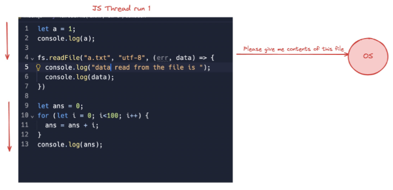
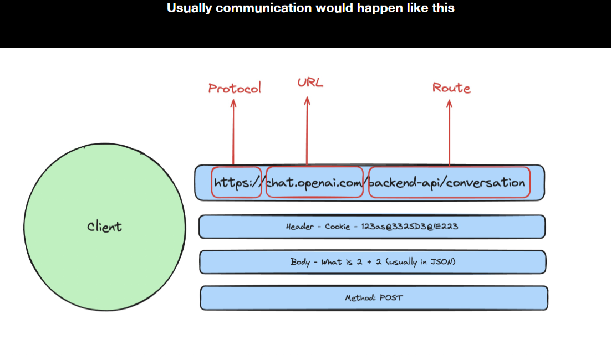
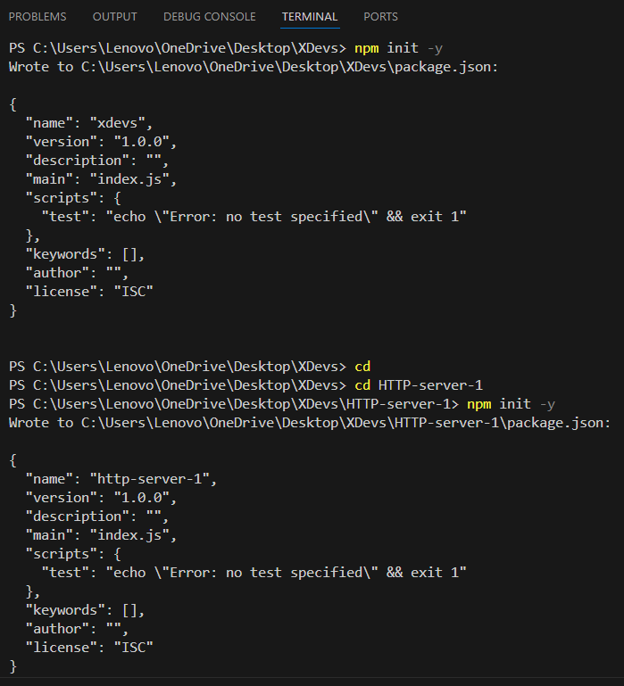

## javascript Engine:
- javascript engine is a program present in web browser that is used to execute javascript code.
- Chrome : V8
- Nodejs : V8
- Firefox : spider-monkey
- Safari : JavaScript-Core
- Edge : Chakra
## Client side vs server side
- Client Side is a device, application, or software component that request and consumes services or resource from a server.
- A server is a device, Computer, or Software application that provides services, resources, or function to a client.
- 
## Difference between static type and dynamic type language
## Json :
- Json is a syntax for storing and transferring data. It is a JavaScript object notation. It is a lightweight data interchange format that is easy to understand and use.
- it consist of key value pair.
```json
{
  "name": "Prince",
  "age": 22,
  "address": {
    "city": "Patna",
    "state": "Bihar",
    "Pin-code": 852220
  }
}
```
## Advantages of JavaScript.
- Less Server Interaction: JavaScript can handle many tasks directly on the client side (in the browser) without needing to send requests to the server. This reduces server load, saves bandwidth, and makes applications faster since fewer round trips are needed to fetch data or perform operations.
- Immediate Feedback to Visitors: JavaScript can validate user inputs (like checking if a form is filled correctly) and show results immediately without waiting for a server response. This provides users with instant feedback, improving the user experience and making applications feel more responsive.
- High Interactivity: JavaScript makes it easy to create interactive elements on a web page, such as sliders, drag-and-drop items, or animations. This level of interactivity helps engage users, making web applications more dynamic and engaging.
- Richer Interfaces: JavaScript enables the development of complex interfaces with features like dropdowns, modals, auto-complete, and custom tooltips, enhancing usability. Libraries and frameworks like React, Angular, and Vue make it easier to build these advanced interfaces efficiently. 

## Disadvantage of javascript
- No support for Multithreading :- it operates on single threaded model means, it can  execute only one task at a time.
- No support for multiprocessing :- JavaScript can’t leverage multiple CPU cores directly to run different processes in parallel. This can limit performance for resource-heavy applications, especially on systems with multiple cores.
- Restricted file system access :- for security purpose javascript running in a web browser, it restricts access to the file system.While the File API allows limited access to user-selected files.
- Limited support for Networking Application :-  JavaScript in the browser has restricted network access. It can perform HTTP requests but lacks lower-level networking capabilities.
## Named function:
- The function which has named at the time of definition is called a named function. 
```js
function msg()  
{  
  console.log("Named Function");  
}  
msg();
```

## Client side and server side
- A client is a device, application, or software component that request and consumes services or resource from a server.
- A server is a device, Computer, or Software application that provides services, resources, or function to a client.

## Difference between var, Let and const.
- Scope:
    - var: Function-scoped. Variables declared with var are function-scoped, meaning they are accessible throughout the function in which they are defined.
    - let and const: Block-scoped. Variables declared with let and const are block-scoped, meaning they are only accessible within the block (enclosed by curly braces) where they are defined, such as a loop or an if statement.
- Hoisting:
    - var: Hoisted. Variables declared with var are hoisted to the top of their containing function or global scope. This means you can access them before they are declared in the code, but they will be initialized with undefined.
    - let and const: Hoisted but not initialized. Variables declared with let and const are also hoisted, but they are not initialized until their declaration statement is executed. Trying to access them before the declaration will result in a ReferenceError.
- Reassignment:
    - var and let: Can be reassigned. Variables declared with var and let can be reassigned new values after their initial declaration.
    - const: Cannot be reassigned. Variables declared with const are read-only and cannot be reassigned once they are given a value. However, it's important to note that for objects and arrays declared with const, their properties or elements can still be modified.
- Temporal Dead Zone (TDZ):
    - var: Variables are not affected by the Temporal Dead Zone (TDZ) because they are hoisted and initialized with undefined.
    - let and const: Variables declared with let and const are affected by the TDZ, which means you cannot access them before their declaration in the code.
- Global Object Property:
    - var: Variables declared with var become properties of the global object (window in a browser or global in Node.js) if declared in the global scope.
    - let and const: Variables declared with let and const do not become properties of the global object when declared in the global scope.
  - NOte 
      - When a variable defined without without any key words like var, let, and const, it is considered as a global variable.

## Types of Data-Types
- Primitive Data-Types
    - can hold only single value. primitive data types are immutable, means there value once assigned cannot be changed.
    - it is simple data type. Numbers, Strings, Booleans, Null, Undefined
- Non-Primitive Data-Types  
    - it can holds multiple values and methods.
    - it is a complex type data types. Objects,Arrays,Functions,Date,Regexp
## Difference between null and undefined in JS:
- null 
    - it is used to explicitly define an empty value.
    - when you want to assign a variable a value that represents "no value"
    - type of null returns "object" 
    - null == undefined is true because they are loosely equal.
    - null === undefined is false because they are of different types.
- undefined
    - it means a variable has been declared but has not been assigned a value.
    - type of undefined returns "undefined"
## type coercion::
- Automatic conversion of a values from one data-type to another during certain operation and comparison.
- it is used during string and number concatenation and comparison.
## type of opeartor based on number of operands
- unary operator: single operand
```js
let a = 10
let b = 20
```
- binary operator: two operands
```js
let a = 10
let b = 20
let c = a + b;
console.log(c);             // 30
```
- ternary operator: three operands
```js
let a = 10
let b = 20
let result = a > b ? "a is greater" : "b is greater";
console.log(result);            // b is greater
```
## short circuiting
- it stop the execution as soon as the result can be determined without evaluating the remaining sub-expressions.
```js
let result = false && someFunction();
console.log(result);            // false
```
```js
let result = true || someFunction();
console.log(result);            // true
```
## Types of conditional statements
1. if/else statement:
```js
let age = 18;
if (age >= 18) {
    console.log("You are eligible to vote");
} else {
    console.log("You are not eligible to vote");
}


let age = 18;
if (age >= 18) {
    console.log("You are eligible to vote");
} else if (age < 18) {
    console.log("You are not eligible to vote");
} else {
    console.log("Invalid age");   
}
```
2. ternary operator:
```js
let y= 20 ;
let z = y > 10 ? "y is greater than 10" : "y is less than 10";
console.log(z);
```
3. switch statement:
```js
let a =5 ;
switch (a) {
  case 1 :
    console.log("one");
    break;
  case 2 :
    console.log("two");
    break;
  case 5 :
    console.log("five");
    break;
  default :
    console.log("other");
}
```
## What is the difference between == and === ?
- == (Loose equality operator): compares two values for equality after performing type coercion.
- === (Strict equality operator): compares two values for equality without performing type coercion.
- == and === have different behavior when used to compare different data types. === performs type coercion while == does not.
     ```javascript
     let x = 10;
     let y = "10";
     console.log(x == y); // Output: true
     console.log(x === y); // Output: false
     ```
- normally === is used to compare the value and type of two variables.
## Array:
- An array is data type that allows you to store multiple values in a single variable.
```js 
let arr = [1, 2, 3, 4, 5];
console.log(arr.length); // output 5
console.log(arr[0]); // output 1
arr[0] = 10;
console.log(arr); // output [10, 2, 3, 4, 5]
``` 
- push() : will modify the original array it self.
```js
let arr = [1, 2, 3, 4, 5];
arr.push(6);
console.log(arr); // output [1, 2, 3, 4, 5, 6]
```
. concat() : will create the new array and not modify the original array.
```js
let arr1 = [1, 2, 3, 4, 5];
let arr2 = [6, 7, 8, 9, 10];
let arr3 = arr1.concat(arr2);
console.log(arr3); // output [1, 2, 3, 4, 5, 6, 7, 8, 9, 10]
```
. pop() : will remove last element of the array and modify the original array.
```js
let arr = [1, 2, 3, 4, 5];
arr.pop();
console.log(arr); // output [1, 2, 3, 4]
```
. shift() : will remove first element of the array and modify the original array.
```js
let arr = [1, 2, 3, 4, 5];
arr.shift();
console.log(arr); // output [2, 3, 4, 5]
```
- splice() : will used to add, remove, or replace elements in an array.
```js
let arr = [1, 2, 3, 4, 5];
arr.splice(1, 2, 6, 7);
console.log(arr); // output [1, 6, 7, 4, 5]
```
## find, filter, slice method in array:
- find : get first element that satisfies condition.
```js
let arr = [1, 2, 3, 4, 5];
let result = arr.find((num) => num > 2);
console.log(result); // output 3
```
- filter : get an array of elements that satisfies condition
```js
let arr = [1, 2, 3, 4, 5];
let result = arr.filter((num) => num > 2);
console.log(result); // output [3, 4, 5]
```
- slice : get a subset of array from start index to end index (end not included).
```js
let arr = [1, 2, 3, 4, 5];
let result = arr.slice(1, 3);
console.log(result); // output [2, 3]
```

## String Built in methods
```javascript
let myString = "Prince"
console.log(myString.length) // output 7
console.log(myString.toUpperCase) // output PRINCE
console.log(myString.chatAt('0')) // output p
console.log(myString.indexOf(P)) // output 0
console.log(myString.substring(0, 4)) // output Prin
console.log(myString.slice(0, 4)) // output Prin // it follows negative indexing also 
let newString = "   Prince   " 
console.log(newString.trim()) // output "Prince" // it removes extra spaces
let url = "https://PrinceKumar%20gmail.com"
console.log(url.replace('%20', '@'))// output: https://PrinceKumar@gmail.com
let url = "https://PrinceKumar%20gmail.com"
console.log(url.includes('sss')) // output: false 
// it search provided data inside given string if found then return true otherwise false
let name = "Prince Kumar"
console.log(name.split(' ')) // output: ["Prince","Kumar"]

// it separates the strings as per given data here we pass space so it separates by coma(,)where spaces are present.
```

## DOM(Document object model)
- It represent a web page as a tree like structure that allows javascript to dynamically access and manipulate the content and structure of a web page.

## Data-types 
- It determine type of a variable
-  Primitive 
     1. Numbers
     2. string 
     3. boolean
     4. undefined
     5. null
- non-primitive
     1. Object 
     2. array 
     3. function
     4. date
     5. Regexp


## map, filter, reduce
- map 
  - it is used to create a new array from an existing array
    ```JS
    const nums = [1,2,3,4,5]
    const multiplyThree = nums.map((num, i, arr)=>{
        return num * 3
    }) 
    console.log(multiplyThree);   // [ 3, 6, 9, 12, 15 ]
    ```
- filter
  - Filter methods take each element in an array and apply the conditional statement against it if the statement is true it will be added to the new array else it will not be added to the new array
    ```JS
    const nums = [1,2,3,4,5,6]
    console.log(nums);                      // [1,2,3,4,5,6]
    const evenNums = nums.filter((num)=>{
        return num % 2 == 0
    })
    console.log(evenNums);                  // [2,4,6]
    ```
- reduce
  - the reduce method is used to reduce an array to a single value
    ```JS
    const nums = [4,5,6,7,8,9];
    console.log(nums);                      // [4,5,6,7,8,9]
    const sum = nums.reduce((acc, curr , i , arr ) =>{
        return acc + curr;
    },0)
    console.log(sum);                       // 39
    ```
## Array sort
```js
const nums = [9,5,4,7,6,8];
console.log(nums);                       // [9,5,4,7,6,8];
const sorted = nums.sort();
console.log(sorted);                     // [4,5,6,7,8,9]
```
# Loops in JS 
- A loop is programming way to loop a piece of code repeatedly until a certain condition is met.
## for loop 
- for loop allows to iterate a block of code a specified number of times.
- for loop is better for condition and better for initialization and with increment because all can be set in just one line of code.
```js
for (let i = 0; i < 10; i++) {
    console.log(i);                 // 0, 1, 2, 3, 4, 5, 6, 7, 8, 9
}
```
## for in loop
- it is used to iterate over the properties of an object.
- it allow you iterate over the key of an object and access the value associated by using keys as the index.
```js
const obj = { a: 1, b: 2, c: 3 };
for (const key in obj) {
  console.log(key, obj[key]);     // a 1, b 2, c 3
}
```
## for of loop
- this is used to loop through the values of an object like arrays string.
- it allow you to access each value directly without having ti use an index.
```js
const arr = [1, 2, 3, 4, 5];
for (const num of arr) {
  console.log(num);               // 1, 2, 3, 4, 5
}
```
## while loop:
- while loop execute a block of code as long as the condition is true.
- while loop is better when there is only condition, no initialization and no increment
```js
let i = 0;
while (i < 10) {
  console.log(i);                 // 0, 1, 2, 3, 4, 5, 6, 7, 8, 9
  i++;
}
```
## Do-While:
- the do-while loop is similar to the while loop, except that the block of code is executed at least once, even if the condition is false.
```js 
let i = 0;
do {
  console.log(i);                 // 0, 1, 2, 3, 4, 5, 6, 7, 8, 9
  i++;
} while (i < 10);
```
## Break and continue:
- Break:
    - the break statement is used to exit a loop or switch statement.
    ```js
    for (let i = 0; i < 10; i++) {
      if (i === 5) {
        break;
      }
      console.log(i);             // 0, 1, 2, 3, 4
    }
    ```
- Continue:
    - the continue statement is used to skip the rest of the code inside a loop or switch statement and continue with the next iteration.
    ```js
    for (let i = 0; i < 10; i++) {
      if (i === 5) {
        continue;
      }
      console.log(i);             // 0, 1, 2, 3, 4, 6, 7, 8, 9
    }
    ```
## Difference between map and foreach.
- both are used to iterate over an array.
> Key difference
  - purpose and return value
    - map : creates a new array with the result of the callback function. it is used when you want to transform the element and get a new array as a result.
    - foreach : Executes a provided function once for each array element but does not return anything. It is used when you want to perform side effects like logging or modifying elements in place without creating a new array.
  - When to use :
    - map : when you need to transform an array and store the result in a new array.
    - foreach : when you want to execute a function on each item in the array but do not need a return value.
  - map : 
      ```js
        const numbers = [1, 2, 3, 4];
        const doubled = numbers.map(num => num * 2);
        console.log(doubled); // Output: [2, 4, 6, 8]
      ```
  - foreach :
      ```js
        const numbers = [1, 2, 3, 4];
        numbers.forEach(num => console.log(num*2));
        console.log(numbers); // Output: [2, 4, 6, 8]
      ```
# Functions 
## Named function:
- The function which has named at the time of definition is called a named function. 
- use named function fro big and complex logic. when you want to reuse the function at multiple place.
```js
function msg()  
{  
  console.log("Named Function");  
}  
msg();
```
## Function expression  
- when we store function inside a variable it is called function expression.
```js
cons square = function(num){
    return num * num
}
```
## anonymous function
- a function without a name is called anonymous function.
- use for small logic. want to use in a single place.
```js
const square = function(num){
    return num * num
}
```
## callback function 
- A callback function is a function passed as an argument to another function. The callback function is executed after some operation is completed.
```js
function functionName(param1 , param2 , callback){
    console.log(param1);        // 10
    console.log(param2);        // 20
    callback();
}
functionName(10 , 20 , function(){
    console.log("callback function");
})
```
Example: 
```js
document.addEventListener('click' , function(params){
    console.log("hello");
})
```
## Arrow function :
- it is a compact syntax to writing a function
```js
const add = function (num1 , num2){
    console.log(num1 + num2);
}                                     // This is a normal function
```
```js
const add = (num1 , num2) => {
    console.log(num1 + num2);
}                                     // This is an arrow function
```
## High Order function :
- Takes a function as an argument or returns a function as result.
```js
const add = (num1 , num2) => {
    console.log(num1 + num2);             // 30
}
const multiply = (num1 , num2) => {
    console.log(num1 * num2);             // 50
}
const higherOrder = (num1 , num2 , callback) => {
    callback(num1 , num2);          
}
```
## first class function:
- In a language where a function can be treated like a variable, it is called a first-class function.
```js
const square = function(num){
    return num * num
}
function display(fn){
    console.log(square(5))
}
display(square);          // 25
```
## pure and impure function
- Pure function : a future function always produces the same output for the same input.
```js
function add(a,b){
  return a+b;
} 
console.log(add(10,20)); // 30
console.log(add(10,20)); // 30
```
- impure function : a impure function different output for the same input.
```js 
let total = 0;
function addTotal(value){
  total += value;
  return total;
}
console.log(addTotal(10)); // 10
console.log(addTotal(10)); // 20
```
## Function currying:
- currying in javascript transform a function with multiple arguments into a nested series of functions, each taking a single argument.
```js 
function multiply(a,b){
  return a*b;
}
function curriedMultiple(){
  return function(b){
    return a*b;
  }
}
const double = curriedMultiple(5); 
console.log(double(10));                // 50
```
## IIFE
- IIFE stands for Immediately Invoked Function Expression
- we wrap a function in parenthesis and call the function right there.
```js
(function(num){
    return num * num
})(5)                     // 25
```
## hoisting in term of function 
- Hoisting is a JavaScript mechanism where variables and function declarations are moved to the top of their scope before code execution.
- in case of function declaration it is hoisted completely.
```js
functionName();
function functionName(){
    console.log("hello");       // hello
} 
```
```js
var x = 20 ;
function functionName(){
    console.log(x);             // undefined 
    var x = 10
}
functionName();
// here we get undefined because of hoisting in hosting process create a separate execution context for function declaration.
```
## params vs argument
- params are the variables that are declared inside a function and arguments are the values that are passed to the function when it is called.
```js
function functionName(param1 , param2 ){    // Parameters / params
    console.log(param1);        // 10
    console.log(param2);        // 20
}
functionName(10 , 20)                      //Arguments     
```
## spread vs rest
- spread : spread operator is used to expand or spread elements from an iterable (such as an array, string, or object) into individual elements.
- use case : copying an array, merging arrays, or passing multiple arguments to a function.
- Rest : the rest operator in function parameters to collect all remaining arguments into an array.
```js
let arr = [1,2,3,4,5];
let arr1 = [...arr, 6,7,8];
console.log(arr1);         // [1, 2, 3, 4, 5, 6, 7, 8]
``` 
```js
function sum(...nums){                  // ...nums this is called rest operator
    console.log(nums[0] + nums[1]);
}
let arr = [1,2]
console.log(sum(...arr))      // 3      // ...arr this is called spread operator
```
- rest parameter is must be the last formal parameter.

## Lexical scope:
- A variable defined outside a function can be accessible in inside of another function after a variable declaration but vice versa is not true.
```js
var userName = "Hitesh";        // Global scope
function functionName(){
     console.log(userName);
}
functionName();
```
```js
function functionName(){
    var userName = "Sourabh";      // Local scope
}
functionName();
console.log(userName);              // undefined
```
## closure:
- A closure is a js function that remembers nad can access its own scope, the scope of the parent function, and the global functions even after the parent function has finished executing.
```js
function OuterFunction (){
    var outerVariable = 42;
    function InnerFunction(){
        var Innervariable = 43; 
        console.log(outerVariable);         // 42
    }
    InnerFunction();
    console.log(Innervariable);             // undefined
}
OuterFunction();
```
- A closure gives you access to an outer function's scope from an inner function.
## Error handling:
- it is the process of managing errors in a program.
## Throw statement:
```js
function userData(){
  try{
    validateUserAge(25);
    validateUserAge("invalid");
    validateUserAge(15);
  }
  catch(error){
    console.error("error", error.message);
  }
  function validateUserAge(age){
    if(type of age !== "number"){
      throw new Error("age must be a number");
    }
    console.log("User age is valid");
  }
}
```
## Types of error:
1. Syntax error
```js
console.log("hello";            // missing closing parenthesis
```
2. Reference error
```js
console.log(myVariable);        // myVariable is not defined
```
3. Type error
```js
const number = 42 ;
console.log(number.toUpperCase); // TypeError: number.toUpperCase is not a function
```
4. Range error
```js
const array = [1,2,3,4,5];
console.log(array[10]);          // RangeError: index out of range
```
# Objects
## Objects in JS:
- A object is a data type that allows you to store key value pairs.
## Ways to create objects:
1. Object literals
```js 
const person = {
    name : "Prince",
    age : 25,
    city : "delhi",
    country : "India" 
}
console.log(person);            // { name: 'Prince', age: 25, city: 'delhi', country: 'India' }
```
2. object constructor:
```js
var person = new Object();
person.name = "Prince";
person.age = 25;
person.city = "delhi";
person.country = "India";
console.log(person);            // { name: 'Prince', age: 25, city: 'delhi', country: 'India' }
```
3. Object.create() Method:
```js
var person = {
  name :"",
  age : 0 ,
  role : ""
}
var men = object.create(person);
men.name = "Prince";
men.age = 25;
men.role = "student";
console.log(men);               // { name: 'Prince', age: 25, role: 'student' }
```
## add, modify, delete properties oof an object:
```js
var person = {
    name : "Prince",
    age : 25,
    city : "delhi",
    country : "India" 
}
person.age = 30;              // Modifying properties 
person.state = "UP";          // Adding properties
delete person.city;           // Deleting properties
console.log(person);          // { name: 'Prince', age: 30, country: 'India', state: 'UP' }
```
# DOM (Document Object Model)
- represent a web page as a tree like structure that allows javascript to dynamically access and manipulate the content and structure of a web page.
## DDom Methods:
- Selecting Dom elements
    - getElementById(id)
    - getElementsByClassName(className)
    - querySelector(selector)
    - querySelectorAll(selector)
    - getElementsByTagName(tagName)
    - getElementsByName(name)
- modifying Dom elements
    - textContent()
    - innerHTML
    - setAttribute(name, value)
    - removeAttribute(name)
    - style.property
- Creating and appending elements
    - createElement(tagName)
    - appendChild(element)
    - cloneNode(deep)
- Removing elements
    - remove()
    - removeChild(element)
- Adding and removing event listeners
    - addEventListener(type, listeners)
    - removeEventListener(type, listeners)
## Event handling
- event handling is the process of responding to user actions or events in a web application.
- the addEventListener method of javascript allow to attach n event name and with the function you want to perform on that event.
- click Event : addEventListener('click' , handler)
- hover Event : addEventListener('mouseover' , handler)
- keyDown Event : addEventListener('keydown' , handler)
- keyUp Event : addEventListener('keyup' , handler)
- Submit Event : addEventListener('submit' , handler)
- focus Event : addEventListener('focus' , handler)
- blur Event : addEventListener('blur' , handler)
- change Event : addEventListener('change' , handler)
- load Event : addEventListener('load' , handler)
- resize Event : addEventListener('resize' , handler)
## try catch and final block:
```JS
try {
    // try block
} catch (error) {
    // catch block
} finally {
    // finally block
}
```

***********************************************************************************************************
# 100xDev
## Callbacks

```javascript
function square(n){
  return n*n;
}

function cube(n){
  return n*n*n;
}

function sumOfSquares(a,b){
  let square1 = square(a)
  let square2 = square(b)
  return square1 + square2;
}
function sumOfCubes(a,b){
  let cube1 = cube(a)
  let cube2 = cube(b)
  return cube1 + cube2;
}

let ans1 = sumOfSquares(1,2);
console.log(ans1);      // output : 5

let ans2 = sumOfCubes(1,2);
console.log(ans2);      // output : 9
```
- lets just understand the code and figure out the problem
- you can see that one of thing which we are violating here is DRY(Donot repeat yourself).
- instead we can do this make a generic function and call a function as a third parameter inside the generic function

```javascript
function square(n){
  return n*n;
}

function cube(n){
  return n*n*n;
}
function quad(n){
  return n*n*n*n;
}
// Generic function - Accepting a function as an argument
function sumOfSomething(a, b, callBackFn){
  let square1 = callBackFn(a)
  let square2 = callBackFn(b)
  return square1 + square2;
}
// Passing a function as an argumet 
let ans1 = sumOfSomething(1,2 , square);
console.log(ans1);      // output : 5

let ans2 = sumOfSomething(1,2 , cube);
console.log(ans2);      // output : 9

let ans3 = sumOfSomething(1,2, quad);
console.log(ans3)       // output : 17

```
- this is call back actully in which passing a function as an argument
> javascript is a single threading language
## Async function
What is async? - Asynchronous 
Your javascript thread doesn’t have access to everything immediately There are some tasks it needs to wait for 

For example -  
1. Reading a file 
2. Sending a network request 
3. A deliberate timeout

> lets assume there is a file in your sytem name a.txt the javascript dont have access to read the file. for that you use some js function to reda the file from system with the help of JS. and after that function other code functionalitty code also written. so if the file read system is taking two much time, the other functionality code is waiting for to execute in that scenario Async came into picture..

> Async call - for the time function filesystem taking file from system and reading the file do the other things.




```javascript
let a =1 ;
console.log(a);
fs.readFile("a.text", "utf-8", (err, data) => {
  console.log("data read from the file is ");
  console.log(data);
})
let ans = 0 ;
for(let i= 0 ; i<100; i++){
  ans= ans+i;
}
console.log(ans); 
```
goto http://latentflip.com/loupe/?code=Y29uc29sZS5sb2coImhpIik7CmZ1bmN0aW9uIG9uRG9uZSgpewogICAgY29uc29sZS5sb2coIkNsaWNrIHRoZSBidXR0b24iKQp9CgpzZXRUaW1lb3V0KG9uRG9uZSwgNTAwMCk7CmNvbnNvbGUubG9nKCJzc3RhY2sgY29tcGxldGVkIikK!!!PGJ1dHRvbj5DbGljayBtZSE8L2J1dHRvbj4%3D and runt the above given code to visualize the how javascript single threading call stack is working.

- here OnDone is not your own api, you are saying a api to complete the task for me and whenever task is completed let me know.
- Then here a big Question mark is coming what about if we create our own api.

```javascript
const fs = require ('fs')
function princeReadFile(callBack){
  fs.readFile("a.text", "utf-8", function(err , data){
    callBack(data);
  });
}
function onDone(data){
  console.log(data)
}
princeReadFile(onDone)
```
- but this is ugly of wwriting code, the function princeReadFile it is just a wrapper on top of another async function, which is fine. 
- Usually all async functions you will write will be on top of JS provided async function like settimeout and fs.readFile.
- the right way to write the code wiit the help of promises
## Promises
-  Just syntactical sugar.
- Just a more readable way to write async functions.
- Can you write JS without them Yes - Just use callbacks.
> cleaner way to write code with the help of Promise

```javascript
const fs = require ('fs')
function princeReadFile(){
  return new Promise(function(resolve){
    fs.readFile("a.txt", "utf-8", function(err , data){
      resolve(data);
    });
  });
}
function onDone(data){
  console.log(data)
}
princeReadFile().then(onDone);
```
> Promise tree


<text style="color:red ; font-size:20px ; font-weight:bold" > Basic Cmd command</Text>

- cd (Locate the current directory)
- cd fileName (Move to the file) 
- cd.. (One step back in folder tree)
- dir  (List of file available in current directory)
- mkdir fileName (create folder in currrent directory)
- vi (to read and write the file ) this one is quite complicated make a search before doing this.
-  move fileName.extension FolderName (use move file to another folder) (you can also move a folder to another Folder)
-  copy fileName.extension FolderName (use copy file one folder to another folder)


## Nodejs and it's runtime

> EcmaScript
- It is a scripting language specification on which javascript is based. or we can say this is the standard way to write javascript. 
- It serves as the guide line and rules fro scripting language design.
- here is the link https://tc39.es/ecma262/#sec-numbers-and-dates
>JavaScript
- It is scripting language that conforms the EcmaScript specification.
Ex - Date, var, let, const, function
- Apart from ES specfication it includes additional features that are not part of ES Like he document object model (DOM) manipulation, which is cricial for webdevelopment.
Ex -    setTimeout, fs.readFile
- generally every browser (V8 fro google chrome) has a engine which compile and run the JS code or we can say convert ot 0 & 1.
>Node.js
- it is runtime(something that can run javascript or compile javascript)
- Some smart people took out the V8 engine  
Added some Backend things (filesystem reads) on top 
to create a new runtime to compete with Backend languages 
like java
>Bun
- Other than the fact that JS is single threaded, Node.js is slow (multiple reasons for it) Some smart people said they wanted to re-write the JS runtime for the backend and introduced Bun.
- It is a significantly faster runtime 
 
- It is written in Zig
- https://github.com/oven-sh/bun
> HTTP(Hyper text transfer protocol)
- A protocol that is defined for machines to communicate..
- Specifically for websites, it is the most common way for your 
website’s frontend to talk to its backend.
A protocol that is defined for machines to communicate 
2. Specifically for websites, it is the most common way for your 
website’s frontend to talk to its backend

> What are the common methods you can send to your BE server? 
1. GET 
2. POST 
3. PUT 
4. DELETE
> What are the common status codes the backend responds with? 
1. 200 - Everything is ok 
2. 404 - Page/route not found 
3. 403 - Authentication issues 
4. 500 - Internal server error

And other status codes are also avaiable.
 > Creating a HTTP Server 
1. select a folder in vs code nad open the developer shell
2. run the command [*npm init -y*]

 It will Create a file inside the folder name package.json 
 3. Create a new file inseide the folder index.js
 4. *npm install express* run this command to install express locally
```Javascript
> Index.js 
const express = require('express')
const port = 3000
const app = express();
// ti is similar to fs.readFile("path" , "utf-7" , ())
app.get('/prince/1', function(req, res){
    res.send({
        name: "prince", 
        age : 28
    })
  })

app.get('/', function(req, res){
  res.send('Hello World!')
})

app.listen(port)
```
5. **node Indexx.js**  Run this command and open **localhost:3000** in your browser .
6. there you can see the output **Hello World!**