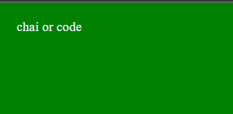

## JAVASCRIPT 
#### runtime environment:- Node.Js, Deno.Js, Bun.Js
In JavaScript, var, let, and const are used to declare variables, but they have some key differences:
- Scope:
- var: Function-scoped. Variables declared with var are function-scoped, meaning they are accessible throughout the function in which they are defined.
- let and const: Block-scoped. Variables declared with let and const are block-scoped, meaning they are only accessible within the block (enclosed by curly braces) where they are defined, such as a loop or an if statement.
- Hoisting:
- var: Hoisted. Variables declared with var are hoisted to the top of their containing function or global scope. This means you can access them before they are declared in the code, but they will be initialized with undefined.
    - let and const: Hoisted but not initialized. Variables declared with let and const are also hoisted, but they are not initialized until their declaration statement is executed. Trying to access them before the declaration will result in a ReferenceError.
- Reassignment:
- var and let: Can be reassigned. Variables declared with var and let can be reassigned new values after their initial declaration.
- const: Cannot be reassigned. Variables declared with const are read-only and cannot be reassigned once they are given a value. However, it's important to note that for objects and arrays declared with const, their properties or elements can still be modified.
- Temporal Dead Zone (TDZ):
- var: Variables are not affected by the Temporal Dead Zone (TDZ) because they are hoisted and initialized with undefined.
- let and const: Variables declared with let and const are affected by the TDZ, which means you cannot access them before their declaration in the code.
- Global Object Property:
-var: Variables declared with var become properties of the global object (window in a browser or global in Node.js) if declared in the global scope.
-- let and const: Variables declared with let and const do not become properties of the global object when declared in the global scope.
-- OPERATORS:
-- Equal (==): Compares two values for equality, but it performs type coercion if the values have different data types. This means that it can consider values of different types as equal.
5 == "5"; // true (type coercion)
-- Not Equal (!=): Compares two values for inequality, performing type coercion if necessary.
5 != "10"; // true (type coercion)
-- Strict Equal (===): Compares two values for equality without type coercion. It checks if both the value and data type are the same.
5 === 5; // true
5 === "5"; // false (strict comparison)
-- Strict Not Equal (!==): Compares two values for inequality without type coercion.
5 !== "5"; // true (strict comparison).

-- Ternary Operator (conditional operator): A shorthand way to write a simple conditional statement. It evaluates an expression and returns one of two values depending on whether the expression is true or false.
-- ex: condition ? valueIfTrue : valueIfFalse;
-- ex: const result = 20 == 20? "value match":"not matched";
console.log(result);
we can also do like ex:
if(20===200){
  console.log("value match");
}
else{
  console.log("not matched");
} 

```
"use strict";
```
 treat all js code as new version.
``` javascript
alert(3+3)
```
 - here we are using nodejs not browser to it has to written in diffrent way.
-  code readability should be heigh.
- number -> 2 to the power of 53 is the range.
- bigint->if number is large.
- boolean -> truem/false.
- null -> it is treated as type because it is a standalone value.
- example->if we need to get temperature and if server failed to send any value then there is no offerd value for temperature variavble 
- then we can't take it 0 because it a value and not provided by server. in this case we take null.
- undefined -> value not assigned yet.
- typeOf -> used to check type of data.
- these are asked in interviews.

``` javascript 
console.log(typeof(null)) // output: object
console.log(typeof(undefined)) // output: undefined
```
## Type casting
here in javascript typecasting works in diffrent way like lets understand this by convertnig some datatypes.
``` javascript
//string to number
let a = "33abc"
let b = Number(a)
console.log(b) // output: NaN
console.log(typeof(b)) // output: Nubmer

//number, empty string and string to boolean
let a = 1
let b = Boolean(a)
console.log(b) // output: true
console.log(typeof(b)) // output: boolean

let a = ""
let b = Boolean(a)
console.log(b) // output: false
console.log(typeof(b)) // output: boolean

let a = "sourabh"
let b = Boolean(a)
console.log(b) // output: true
console.log(typeof(b)) // output: boolean

``` 
## Operations:
### here we will see some weired behaviour of operators with diffrent data types:
```javascript
console.log("2">1) // output: true
console.log("02">1) // output: true

```
- in javascript >, ==, >= these operators works diffrently we can not relay on predictable results.
- in this case strings are getting converted into number and then compairision is done but one thing to notice that this is not fair comparison.
- type script does not allow these kind of comparisons.
```javascript
console.log(null>0) // output: false
console.log(null==0) // output: false
console.log(null>=0) // output: true 
//in this case null is converted to 0 thats why output is true.
```
```javascript
console.log(undefined>0) // output: false
console.log(undefined==0) // output: false
console.log(undefined>=0) // output: false 
```
## Note: 
#### we always try to avoid these sort of conversions because they may create confusions ans due to this developer will distract from their primary work and he will try to find out why these conversions are showing inconsistance results.

## Data Type Summery:
- Primitive(7-types): string, number, boolean, null, undefined, symbol, BigInt.
- Non-Primitive: Arrays, Objects, functions.
- to provide uniqueness to any data we declare it as a symbol.
#### lets see in code:
```javascript
const id = Symbol('123')
const anotherId = symbol('123')
console.log(id===anotherId) // outrput: false
// here we are getting false in output even if both of this is same because they are declare as symbol so it makes them unique even if they have same values.
```
#### typeof function:
##### Documentation link: 
#### https://262.ecma-international.org/5.1/#sec-11.4.3
this is used to check the data type of any value. value may be either primitive or non-primitive. most of the times it returns object as type of non-primitive values.
#### lets see this in code how it works:
```javascript
let prsonalDetails = {
    Name: "Sourabh",
    Age: 27
 };
 console.log(typeof personalDetails);
 //output: object
 let prsonalDetails = ["sourabh", 27];
 console.log(typeof prsonalDetails);
 //output: object
 let prsonalDetails = function(){
    let Name = "Sourabh"
    let age = 27
};
 console.log(typeof prsonalDetails);
 //output: function
 // this is also called function object
function prsonalDetails(){
    let Name = "Souyrabh"
    let age = 27
};
 console.log(typeof prsonalDetails);
//output: function
let temperature = null
console.log(typeof temperature)
//ouptput: object
let score = 12.3
console.log(typeof score)
//output: number
const id = Symbol('123')
// output: symbol
```
#### How to declare bigInt:
```javascript
let bigIntNum = 2324423456767787754n
console.log(typeof bigIntNum)
// output: bigint
```
## Memory management in JavaScript:
So there are two types of memory:
1. Stack 
2. heap.
- when we declare any primitive data it will be stored inside stack and when we use that data in our program the copy of that value is passed so if we modify the value of that data then original value will remains unchanged and modified value will store in diffrent memory location.
```javascript
let myName = "Sourabh"
let anotherName = myName
anotherName = "Pardhi"
console.log(myName) // output: Sourabh
console.log(anotherName) // output: Pardhi
// here we can see that original value remain unchanged because copy of myName is passed to anotherName.
let myDetails = {Name: "Sourabh", Age:27}
let otherDetails = myDetails
otherDetails.Name = "Pardhi"
console.log(myDetails.Name) // output: Pardhi
console.log(otherDetails.Name) //output:Pardhi
// here we found that after changing value in another varriable the original value also changed because reffrence of myDetails is passed to otherDetails.

```
## String:
#### string interpolation:
its a way of concating strings and varriables. In modern days we avoid using + operator to concat strings and variables.
lets see in code: 
```javascript
let name = "Sourabh"
let age = 27
console.log("my name is " + name + " and my age is " + age)
// output: my name is Sourabh and my age is 27
// this is not good way of dealing with strings and variables
let name = "Sourabh"
let age = 27
console.log(`my name is ${name} and my age is ${age}`);
// output: my name is Sourabh and my age is 27
// this is good way of dealing with strings and variables
```
```javascript
// another way of declaring string
let myString = new String('Sourabh')
let name = "Sourabh"
console.log(name.__proto__); // output: {}
//if we run this on console then we will see that each character of this string is saved in object in form of key vlaue pairs and their key will start from 0. So do not get confussed with strings that they are saved as object not as array. 
```
## BuiltIn Methods and functions:
```javascript
let myString = "Sourabh"
console.log(myString.length) // output 7
console.log(myString.toUpperCase) // output SOURABH
console.log(myString.chatAt('0')) // output S
console.log(myString.indexOf(S)) // output S
console.log(myString.substring(0, 4)) // output Sour
console.log(myString.slice(0, 4)) // output Sour // it follows negative indexing also 
let newString = "   Sourabh   " 
console.log(newString.trim()) // output "Sourabh" // it removes extra spaces
let url = "https://sourabhpardhi%20tcs.com"
console.log(url.replace('%20', '@'))// output: https://sourabhpardhi@tcs.com
let url = "https://sourabhpardhi%20tcs.com"
console.log(url.includes('sss')) // output: false 
// it search provided data inside given string if found then return true otherwise false
let name = "sourabh pardhi"
console.log(name.split(' ')) // output: ["sourabh","pardhi"]

// it saperates the strings as per given data here we pass space so it saperates by coma(,)where spaces are present.
```
# map() function:
- this function applied on array and it recieve an argument which has to be a callback function and that function is called for each elements of the array:
```javascript
const input = [2,3,4,5];
const ans = input.map((i)=>{
  return i*2;
});
console.log(ans);
```
## filter() function:
- this function used to filterout elements as per our choice from an array. Filterout we need to pass a function which includes logic for the filtering purpose.
```javascript
const input = [2,3,4,5]
function filterlogic(i){
  if(i%2==0){
    return true;
  }
  else{
    return false;
  }
}
const ans = input.filter()
```
## More for Strings and Numbers: 
```javascript
let num = "34"
console.log(parseInt(num)) // output: 34
let num = 3.14
console.log(parseInt(num)) // output: 3
let num = "42px"
comsole.log(parseInt(num)) // output: 42
let num = "asdfg42px"
comsole.log(parseInt(num)) // output: NaN
let balance = 100
console.log(balance.toString()) // output: 100
console.log(balance.toFixed(2)) // output: 100.00

//we can fixed upto any decimal value.

let otherNumber = 23.889
console.log(balance.toPrecision(3)) // output: 23.9

//while working with the precision focus on your value which has to be rounded off upto which digit like here we gave value upto 3 it means it will go to 3rd value which is 8 and it check that next value of of 8 is also 8 so it will make this 8 as 9 after rounding off. if i will give it 2 then it will go to 3 and check next value of 3 is 8 so it will round off and make 3 as 4. if we give 1 then it will go to 2 and after round off value will become 2e+1. so be carefull while working with toPresision().

let hundreds = 1000000
console.log(hundreds.toLocaleString()) // output: 1,00,000
// so it will generate value with comma and it is bassed on US standerd to make it according to indian standerd pass ('en-IN') this in method.

```
- in javascript while working with numbers there we got alot of inbuild methods you can check them by going to console and type Number. then you will get multiple methods like MIN_VALUE, MAX_VALUE, MIN_SAFE_INTEGER, MAX_SAFE_INTEGER etc.
## Maths in JS:
Math in js is an inbuilt default library using this we can do many things to a number there are many methods which gives us various mathematical calculations and properties directly.
To have more idea about Math go to console and type Math then you will see many methods are there inside Math library.
- here we discuss few of them:
```javascript
console.log(Math.abs(-1)) // output: 1
console.log(Math.round(4.6)) // output: 5
console.log(Math.ceil(4.3)) // output: 5
console.log(Math.floor(4.6)) // output: 4
console.log(Math.max(2,3,4,6)) // output: 6
console.log(Math.min(2,3,4,6)) // output: 2
```
#### random() is very important method in js we have to work with it alot so this method gives us random values between 0 and 1 but we need more specific values sometime so we will understand how can we deal with random() in such scenarios:
```javascript
console.log(Math.random())
let min = 10
let max = 20
console.log(Math.floor(Math.random()*(max-min+1)+min))
// now we will get values between 10 and 20 always.
//so thats how according to the scenarios we have to work with random().
```
## Working with Dates in js:
- Dates are very important data in js bcz we have to deal with it more oftenly.
- see in code how to work with Dates:
```javascript
let myDate = new Date()
console.log(myDate) // output: 2023-11-03T18:50:17.173Z
// this is provided by the console not readable properly.

//To read this data proprly lets call some string metods.

console.log(myDate.toString())
// output: Sat Nov 04 2023 00:22:53 GMT+0530 (India Standard Time)
// this makes more sense

console.log(myDate.toDateString())
// output: Sat Nov 04 2023
// this is one of the format 

console.log(myDate.toLocaleString())
// output: 4/11/2023, 12:25:34 am

//lets check the type of Date()
let myDate = new Date()
console.log(typeof myDate) // output: object
 
 // lets create our own date
 let myCreatedDate = new Date(2023, 0, 03)
 console.log(myCreatedDate) // output: 2023-01-02T18:30:00.000Z
 console.log(myCreatedDatetoDateString()) // output: Tue Jan 03 2023
 // here we pass month as 0 and we get jan as output so in js months starts from 0.

 let myCreatedDate = new Date(2023, 0, 3, 5, 3)
console.log(myCreatedDate.toLocaleString()) 
// output: 3/1/2023, 5:03:00 am
// thru toLocaleString() this method time also included

 let myCreatedDate = new Date("2023-01-23")
console.log(myCreatedDate.toDateString()) 
// ouptput: Mon Jan 23 2023 

 let myCreatedDate = new Date("01-14-2023")
console.log(myCreatedDate.toDateString()) 
// ouptput: Sat Jan 14 2023 
```
- in javascript by default time is shown in miliseconds to work with it we will see some exp:
```javascript
let myTimeStamp = Date.now()
console.log(myTimeStamp) // output: 1699040055898
console.log(Math.floor(myTimeStamp/1000)) // output: 1699040491

let myCreatedDate = new Date("01-23-2023")
console.log(myCreatedDate.getTime()) // output: 1674412200000
```
- toLocaleString() is an important method here we can pass object inside this and some suggesions.
## Arrays in JS:
- can store multiple data type values.
- JavaScript array-copy operations create shallow copies. (All standard built-in copy operations with any JavaScript objects create shallow copies, rather than deep copies).

https://developer.mozilla.org/en-US/docs/Glossary/Shallow_copy

- Shallow copies: A shallow copy of an object is a copy whose properties share the same 
references (point to the same underlying values) as those of the source object from which the copy was made. As a result, when you change either the source or the copy, you may also cause the other object to change too. That behavior contrasts with the behavior of a deep copy, in which the source and copy are completely independent.

Deep copies: A deep copy of an object is a copy whose properties do not share the same references (point to the same underlying values) as those of the source object from which the copy was made. As a result, when you change either the source or the copy, you can be assured you're not causing the other object to change too. That behavior contrasts with the behavior of a shallow copy, in which changes to nested properties in the source or the copy may cause the other object to change too.

## Methods in Arrays:
```javascript
let myArr = [1,2,3,4,5]
myArr.push(6)
console.log(myArr) // output: [1,2,3,4,5,6]

myArr.pop()
console.log(myArr) // output: [1,2,3,4,5]

myArr.unshift(6)
console.log(myArr) // output: [6,1,2,3,4,5]

myArr.shift()
console.log(myArr) // output: [1,2,3,4,5]

// Questionire methods:
console.log(myArr.includes(6)) // output: false

console.log(myArr.indexOf(6)) // output: -1 (because 6 is not present in array)

console.log(myArr.indexOf(5)) // output: 4

let myArr = [1,2,3,4,5]
let newArr = myArr.join()
console.log(newArr) // output: [1,2,3,4,5]
console.log(newArr) // output: 1,2,3,4,5
console.log(typeof myArr) // output: object
console.log(typeof newArr) // output: string
```
## slice() & splice():
```javascript
let myArr = [1,2,3,4,5]
console.log("A", myArr) // output: A [ 1, 2, 3, 4, 5 ]

myn1 = myArr.slice(1, 3)
console.log("B", myArr) //output: B [ 1, 2, 3, 4, 5 ] // original array is not modified
console.log(myn1) // output: [ 2, 3 ] // getting one value before the range

myn2 = myArr.splice(1, 3)
console.log("C", myArr) // output: C [ 1, 5 ] // original array is modified
console.log(myn2) // output: [ 2, 3, 4 ] // getting values upto the range
```
- add two arrays:
```javascript
let myArr = [1,2,3,4,]
let myArr1 = [5,6,7,8,]
myArr.push(myArr1)
console.log(myArr) // output: [ 1, 2, 3, 4, [ 5, 6, 7, 8 ] ]
let newArr = myArr.concat(myArr1)
console.log(newArr)// output: [1, 2, 3, 4, 5, 6, 7, 8]

//Spread Operator:
console.log(...myArr, ...myArr1)// output: 1 2 3 4 5 6 7 8

let anotherArray = [1,2,[3,4],[5,[6,7],8]]
//this kind of case can be handelled by flat() method it will return single array with all the elements in anotherArray. In the flat mwthod we have to provide depth upto which we want make anotherArray flat.
console.log(anotherArray.flat(Infinity))// output: // output: [1, 2, 3, 4, 5, 6, 7, 8]
```
- when we have to deal with data scrapping or we have to perform some operations(looping, index bassed searching) on data like string, object then we have to convert it into an array for that below methods with be used:
```javascript

console.log(Array.isArray("Hitesh")) // output: false
// this method check if provided data is array or not we can check any data

console.log(Array.from("Hitesh"))
// output: ['S', 'o', 'u','r', 'a', 'b', 'h']

// interestnig case of interview
console.log(Array.from({name: "Sourabh"})) // output: []
// it return [] because it gets confussed which array should have to return like array of keys or array of values so we have to specify that what sort of array we want in case of objects

// in case we have multiple Numbers and we want to convert them into an array:
let score1 = 100
let score2 = 200
let score3 = 300
console.log(Array.of(score1,score2,score3)) // output: [ 100, 200, 300 ]
```
## Objects in JS:
- we can declare them in two ways:
1. as literals
2. as constructors
- so when we declare an object as literal them there may be multiple instances of that object.
- and when we declare an object as constructor then there is only one instance of that object and that object is known as Singleton(it means that it is one of a kind object present over there) object.

- how to create objects:
```javascript
//object literals: 
const jsUser = {}

//object constuctor(singleton object):
Object.create
```
```javascript
const jsUser = {
    name: "Sourabh", 
    age: 27
    // data type of name and age is string by default(in js object keys have data type as string)
}
// how to access values in object:
let myObj = {name: "Sourabh", age: 27}
console.log(myObj.name) // output: Sourabh

// accessing values using square notation:
console.log(myObj["name"]) // output: Sourabh
// this way we can also access object values. when our keys is declared as "key name" like this then only this way of accessing the object value is applicable means if key name contains spaces and declared under double quotes("") then only this way is used:
1. let myObj = {"full name": "Sourabh pardhi", age: 27}
console.log(myObj["full name"]) // output: Sourabh pardhi

// how to access symbol:
2. let mySym = Symbol("key1")
console.log(typeof mySym) // output: symbol
let myObj = {[mySym]: "key1", name: "Sourabh pardhi", age: 27}
console.log(myObj[mySym]) // output: key1
console.log(myObj) // output: { name: 'Sourabh pardhi', age: 27, [Symbol(key1)]: 'key1' } // here we can see that [mySym] is of type Symbol is printed.


 // how to override the object values:
let mySym = Symbol("key1")
let myObj = {[mySym]: "key1", name: "Sourabh pardhi", age: 27}
myObj.name = "pardhi sourabh" // overriding the name value
console.log(myObj.name) // pardhi sourabh

// we can freeze the value to override:
let mySym = Symbol("key1")
let myObj = {[mySym]: "key1", name: "Sourabh pardhi", age: 27}
Object.freeze(myobj) // we have freeze the name value to override.
myObj.name = "pardhi sourabh"
console.log(myObj.name) // output: Sourabh pardhi

// declaring function inside object:
// we can assign functions into variables.
myObj.greeting = function(){
    console.log("hello js user")
}
myObj.greetingTwo = function(){
    console.log(`hello js user, ${this.name}`)
}
console.log(myObj)

```
## Singleton Objects:
```javascript
const tinderUser = new Object()
console.log(tinderUser) // output: {}
```
```javascript
// Nested Object:
const regularUser = {
    email: "some@gmail.com",
    userName: {
        fullUserName:{
            name: "some",
            surName: "other"

        }
    }
}
console.log(regularUser.userName.fullUserName.name) // output: some
```


## when we have to merge multiple object values inside single object
- this process we have already done in case of arrays lets see now in objects:
```javascript
let obj1 = {1: "a", 2: "b"}
let obj2 = {3: "a", 4: "b"}
let obj3 = {4: "a", 5: "b"}
let obj4 = {obj1, obj2, obj3}
console.log(obj4)
/* output: {
  obj1: { '1': 'a', '2': 'b' },
  obj2: { '3': 'a', '4': 'b' },
  obj3: { '4': 'a', '5': 'b' }
}*/ // this is not the write way of merging object values.

let obj4 = Object.assign(obj1, obj2, obj3) 
// here obj1 is target object and obj2 and obj3 are source object so obj2 and obj3 are merging into obj1
let obj4 = Object.assign({}, obj1, obj2, obj3)
 // use this syntex// here {} is target object and rest is source object
// output: { '1': 'a', '2': 'b', '3': 'a', '4': 'a', '5': 'b' }// this is the write way of merging the object.

// but most often we use this spread operator way:
let obj4 = {...obj1, ...obj2, ...obj3}
console.log(obj4) // output: { '1': 'a', '2': 'b', '3': 'a', '4': 'a', '5': 'b' }
```
- while getting data from data base we have to deal with this kind of data this is an array of objects:
```javascript
const users = [
    {
        name: "f",
        lastName: "g"
    },
    {
        age: 34,
        sex: "male"
    }
]
// how to access values of these objects stored inside array:
console.log(users[0].name) // output: f
```
## Some more inbuilt methods of Objects:
```javascript
let tinderUser = new Object()
tinderUser.id = 121
tinderUser.name = "h"
tinderUser.isLoggedIn = true
console.log(Object.keys(tinderUser)) // output: [ 'id', 'name', 'isLoggedIn' ]
console.log(Object.values(tinderUser))// output: [ 121, 'h', false ]
console.log(Object.entries(tinderUser)) 
// output: [ [ 'id', 121 ], [ 'name', 'h' ], [ 'isLoggedIn', true ] ]

//this is usefull when we have to check property of given is key exist or not:
console.log(tinderUser.hasOwnProperty("isLoggedIn"))// ouptput: true 
```
#### Destructuring of Objects:
```javascript
let course = {
    name: "js",
    price: 2000,
    courseInstructor: "Hitesh"
}
console.log(course.courseInstructor) // output: Hitesh 
// but this syntax is not considered as best practice while working on react or industry level code so here we will follow Object destructuring.
const {courseInstructor} = course
console.log(courseInstructor) // output: Hitesh
// in this way we recieve values from an object while working in react.
// we can use diffrent variable name in case an issue then:
const {courseInstructor: tutor} = course
console.log(tutor) // output: Hitesh
```
## Functions:
```javascript
// how to pass argument in parameter inside function
function getNum(num = 12){
    return num
}
console.log(getNum)
```
- Rest operator:
rest operator and spread operator both of them are same but when we have to call rest and when we have to call spread it depends on use case scenarios.
- Suppose we are working with object and array and there we have to merge all the elements and values of an array or objects in one then there we use spread.
- but when we are dealing with functions then there if we have to pass multiple arguments and we dont have that much parameters there to recieve the arguments then there we will use rest operator it will create an array of all the passed arguments.
- lets see in code:
```javascript
function calCartPrice(...num1){
    return num1
}
console.log(calCartPrice(200, 300, 400)) // output: [ 200, 300, 400 ]

//if we have some parameter there in function:
function calCartPrice(value1, value2, ...num1){
    return num1
}
console.log(calCartPrice(200, 300, 400, 400, 500, 600)) 
// output: [ 400, 400, 500, 600 ]
// so value1 and value2 will recieve 200 and 300 and rest operator will recive all the remaining values.
```
- how to pass object inside a function:
```javascript
let user = {userName: "Sourabh", age: 27}
function handleObject(anyObject){
    consol.log(`my name is ${anyObject.userName} and my age is ${anyObject.age}`)
}
handleObject(user)
// output: my name is Sourabh and my age is 27
```
- how to pass an array inside a function:
```javascript
let myArray = [200, 300, 400, 500]
function handleArray(anyArray){
    console.log(anyArray[0])
}
handleArray(myArray)
// output: 200
```
- Scope of var, let, const and use of these inside a function: i know most of the important stuff regarding this concepts so i am not practicing them here i know how scope works like we can access var declared variables anywhere inside the program but cant access let declared variables inside a scope means curly braces variable globally so ya this concept is clear.

- But here we will see these things inside a function and also learn scope level and mini hoisting where we declare function in multipe ways and try to access them and see the diffrence:
```javascript
console.log(addOne(4))
function addOne(num){
    return num+1
}
// output: 5
// here i am able to call addOne() before its initialization.

(addTwo(4))
addTwo = function(num){ // addTwo=expression or variable
    return num+2
}
//output: error addTwo() is not defined
// so here in this case we have declare a variable and assign a function into it and now we cant call thisfunction thru variable name before its initialization
```
## THIS Keyword:
To understand Arrow function we first need to understand what is THIS keyword, application of THIS in diffrent scopes:
this-> reffering corrent context(currently availible variable or set of variables).
```javascript
const user = {
    userName: "Sourabh",
    price: 999,
    welcomeMessage: function(){
        console.log(`${this.userName}, welcome to website`)
    }
}
user.welcomeMessage()
// output: Sourabh, welcome to website
// here we have used this with username we have to do this because if we are under a scope and want to use such variable present inside that scope we have to use this keyword.
 
 user.userName = "sam"
 user.welcomeMessage()
//output: sam, welcome to website
//this happens because we have used this keyword with our variable so using this keyword we can access curently availible value.
```
- To understand more about current context we can see an example where we will print this keyword in diffrent diffrent position in our program:
```javascript
const user = {
    userName: "Sourabh",
    price: 999,
    welcomeMessage: function(){
        console.log(this)
    }
}
user.welcomeMessage()
/*output: {
  userName: 'Sourabh',
  price: 999,
  welcomeMessage: [Function: welcomeMessage]
}*/

//now if we print this word outside the function:
const user = {
    userName: "Sourabh",
    price: 999,
    welcomeMessage: function(){
        //console.log(this)
    }
}
user.welcomeMessage()
console.log(this)
// output: {}
// why this happen because now this keyword is placed outside of any scope so it printed empty object
const user = {
    userName: "Sourabh",
    price: 999,
    welcomeMessage: function(){
        console.log(`${this.userName}, welcome to website`)
        console.log(this)
    }
}
user.welcomeMessage()
 user.userName = "sam"
 user.welcomeMessage()
 //output:
 /*Sourabh, welcome to website
{
  userName: 'Sourabh',
  price: 999,
  welcomeMessage: [Function: welcomeMessage]
}
sam, welcome to website
{
  userName: 'sam',
  price: 999,
  welcomeMessage: [Function: welcomeMessage]
}*/
// in this output we can clearly see the diffrence when any change happen in the current context then this keyword will hold it.
```
- lets see can we use this keyword inside a function:
```javascript
function chai(){
    userName: "Sourabh"
    console.log(userName)
}
chai()
// output: undefined // we will see this later why rhis is not applicable inside function.
```
## Arrow Function:
- this keyword is not applicable in Arrow function.
```javascript
let arrowFunction = () => {
    let userName = "Sourabh"
    console.log(this)
}
arrowFunction()
// output: {} // getting empty object.
```
 - lets remove curly braces and we don't need to write return keyword as well and function will return num1+num2:
```javascript
let arrowFunction = (num1, num2) => {
    return num1+num2
}
arrowFunction(4,3)
 // we can write above code like this also.
 let arrowFunction = (num1, num2) =>  num1+num2
arrowFunction(4,3)// it will return 7
```
- now understand use of paranthesis:
```javascript
 let arrowFunction = (num1, num2) =>  (num1+num2)
arrowFunction(4,3)// it will return 7

// in this case no need of () but if we want to return any object in arrow function then we have to write that object inside ().
 let arrowFunction = () =>  ({userName: "Sourabh"})
console.log(arrowFunction()) // output: { userName: 'Sourabh' }

let obj = {userName: "Sourabh", age: 45}
let arrowFunction = (ob) =>  (ob) 
console.log(arrowFunction(obj))
 //  output: { userName: 'Sourabh', age: 45 }

let obj = {userName: "Sourabh", age: 45}
let arrowFunction = (ob) =>  (ob.age)
console.log(arrowFunction(obj)) // output: 45
```
## Immediately Invoked Function Expression(IIFE):
- these function expressions are become usefull when we have certain scenarios like if want that when we start our application Immediately DB connection should stablished in this case we will go for IIFE.
- they can be normal function and arrow function as well.
at the end of these function we have to give semi colon(;) otherwise if program contains multiple IIFEs then it will throw error.
```javascript
(function namedIife(){
    console.log("invoked in normal function")
})();
// output: invoked in normal function
// as we run the the program we will get output.

(()=>{
    console.log("invoked in arrow function")
})();
// output: invoked in arrow function

// how to pass arguments in IIFEs:
((name)=>{
    console.log(`invoked in ${name} function`)
})("arrow");
// output: invoked in arrow function
```
# Call Back Functions:
- Imagine you have a function A, and you want to perform some specific actions at a certain point within that function. Instead of hardcoding those actions directly into function A, you allow the user to define a separate function B. You then pass function B as an argument to function A. When function A reaches the specified point, it calls (or invokes) function B, allowing the user to customize the behavior of function A without modifying its code.

```javascript
// Example:-
// Function A with a callback parameter
function doSomething(callback) {
  // ...do some work...

  // Call the callback function
  callback();

  // ...do more work...
}

// Function B, which will be passed as a callback to doSomething
function myCallback() {
  console.log("Callback function executed!");
}

// Using doSomething with myCallback as a callback
doSomething(myCallback);
```
# forEach function:
- In simple terms, forEach is a way in JavaScript to go through each item in a list (like an array) and do something with each item. It's like saying, "For each thing in this list, do this specific action."
- It's a convenient way to perform an operation for each item in a list without writing a traditional loop.
```javascript
let fruits = ['apple', 'banana', 'orange'];

fruits.forEach(function(fruit) {
  console.log(fruit);
});
/*In this example:

fruits is an array.
forEach is a function you can use with arrays.
The function inside forEach is saying, "For each fruit in the array, log it to the console."
So, when you run this code, it would output: 
apple
banana
orange*/
```
## Synchronous and Asynchronous Functions:
## Synchronous Functions: 
- together, one after the other, sequential only one thing is happening at a time.
## Synchronous Functions:
- opposite of Synchronous, happens in parts, multiple things are contex switching with each other.
### lets build some intution:
- human brain and body are single threaded.
- we csn only do one thing at a time.
- but we can context switch b/w tasks, or we can delegate tasks to other people.
## lets see some global async functions:
```javascript

function findSum(n) {
  let ans = 0;
  for (let i = 0; i<n; i++) {
    ans += i;
  }
  return ans;
}

function findSumTill100() {
  console.log(findSum(100));
}

setTimeout(findSumTill100, 1000)
console.log("hello world");
// here first hello world is printed then other thing will be printed becz setTimeout() this is a globally present async function which will wait for 1000 miliseconds but do not block the thread to execute other tasks.
```
- we can see how javascript works in case of asysnc functions with this link:http://latentflip.com/loupe
### javascipt provided async functions:
```javascript
//01 fs.readFile()
const fs = require('fs');

fs.readFile("a.txt", "utf-8", function(err, data) {
  console.log(data);
})
//02 setTimeOut(function which to call , time interval in ms)
function printHelloWorld() {
    console.log("hello world")
}
setTimeout(printHelloWorld, 5000);

let ans = 0;
for (let i = 1; i<5; i++) {
    ans = ans + i
}
console.log(ans);
```
### User defined Async Function:
```javascript
const fs = require('fs');

// my own asynchronous function
function kiratsReadFile(cb) {
  fs.readFile("a.txt", "utf-8", function(err, data) {
    cb(data);
  });
}

function onDone(data) {
  console.log(data)
}

kiratsReadFile(onDone)
```
## Promises:- 
- it is just a class that makes callbacks and async functions more readable.
- whenever you create it, you need to pass in a function as the first argument which has resolve as the first argument 
- these are the syntactical sugar on the async functions and these are the user defined async function and one more thing to keep in mind is that every user defined async function will create under the hood of javascript provided async function.
- promises are used to get rid off call back functions means if we are writing a async function as promise then there should not be any call back function means in the main function we will not pass any argument as call back.
```javascript
const fs = require('fs');

// my own asynchronous function
function kiratsReadFile() {
  return new Promise(function(resolve) {
    fs.readFile("a.txt", "utf-8", function(err, data) {
      resolve(data);
    });
  })
}

// callback function to call
function onDone(data) {
  console.log(data)
}

kiratsReadFile().then(onDone);
```
### Async Await:
```javascript
function kiratsAsyncFunction() {
  let p = new Promise(function(resolve) {
    // do some async logic here
    resolve("hi there!")
  });
  return p;
}

async function main() {
  const value = await kiratsAsyncFunction();
  console.log(value);
}

main();
```
### what is ECMAScript?
### what is javascript?
### what is nodejs?
### what is bun?
## Javascript Execution Context:
- In this we can understand how our javascript code gets run or execute.

- so javascript will execute our code into two phases:

1. Global Execution Context: it is executed on a thread. so this will definately created when we want to run our code and it will reffer to one variable which we discussed before named "this" so this variable also hold GEC things. GEC will definately be present that is a diffrent matter that "this" value is present over there or not.

- note: in interview one question is asked that: GEC will be diffrent in case of browser environment and other environments like node, dino, bun so "this" value become difrently like in browser its value is "window object" so due to this sometimes our react code is not working properly in node environment because window object is not there.

2. Functional Execution Context

3. eval Execution Context: it is not very important for interviews. it is created globally.

#### how JS code run:
- code will run in two phases:
1. memory creation phase(creation phase): in this memory space is allocation is done for our declared variables.
2. Execution phase: so execution of code like mathematical calculation and other stuff is done in this phase.

## Execution Phase:
#### lets deep dive in Execution Phase:
### we will understand how flow of the program, Global execution, memory creation happens:
```javascript
let val1 = 10
let val2 = 5
function addNum(num1, num2){
    let total = num1 + num2
    return total
}
let return = addNum(val1, val2)
let result = addNum(10, 2)
```
1. Global Execution/Environment: so when execution starts frist above code is run by Global Execution and allocate to "this" variable.
2. Memory Creation Phase: 
 in this collection of all the variables present in above code is done and keep them in it and store "undefined" in those variables.

- like at this phase val1 will hold "undefined" & val2 will hold "undefined".
- now addNum() will hold the definition(means all the things which is inintialized and created into the scope of addNum function simply we can everything written in between those {}.)
- now result1 will hold "undefined" and result2 will hold "undefined".
### lets do some more dom manipulation:
- for that we have created our own html document and we will perform manipulation on it:
 we can see that we can access multiple objects and attributes of our document with the help of element selector.

- now lets store id in a variable and apply manipulation on that variable:


now we will see the changes on the web page:
### now we will learn how to take out the text:

- here all are giving the same text content so what is the diffrence:
- to see the change we need to add some styling for that:

and now see the diffrence:

## Now we will see some important query selectors which we will use in real world:
 1. querySelector():- it will give us 1st heading tag if i write h1 inside it then it will give us first h1:


some more use case of querySelector():

now see the changes happen on the webpage:

2. querySelectorAll():- it will igves us all the vales like if ask for a list to querySelector() it will give us only top value but if we ask for a list to querySelectorAll() it will give use all the values lets see:
here we get NodeList but it looks like an array and also holds some properties of array but not all the properties like it offer forEach() but cant provide map(), filter() we can check this in prototype[].
- to work with it we need to remeber that it always return a nodelist and to work with node list we have to first access its element like we do in array otherwise it will not work: here it will throw error because we need to first go to myH1.[0] then apply changes then it will work 

correct way:

- now lets apply a forEach() on a NodeList:

3. getElementByClassName():- this will give us all the vlaues which has provided class name inside this function.
suppose we have an ul and all the li present inside it have same className then we will get HTMLCollection of those items and if we want to apply forEach() on those items it will not work:

so we have to convert it into array first then we can apply these functions:


now we will see response of the above manipulation:

### apply all the learning to manipulate javascript wickipedia page:


## Lets practice DOM Manipulation by understanding Parent Child Relationships:
THIS IS THE CODE BASE:

CONSOLE RESPOSE:

SOME MORE PROPERTIES WHICH PARENT HOLDS: in this way we can access child from parent:

we can access parent from child:

CONSOLE RESPONSE: HERE WE CAN GET WHOLE PARENT:


## How to Create Element and operations related to that element:
- we are creating an html element (div) we can create any element like(h1 etc.)

lets see the response on the web

## CREATE:
## lets create an element and pass the value in it through javacript:

browser response:

#### Optimised Approach: here we are avoiding traversing the whole dom tree because we are not using innerHTML ETC.:


## EDIT:
#### Editing of elements through diffrent methods:
- lets replace python with mojo:
1ST WAY:


2ND WAY:


3RD WAY:

 
## REMOVE:


## Projects:
- this is the project link:https://github.com/hiteshchoudhary/js-hindi-youtube/blob/main/07_projects/projectsset1.md
### now we are creating some basic projects on DOM Manipulation and learn some concepts:
## EVENTS:
- In JavaScript, events are actions or occurrences that happen in the browser, typically as a result of user interaction or other activities. Examples of events include mouse clicks, keyboard input, page loading, and changes to the content of an HTML element. Events allow developers to respond to user actions and create dynamic, interactive web pages.

JavaScript provides an Event-driven programming model, where you can define event handlers or functions that will be executed in response to a specific event. Event handlers are functions that are triggered when a particular event occurs.
```javascript
const myButton = document.getElementById('myButton');

myButton.addEventListener('click', function() {
    console.log('Button clicked!');
});
```