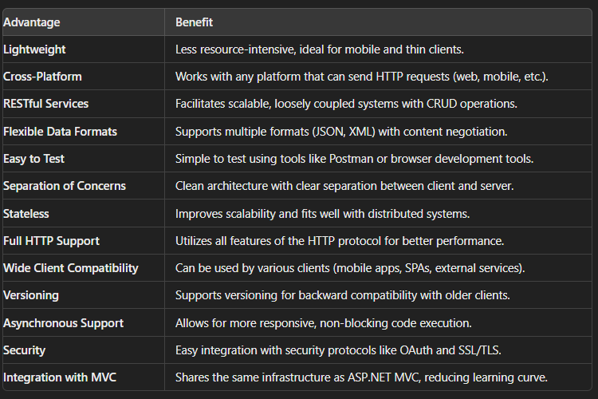
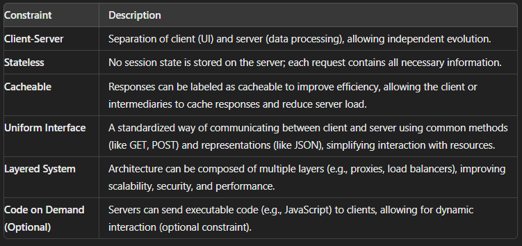
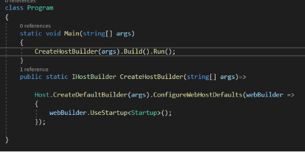
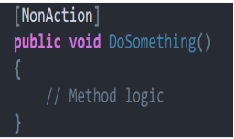
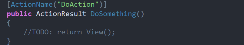
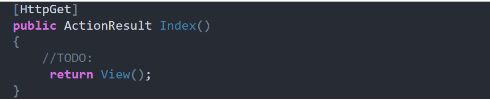
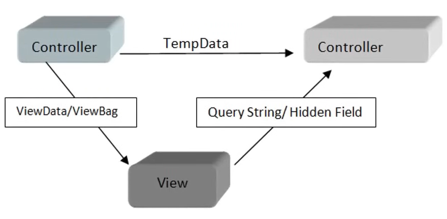

### Question :- What is view state.
### Question :- Difference between soap API and REST API 
### Question :- what is post back?
- it is the process where web Browser sends data back to the server for processing and then reloads or update itself. It is like a conversation between the browser and the server where the server taken an action and sends a response back to the browser.
## Question :- Differentiate between ASP .NET Web-forms vs MVC vs MVC core ?
- ASP.NET WebForms, ASP.NET MVC, and ASP.NET Core MVC are three different ways to build web applications using Microsoft technologies. ASP.NET WebForms is the oldest of the three and works in a way that feels similar to building desktop applications. It lets you drag and drop controls onto a page and handles a lot of the web details for you, like keeping track of what the user is doing. However, this can make the pages slower and harder to customize.

- ASP.NET MVC is different because it focuses on separating the different parts of the application, like the logic, the user interface, and the data. This makes it easier to manage and test large applications. It also gives you more control over the HTML and the URLs, which can help make your website faster and easier to use.

- ASP.NET Core MVC is the newest and most modern option. It's built to work across different operating systems like Windows, macOS, and Linux, and it's designed to be very fast and flexible. This makes it a great choice for building modern, high-performance web applications, especially those that need to run in the cloud or on different platforms.
## Question :- Explain MVC Architecture ?
- It is an architectural design pattern; the Model View Controller is the main component of MVC. The main objective of the MVC design pattern is the separation of concern. It means the domain model and business logic are separated from the user interface(View). Thus, maintenance and testing of applications become easier. 
- Model is responsible for data; View is responsible for UI(User Interface) and Controller is responsible for the flow of the application.
1. Controller.
    - Controller is a special .cs class that inherits the inbuilt controller class.
    - It is used to handle an incoming HTTP request and contains action methods.
    - It is the one that will interact with both view and model in order to control the flow of the application.
    -  By Default, controllers are available inside the controller folder.
2. Model:
    - Model is basically a C# class used to manage the business data and business logic.
    - It can be accessed by both the controller(to pass the data to a view) and the view(to display the data to the user).
3. View:
    - It is responsible for displaying the data to the user. By default, views are stored inside the Views folder.
    - View is nothing but the cshtml file which is a combination of C# and HTML files.
    - A view request can be made from the controller’s action method only.
## Question :- Why do we have wwwroot folder ?
- The wwwroot folder in an ASP.NET Core project serves a specific and important purpose: it is the designated location for all the static files that your web application needs to serve directly to the client, such as web browsers.
- By default, only files inside the wwwroot folder are accessible from the web. This prevents users from inadvertently exposing sensitive server-side files or code (like configuration files or C# classes) that reside outside of this folder. It adds a layer of security by clearly separating what is meant to be publicly accessible from what is meant to remain private.
- The contents of the wwwroot folder are mapped to the root of your application’s URL path. For example, if you place a file style.css in **"wwwroot/css"**, it can be accessed via http://yourdomain.com/css/style.css. This mapping makes it straightforward to link to your static files in your HTML or Razor views.
## Question :- Explain the importance of appsettings.json ?
- The appsettings.json file in an ASP.NET Core application is a configuration file used to store key-value pairs and settings that your application needs to run. This file plays a crucial role in configuring the application and can contain settings such as database connection strings, logging configurations, and other environment-specific settings.
- ASP.NET Core supports multiple configuration files for different environments (e.g., appsettings.Development.json, appsettings.Production.json). These environment-specific files override the settings in appsettings.json based on the environment the application is running in. This allows for seamless configuration management across development, testing, and production environments.
- The appsettings.json file is a critical component in ASP.NET Core applications for managing configuration settings. It centralizes application settings in a structured format, supports environment-specific configurations, and integrates seamlessly with the ASP.NET Core configuration system, making it easy to access and manage application settings.
```json
{
  "Logging": {
    "LogLevel": {
      "Default": "Information",
      "Microsoft": "Warning",
      "Microsoft.Hosting.Lifetime": "Information"
    }
  },
  "ConnectionStrings": {
    "DefaultConnection": "Server=.;Database=MyAppDb;Trusted_Connection=True;"
  },
  "AllowedHosts": "*"
}

```
## Question :- How to read configurations from appsettings.json ?
- The simplest way to read values from appsettings.json is to use the IConfiguration interface. The IConfiguration object is available in the Dependency Injection (DI) container by default.
```C#
using Microsoft.AspNetCore.Mvc;
using Microsoft.Extensions.Configuration;

public class HomeController : Controller
{
    private readonly IConfiguration _configuration;

    public HomeController(IConfiguration configuration)
    {
        _configuration = configuration;
    }

    public IActionResult Index()
    {
        // Accessing simple configuration values
        string appName = _configuration["MySettings:ApplicationName"];
        string version = _configuration["MySettings:Version"];
        int maxItems = int.Parse(_configuration["MySettings:MaxItems"]);
        // Accessing connection strings
        string connectionString = _configuration.GetConnectionString("DefaultConnection");
        ViewBag.AppName = appName;
        ViewBag.Version = version;
        ViewBag.MaxItems = maxItems;
        ViewBag.ConnectionString = connectionString;
        return View();
    }
}
```
- ASP.NET Core supports environment-specific configuration files, like appsettings.Development.json or appsettings.Production.json. These files override the settings in appsettings.json based on the environment.

## Question :- What is dependency injection ?
- It is a technique to achieve IOC(Inversion of control – It means you need to make your loosely coupled so that in future there is any change then there should not be any tightly coupling between two classes or objects they should have loosely coupling and that is the main agenda of inversion of control that is loosely binding)
- It is a design pattern used in software development, including .NET Core, to manage how components (objects or services) depend on each other. It's a way to provide the necessary dependencies to a class from the outside rather than having the class create them itself. It promotes loose coupling.
> Real Life example
- Imagine you're a chef in a restaurant, and you need ingredients (like vegetables, spices, etc.) to cook a dish. Instead of going out to the market to buy the ingredients yourself every time you need them, you have an assistant who brings you the ingredients whenever you need them. This way, you can focus on cooking, and if the restaurant decides to change the supplier for those ingredients, it doesn't affect how you cook—they just bring you the new ingredients.

> In this example:
>>Chef = Your class (or object)
>>Ingredients = Dependencies (other objects or services your class needs to work)
>>Assistant = Dependency Injection (DI) system that provides the dependencies
## Question :- Why do we need dependency injection ?

> Here are the key characteristics of the Singleton pattern:
- Only one instance created once for entire application and allowing other part of the code to easily access it.
- **Single Instance**: The Singleton class guarantees that there is only one instance of itself in the entire application.
- **Global Access**: It provides a global point of access to that single instance, allowing other parts of the code to easily access it.
- **Lazy Initialization**: The instance is created only when it's first requested, not when the program starts. This helps optimize resource usage.
- **Thread Safety**: Properly implemented Singleton patterns are thread-safe, meaning they can be safely used in a multi-threaded environment without causing issues.
## Question :- Transient Lifetime:
- New instance is created for every request at every place. And same instance is not reused.
- In the Transient lifetime, a new instance of the service is created every time it is requested. This means that every time you ask for the service, you get a fresh instance. Transient services are not shared; they are created a new for each request.
> Scoped Lifetime:
- New instance created once for every (round trip) http request and can be reused.
- In the Scoped lifetime, a new instance of the service is created once per client request. The same instance is reused within the scope of a single client request, but different requests will have different instances. This is typically used in web applications to ensure that the same instance is available throughout the duration of a single HTTP request.
> Dependency Injection:
- It is a technique to achieve IOC(Inversion of control – It means you need to make your loosely coupled so that in future there is any change then there should not be any tightly coupling between two classes or objects they should have loosely coupling and that is the main agenda of inversion of control that is loosely binding)

> Problem if we do not use DI:

- Suppose I am working on a web application and I have created few controllers. Suppose I have five controller file asp.Net Core web application in general when you working on a large project then you can see there are more than five controllers in your project.
- Suppose in this application you are using some services in our case we are using repository, and we are using those repositories into our controller class and this concept is not fixed only for controller and repository. it is applicable for two classes, if you are going to use two classes in each other then you need to use dependency injection.
## Question :- How do we implement dependency injection ?
> Steps to Implement Dependency Injection in ASP.NET Core:
1. Define Interfaces and Implementations
   -   Start by defining an interface and a class that implements it. The interface defines the contract, and the class provides the concrete implementation.
```C#
// Define an interface
public interface IGreetingService
{
    string GetGreeting();
}

// Implement the interface
public class GreetingService : IGreetingService
{
    public string GetGreeting()
    {
        return "Hello, World!";
    }
}
```
2. Register Services with the DI Container
      - In ASP.NET Core, you register services with the Dependency Injection container in the Program.cs or Startup.cs file. This tells the DI container how to create instances of your services.
      - In ASP.NET Core 6.0 and later (Program.cs):
```C#
var builder = WebApplication.CreateBuilder(args);

// Register the service with the DI container
builder.Services.AddTransient<IGreetingService, GreetingService>();

var app = builder.Build();

app.MapGet("/", (IGreetingService greetingService) =>
{
    return greetingService.GetGreeting();
});

app.Run();

```
3. Inject Services into Controllers or Other Components
      - Now that the service is registered, you can inject it into controllers or other components.
      - Example of controller
```C#
using Microsoft.AspNetCore.Mvc;

public class HomeController : Controller
{
    private readonly IGreetingService _greetingService;

    // Inject the service via constructor
    public HomeController(IGreetingService greetingService)
    {
        _greetingService = greetingService;
    }

    public IActionResult Index()
    {
        var greeting = _greetingService.GetGreeting();
        ViewBag.Greeting = greeting;
        return View();
    }
}
```
- When you run the application, the DI container will handle the creation of the GreetingService and inject it into the HomeController or any other component that needs it.
## Question :- What is the use of Middleware ?
- It is responsible for handle all the requests and responses of the application. 
- All the request goes through the http pipelines.
- http pipeline is combination of multiple Middleware.
- A Middleware is a piece of code (Software component) that is used in the HTTP pipeline.
- Generally, before actually hitting to the controller we have a separate path or component, where we have to define lots of middleware and this middleware has access to all those request and responses that are made to the particular application.
- We do not hit controller directly from the http pipeline because logic and data available inside the controller. so, we have to perform some tasks for that we use the middleware’s. Middleware validates all the request and if it is a valid request then it will forward to the next step otherwise it will send back the request that is called short circuiting.
## Question :- How to create a Middle ware ?
## Question :- What does startup.cs file do ?
> Startup class:
  - With the help of this class, we can configure the environment in our ASP.net Core application. We can use Constructor and two different methods: ConfigureServices and Configure for setting up the environment. This class creates services and injects services as dependencies so the rest of the application can use these dependencies. The ConfigureServices used to register the service and Configure method allow us to add middleware and services to the HTTP pipeline. This is the reason ConfigureServices method calls before Configure method.
- The startup class can be configured using UseStartup<T>() extension method at the time of configuring the host in the main method.
- It contains all the information regarding the configuration and hosting the ASP.Net Core application.
1. ConfigureServices() Method:
    - We can add services to DI container using this method.
    - It is used to configure services that are used by the application.
    - This method must be declared with a public access modifier so that environment will able to read the content from metadata.
1. Configure() Method:
    - This method is used to define how the application will respond on each HTTP request i.e., we can control the ASP.net pipeline.
    - It is also used to configure Middleware  into the application http line.
    - Whenever any service is added to ConfigureServices method, it is available to use inside the Configure method.
    - Inside the Configure() Method we have some middleware let’s understand one by one.
## Question :- What is Razor ?
- Razor is a view engine used in ASP.NET for generating dynamic web content. It allows you to embed C# code within HTML to create server-side web pages. Razor is designed to be simple and concise, making it easy to work with and integrate server-side logic into your HTML markup.
- Razor syntax is clean and easy to use. You use the @ symbol to switch from HTML to C# code. For example, @DateTime.Now will output the current date and time.
```C#
@{
    ViewBag.Title = "Home Page";
    var message = "Welcome to the Razor view!";
}

<!DOCTYPE html>
<html>
<head>
    <title>@ViewBag.Title</title>
</head>
<body>
    <h1>@message</h1>
</body>
</html>
```
## Question :- Explain the concept of ViewModel in MVC ?
- In the context of MVC (Model-View-Controller), a ViewModel is a design pattern used to pass data from the controller to the view. It acts as a container for data that you want to display on the view, often aggregating data from multiple models, transforming data for display purposes, or combining related data fields into a single object that makes it easier to work with in the view.
## Question :- What is Kestrel Web Server ?
- Kestrel is a cross-platform, high-performance web server used for hosting ASP.NET Core applications. It's the default web server included with ASP.NET Core and is designed to be fast and lightweight, making it suitable for both development and production environments.
## Question :- Why Kestrel when we have IIS server ?
- While IIS is a powerful and feature-rich web server with deep integration into the Windows ecosystem, Kestrel offers a modern, high-performance, and cross-platform alternative tailored for ASP.NET Core applications. Kestrel's lightweight and efficient design makes it an excellent choice for both development and production environments, especially when combined with reverse proxies to enhance security and scalability.
## Question :- What is the concept of Reverse proxy ?
- A reverse proxy is a server that sits between client devices (such as web browsers) and a web server. It forwards client requests to the appropriate backend server and then returns the server's response back to the client. Essentially, a reverse proxy acts as an intermediary, handling client requests and server responses, but clients remain unaware of the backend server's existence.
- A reverse proxy can distribute incoming client requests across multiple backend servers, balancing the load to ensure no single server is overwhelmed. This improves the performance and reliability of the application, particularly under heavy traffic.
- Reverse proxies can enhance security by masking the identity of the backend servers. They act as a gateway, making it harder for attackers to target specific backend servers directly. They can also filter incoming requests, blocking malicious traffic and protecting against certain types of attacks, such as Distributed Denial of Service (DDoS) attacks.
- Reverse proxies can cache responses from the backend servers and serve these cached responses to clients, reducing the load on backend servers and improving response times for repeated requests.
- They can handle authentication and authorization, ensuring that only authenticated users can access certain resources on the backend servers.
## Question :- What are cookies ?
- Cookies are small pieces of data stored on a user's device by a web browser while they are browsing a website. These cookies are sent back and forth between the browser and the server, allowing the server to keep track of the user's activity and preferences across multiple visits or during a single session. Cookies are an essential part of how the web works, enabling things like user authentication, session management, and personalized experiences.
## Question :- What is the need session management ?
- A session is a temporary and interactive information interchange between a user (client) and the server. It starts when the user first interacts with the web application and ends when the user leaves the application or after a certain period of inactivity.
- Key Concepts of Session Management
> Session:

- A session is a temporary and interactive information interchange between a user (client) and the server. It starts when the user first interacts with the web application and ends when the user leaves the application or after a certain period of inactivity.
> Session ID:

- When a session is created, the server generates a unique session ID for the user. This ID is often stored in a cookie on the user's browser or appended to URLs. The session ID allows the server to recognize subsequent requests from the same user and associate them with the same session.
> Session Storage:

- The server stores session data, which could include user preferences, login status, shopping cart contents, etc. This data is linked to the session ID. The storage can be in-memory, in a database, or other storage mechanisms depending on the scale and requirements of the application.
> Session Timeout:

- To ensure security and manage resources, sessions usually have a timeout period. If the user is inactive for a certain duration, the session expires, and the server may require the user to log in again.
> **Why Session Management is Important**

> User Authentication:

- After a user logs in, the session can keep track of their authentication status, so they don’t have to log in again on each new page or action within the application.
> Personalization:

- Sessions allow web applications to remember user preferences, settings, or the state of their interaction (like items in a shopping cart) across multiple pages or visits.
> Security:

- Proper session management helps in protecting sensitive data and ensuring that user actions are authorized. Techniques like regenerating session IDs upon login, using secure cookies, and setting appropriate session expiration times enhance security.
> Stateful User Interactions:

- Web applications often require users to perform a series of related actions, such as filling out multi-page forms or completing transactions. Session management ensures that data persists between these steps, making the interaction seamless.

## Question :- When should we use viewdata ?
- ViewData in ASP.NET MVC is a dictionary used to pass data from the controller to the view.
- Use ViewData when you need to pass small, temporary, or dynamic pieces of data to a view, especially if the view is not strongly typed. For more structured or strongly-typed data, consider using a view model or ViewBag.
## Question :- How to pass data from controller to view ?
- Use a View Model when you have structured data that the view needs to render.
- Use ViewBag or ViewData for small, temporary pieces of data when you don’t need strict typing.
- Use TempData for passing data between actions, particularly when redirecting.
## Question :- In same request can viewdata persist across actions ?
- No, ViewData cannot persist across actions within the same request in ASP.NET MVC. ViewData is designed to hold data only for the duration of the current request and is specifically used to pass data from a controller to a view.
## Question :- ViewData vs ViewBag
- ViewData and ViewBag are both used in ASP.NET MVC to pass data from a controller to a view. They serve a similar purpose but are used in slightly different ways.
- ViewData is a dictionary (key-value pair) that allows you to store and retrieve data using string keys.
- ViewBag is a dynamic object that allows you to add properties to it on the fly without defining them beforehand.
- Both ViewData and ViewBag are limited to the current request. They are not suitable for passing data between different requests (like redirecting to another page). For that, you would use something like TempData or session storage
## Question :- How is TempData different from session variables ?
1. Lifespan:
- TempData: It is designed to store data temporarily. It holds the data only for the duration of a single request, and it is available for the next request, but only until it is read. Once it is accessed, it is automatically cleared, so it's mainly used for short-lived data, like passing messages or small data between actions (e.g., from a controller to a view or between two actions).
- Session: The data stored in the session persists throughout the user’s session, meaning the data will be available until the user session ends, which could be after a set time period of inactivity or when the user explicitly logs out.
2. Use Case:
- TempData: Primarily used to pass small amounts of data between controller actions. It is useful for one-time message displays, such as success/failure notifications after a form submission.
- Session: Useful when you need to persist user-specific data throughout the entire session, such as login information, user preferences, or shopping cart contents.
## Question :- If I restart the server does TempData, session stay ?
- Default Behavior: Both TempData and Session will be lost if the server is restarted, as they are stored in memory.
- Persisting Across Restarts: If you need them to persist across restarts, you would need to configure persistent storage options like databases or distributed caches.
## Question :- Is TempData private to a user ?
- Yes.
## Question :- ViewData vs ViewBag vs TempData vs Session variables?
- All used to pass data between different components of an application, but they serve different purposes and have distinct behaviors.
- Use ViewData/ViewBag for passing data from controller to view for the current request.
- Use TempData when you need to pass data between two actions or across a redirect.
- Use Session when you need to store data that persists throughout the user’s session.
## Question :- What is WebAPI ?
- building HTTP-based services that can be consumed by a wide variety of clients, including browsers, mobile devices, and desktop applications. It enables the creation of RESTful APIs for performing CRUD operations (Create, Read, Update, Delete) over HTTP. WebAPI allows data to be communicated between the server and the client in formats like JSON or XML.
## Question :- What is the advantage of WebAPI ?

## Question :- Explain REST and Architectural constraints of REST?

- REST (Representational State Transfer) is an architectural style for building scalable and efficient web services. It relies on a stateless, client-server communication model and leverages standard HTTP methods to perform CRUD operations on resources. REST was introduced by Roy Fielding in his doctoral dissertation in 2000.

- RESTful services are based on the concept of resources, which are objects or entities that are identified by URIs (Uniform Resource Identifiers). Clients can interact with these resources through standard HTTP methods like GET, POST, PUT, and DELETE.

> Key Features of REST:
- Stateless: Each request from the client to the server must contain all the information the server needs to fulfill that request.
- Resource-based: Resources are the key abstraction in REST, and each resource is identified by a URI.
Use of Standard HTTP Methods: RESTful services use the HTTP methods (GET, POST, PUT, DELETE) to perform CRUD operations.
- Data Representation: RESTful services can return data in various formats, typically JSON or XML.



## Question :- Can we use TCPIP protocol with Web API?
- While Web APIs indirectly use TCP/IP (because HTTP/HTTPS is built on top of TCP/IP), you cannot use TCP/IP directly with a Web API. Web APIs are designed to communicate using HTTP/HTTPS, which are application-layer protocols operating on top of the TCP/IP stack.
## Question :- How WebAPI different from MVC controller ?
- Use WebAPI when you are building a service that needs to be consumed by multiple types of clients (mobile apps, third-party services, etc.) and primarily deal with data.
- Use MVC controllers when you are building a web application where the goal is to render HTML views for a user interface in the browser.
## Question :- What is content negotiations in Web API ?
- Content Negotiation in Web API is the process where the client and server decide on the format of the data to be exchanged. The server can serve data in multiple formats (like JSON, XML, or others), and content negotiation helps determine which format should be used for a particular request based on the client's preferences.
## Question :- How to return HTTP status codes ?
## Question :- For error which status code is returned ?
## Question :- How did you secure your web API ?
## Question :- How do current JS frameworks work with WebAPI ?
## Question :- How does Token based Authentication works?
## Question :- Why is it called JWT Token?
## Question :- Explain the 3 sections of JWT Token?
## Question :- What are Identity and claims ?
## Question :- Differentiate between Authentication VS Authorization ?
## Question :- Claims vs Roles ?
## Question :- Principal vs Identity
## Question :- Can we put critical information in JWT Token ?
## Question :- How do you create JWT Token in MVC ?
## Question :- What HTTP status code do you send for unauthorized access ?
## Question :- Where is Token Checked in ASP.NET MVC ?
## Question :- What is use of Authorize Attribute ?
## Question :- How did you implement JWT token security ?
## Question :- How do we send tokens from Client Side ?
## Question :- From JavaScript,  jQuery, Angular etc , how is token passed ?
## Question :- Increase UX experience in Mobile apps to avoid re-login ?
## Question :- What are refresh tokens ?
## Question :- How does Refresh token work ?
## Question :- Access tokens vs Refresh Tokens ?
## Question :- Whose expiry time is more Access tokens or Refresh tokens?
## Question :- Explain revocation of Refresh token ?
## Question :- How to extract Principal from a Token ?
## Question :- What is the best practice to store tokens at client side?
## Question :- If we store JWT in cookie how to save from XX attacks?
## Question :- What OAUTH and OpenID ?
## Question :- When should we use what?
## Question :- What is Identity Server?
## Question :- How to achieve single sign on ?
## Question :- What are scopes in Identity Server ?
## Question :- Explain ViewModel?
## Question :- ViewBag vs ViewModel what’s the best practice?
## Question :- Advantage of using ASP.Net Core MVC:
  - It is much faster compared to Asp.Net MVC. It is a cross-platform framework you can use to build web applications that can run on Windows, Linux, or macOS.
  - As we are separating the view from the rest of the application which enables us to change of view in the future without affecting the rest of the application.
  - Separation of concern, it is divided into three major components (Model, View, Controller) which make it easier to manage the application complexity.
  - Provide better support for test-driven development(TDD).
 - Program.cs class:



- This is the entry point of the application, Inside the Program.cs class we have the main method. This is the method from where the execution starts.
- Host Builder:
- Host Builder is a static class that provides two methods (CreateDefaultBuilder) when we call these, they will add some features to Asp.net core applications. One method without a parameter and the other method takes a string array as an argument.
- The Host Builder provides two methods for creating instances of pre-configured IHostBuilder(Interface) which is available inside the Host class.
> Host:
- Host is a static class that can be used for creating an instance of IHostBuilder pre-configured defaults.
> CreateHostBuilder ():
- The CreateHostBuilder () method is responsible for configuring and creating an instance of the IHostBuilder which is used to set up the web host for the application. The web host is the environment in which the application runs, managing requests, services, configuration, logging, and more.
- This is nothing but a name of method we can also use any name instead of CreateHostBuilder ().

> CreateDefaultBuilder(): 
- It is available inside the Host class.
- By using the CreateDefaultBuilder method we will get the in-built support of dependency injection.
- It loads app configuration from “appsettings.json” and “appsettings.[EnvironmentName].json”, configuration is nothing but the settings that our application uses.
- Used to setup the default logging support for us into the application.
- Load configuration from environment variables.
- This method is use to read the environment variable.
- Set the default path of the application.

> ConfigureWebHostDefaults():
- This is the actual method that convert a console application into the web application.
- It is use to configure a HostBuilder with defaults for hosting a web app.
- Enables the IIS Integration and kestrel server.
- Also add the ForwardedHeaders middleware if ASPNETCORE\_FRWARDEDHEADERS\_ENABLED=True.

> webBuilder:
- The WebHostBuilder is typically used in the Program.cs file of an ASP.NET Core application to configure various aspects of the web application, such as setting up the server, configuring services, and defining how requests and responses are handled. It's part of the process of setting up and "building" your web application.
- Because with the help of web builder here we are calling the Startup class.

    
1. App.UseRouting():
- It enables the routing into our application.
> Routing:
- It is used to inspect the http request and then map that http request to the controller’s action method.
1. Conventional Routing:
- It is default routing behavior which application follows, in this first look for the controller then action method. According to URL received by the user.
2. Attribute Routing:
- Attribute routing allows us to define routes directly on our controller and action methods using the **Route** Attributes.
- It gives us more control over the URLs by defining routes directly at action methods or Controllers in our Asp.Net Core application.
- With Attribute Routing, we can specify route templates for individual action methods.
> MapGet and Map:
- In ASP.NET Core MVC, the Map and MapGet methods are used to configure routing for specific HTTP methods and paths.
- Map is general purpose method which are applicable for various HTTP verbs(Get, Put, Post, Patch, and Delete).
- But MapGet is applicable for a specific type of HTTP verb(Get) only. 

## Question :- MapDefaultController Route method:
- This method is used to map the endpoints by default to home controller and index method. Suppose instead of using home controller you are using other controller and instead of using index method you are using other main action method. In that scenario you have to tell your application explicitly that you are using this new controller and action method by using some other method.
## Question :- LaunchSettings.json file:
- The launchSettings.json file is a configuration file in ASP.NET Core MVC applications that is used to specify settings related to how the application should be launched and debugged in different environment. And how the application should behave during development.
- It is a Json file that contain profile for different environment each profile represents a set of settings for running and debugging the application.
## Question :-  Environment Variable:
- It is used to configure the application based on the current profile. 
- It is use to determine whether application should run in a development or production. 
- Type of environment:
  1. Development
  2. Staging
  3. Testing
  4. Production(Prod)
## Question :- AppSettings.json file
- It is a Json file that allows you to store and centralize various configuration settings at one place. It includes Database Connection String, API keys, logging settings, and more.
## Question :- Logging:
- Logging is a process in software development, in this we record and stored information about what a program is doing at runtime. This information can include various events, errors, Warning, and other messages that helps developers and administrators to understand how an application is behaving.
## Question :- What is the difference between 3-layer architecture and MVC architecture?
- The 3-layer architecture separates the application into 3 components which consist of the Presentation Layer,** Business Layer, and Data Access Layer. In 3-layer architecture, the user is going to interacts with the Presentation layer only. 3-layer is a linear architecture.
- The MVC architecture separates the application into three major components such as Model, View, and Controller. In MVC architecture, the user is going to interacts with the controller with the help of a view. MVC is a triangle architecture.
- MVC does not replace 3-layer architecture. Typically, MVC and 3-layer architecture are used together and the MVC Design Pattern acts as the Presentation layer of the application.
## Question :- Can you please explain the request flow in the ASP.NET Core MVC framework?
- In the ASP.NET Core MVC application when the client makes a request (i.e., HTTP Request) for a resource from the browser then that request is first Received by the Routing Engine. Once the Routing engine receives the HTTP Request, then it figures out the URL Pattern of the incoming request and checks if that URL pattern is present in the Route table. If there is no matching URL Pattern found in the routing table for the incoming HTTP request URL Pattern, then it simply returns a 404 HTTP status code to the client. If it found a matching URL pattern for the incoming request in the Route Table, then it fetches the corresponding handler information and forwards the request to the appropriate controller and action method.
- The controller then plays its role and executes the action method. While executing the action method if needed then it will work with the model component in order to serve the request. Once it works with the model component, then it selects a view and passes that model data to that view, and that view will transform the model data and generates an appropriate response that is rendered to the client.
## Question :- What are Action methods in ASP.NET Core MVC?
- Controller actions are methods defined in the controller class and responsible to perform required operations on the user’s inputs like form values, query strings values, etc. with the help of the Model and passing the results back to the View.
- What is ActionResult and how is it different from others?
- The ActionResult class is the base class for all action results. An action result can be of type ViewResult, JsonResult, RedirectResult and so on. Hence, when your action method returns multiple results based on different conditions, ActionResult is the best choice. Since it can return any type of result.
## Question :- How to make a non-Action method in ASP.NET MVC?

By default, the ASP.NET MVC framework treats all public methods of a controller class as action methods. If you do not want a public method to be an action method, you must mark that method with the NonActionAttribute attribute.

  

## Question :- Can you change the action method name?
- We can also change the action method name by using the ActionName attribute. Now action method will be called by the name defined by the ActionName attribute.



- Now, DoSomething action will be identified and called by the name DoAction.
## Question :- How to restrict an action method to be invoked only by HTTP GET, POST, PUT or DELETE?
- By default, each and every action method can be invoked by an HTTP request (i.e., GET, PUT, POST, and DELETE). But you can restrict an action to be invoked only by a specific HTTP request by applying HttpGet or HttpPost or HttpPut or HttpDelete attribute.
- If you want to restrict an action method for HTTP Get request only then decorate it with HttpGet action method selector attribute as given below:



## Question :- What are Partial Views in ASP.NET Core MVC and it’s needed?
- A partial view is like user control in ASP.NET Webforms that are used for code re-usability. Partial views help us to reduce code duplication. Hence partial views are reusable views like Header and Footer views. We can use the partial view to display blog comments, product category, social bookmarks buttons, a dynamic ticker, calendar, etc.
- It is best practice to create a partial view in the shared folder and the partial view name is preceded by “\_”, but it is not mandatory. The “\_” before view name specifies that it is a reusable component i.e., partial view.
## Question :- What are the Layouts in ASP.NET Core MVC?
- A layout is a .cshtml file that is used to provide common structure to other views.
- You can use a layout to define a common template for your site**.** 
- Layouts are used to maintain a consistent look and feel across multiple views within the ASP.NET MVC application. As compared to Web Forms, layouts serve the same purpose as master pages but offer a simple syntax and greater flexibility.
## Question :- RenderBody: 
- It is used inside layout file to provide space for other view and we can have only one Render Body method inside one layout file.
## Question :- RenderSection:
- Render section is a space with a specific name and it used on \_Layout file.
- Render section tells the application that some other code ( coming from view ) will be placed here.{So whatever place we will define inside the \_Layout file that place will be replaced by some other code that is coming from other views}.
## Question :- _ViewStart.cshtml file:
- Whenever we will run the application, this is the first file which will execute before any view file which is available in our application. 
- It means instead of defining the code that is required for each view you can define that code here into this common \_ViewStart.cshtml file.
- As we know we can use the \_Layout.cshtml file for common code of View. and we have to mention that particular common \_Layout.cshtml file for each View separately.
- If we mention that \_Layout.cshtml file inside the \_ViewStart.cshtml file, then the \_Layout.cshtml file will apply on each View Automatically. No need to mention the \_Layout.cshtml file to each view, Because I already told you \_ViewStart.cshtml file is the first View file which will render after running the application.
## Question :- _ViewImport.cshtml:
- You can see that a Namespace is used at top of the code. here you are repeating the code, it means you are not following the good architecture. And to manage this code repetition you need a one new file in Asp.Net Core application named \_ViewImports.cshtml.
- All the common directives that we are going to used inside our application that we can write over here.
- The main purpose of using this \_ViewImports.cshtml file is to create a centralized place for all the directives that you are using into the application.	
## Question :- ViewBag:
- ViewBag is used to pass data from action method to view and we can display this data on view.
- We can pass any type of data in ViewBag.
- It is a dynamic property.
- Its life lies only during the current request.
- If redirection occurs then its value becomes null.
- It doesn’t require typecasting for getting data.
## Question :- ViewData:
- ViewData is also used to pass data from action method to view and we can display data on view.
- The type of data binding is known as loosely binding.
- We can pass any type of data in view data.
- View data use ViewDataDictionary.
- Its life lies only during the current request.
- If redirection occurs then its value becomes null.
- It’s required typecasting for getting data and check for null values to avoid the error.
## Question :- TempData :
- TempData is used to transfer data from the view to the controller, the controller to the view, or from an action method to another action method of the same or a different controller. 
- TempData temporarily saves data and deletes it automatically after a value is recovered.


## Question :- Session:
- In ASP.NET Core MVC, sessions are a mechanism for storing and managing user-specific data on the server side across multiple HTTP requests for a given session
- A session is responsible for storing user data in the web server when browsing a web application. In general, web applications operate on the stateless HTTP Protocol, where each HTTP request is independent.
## Question :- Authorization: 
- Authorization is a security mechanism used to determine whether the user has access to a particular resource or not.
## Question :- Validation: 
- It is used to validate the data that we are getting from the request and in .NETCore we can implement the validation by using data annotation.
## Question :- Tag Helpers: 
- Tag helpers are used to render server-side code on a Razor (.cshtml) file to create and render html elements.
- It is basically a concept by using this we can combine html and the C# code by using Tag Helpers you will get lots of functionalities you can even enhance the functionalities of your html elements and you will get the robust and fast application.
- It is use to simplifies the process of generating elements in views.
## Question :- Memory Cache: 
- It Is used to store something in memory that is being used frequently to provide better performance.
## Question :- Filter and types of filters in .Net Core MVC application.
- The Filters in ASP.NET Core MVC Framework are the attribute that allows us to inject some logic or code which is going to be executed either before or after an action method is invoked.

## Question :- Types of filters:

- Authentication Filter (Introduced in MVC 5)
- Authorization Filter
- Action Filter
- Result Filter
- Exception Filter

  Note : 

  This is also the order of the execution of Filters if more than one filter is applied. But the point that you need to remember is the Exception Filter can be executed at any point in time when there is an unhandled exception occurred in your application.

- we can also create custom filters in MVC. If the built-in filters do not serve our purpose, then we can create our own custom filter as per our business requirements. We can create the Custom Filter for all the five categories (Authentication Filter, Authorization Filter, Action Filter, Result Filter, and Exception Filter) of Filters.
- We can configure our filter to three different level
  1. Global Level (Applicable to all controllers and all action methods)
  2. Controller Level (Applicable to all the action methods of the particular controller)
  3. Action Level (Applicable to the specific action methods)
## Question :- Child Action in Asp.net Core MVC:
- Suppose you have a scenario where you have one action method and you don’t want that action method to be invoked via URL rather you want that action method to be invoked by other actions of your application. Then in such scenarios, **ChildActionOnly Attribute** can be handy. 
- So, when we decorate an action method with the ChildActionOnly attribute, then it is called child action method.
- The child action methods will not be responded to incoming URL requests. If you try to invoke the child actions using URL, then you will get a runtime error saying – Child action is accessible only by a child request.
- You can only access the child action methods by making a child request from a view either by using the “Action()” or “RenderAction()” HTML helper methods.
- an action method doesn’t need to have the **ChildActionOnly** attribute to be used as a child action. You can access the normal action methods by making a child request. You need to use the **ChildActionOnly** attribute only if you want to prevent the action method to be invoked using URL.
## Question :- Partial View:
- We need to develop a partial view when we need a common part of the user interface on multiple pages in a web application. A partial view is a regular view that can be used multiple times in an application.
- Sometimes we also use a partial view to divide a web page into small parts such as header, footer, and menu on Layout.
- Whenever we use Partial Views, it must be rendered as a child view.

> Web API

- Dependency Injection (DI):

## Question :- Difference between synchronous and asynchronous programming:
- Synchronous programming involves executing code in a sequential manner, while asynchronous programming involves executing code in a non-blocking manner. In Asp.Net Core, asynchronous is typically used to improve the responsiveness and scalability of web application.

> Entity Framework Core :

- It is a Microsoft technology to interact with relational database.
- Generally, we need a middle service which is compatible to work with database and application as well.
- Features of Entity Framework Core:
- ORM: It is a tool that is used to manage the database data from an object-oriented perspective.
- Open source
- Light weight
- Extensible
- Support Async

Object-Oriented perspective:

- Database Tables => Classes
- Column => Properties
- Code-First approach: {first you will create classes and properties and from these classes you can generate your database automatically} or 
- Database-First approach: {First you are working on a database then from that database you are creating classes}
## Question :- DbContext Class:
- It works as a bridge between your C# code and the underlying database.
- It is like a manger that helps you to interact with database, allowing you to query and manipulate data.
- It helps you define your data models, configure the database connection, and provides methods to interact with the database, making it easier to perform database operations in your C# application.
## Question :- DbSet property:
- It simplifies database access by allowing you to work with entities and perform CRUD (Create, Read, Update, Delete) operations in a more natural and object-oriented way.
- It is part of DbContext class and serve as an entry point for manipulating data in a specific database table.
