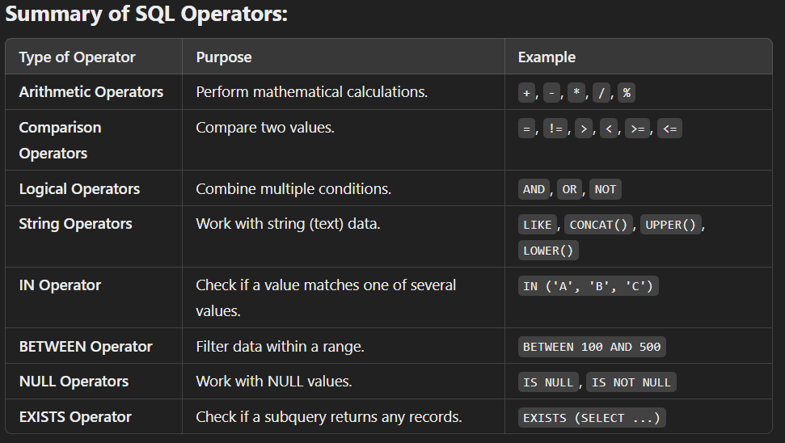
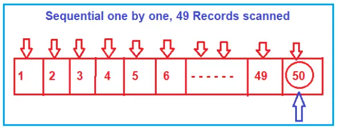

### Qusetion :- Which Aggregate function have you used ?
- An aggregate function in SQL is a way to perform calculations on a group of values and return a single value that summarizes those values. It helps us get information like totals, averages, or counts from multiple rows of data.
- Aggregate functions are : Count(), Sum(), Avg(), Min(), MAx(), etc.

### Qusetion :- Can we select column which is not part of group by ?
- No, in SQL, when you use the GROUP BY clause, you can only select columns that are either part of the GROUP BY clause or are being used in an aggregate function (like SUM(), COUNT(), MAX(), etc.). This rule helps ensure that the data makes sense and is grouped properly.

### Qusetion :- How can we sort records ?
- To sort records in SQL, you use the ORDER BY clause. It allows you to arrange the data in a specific order based on one or more columns. You can sort the records in either ascending (ASC) or descending (DESC) order.
- ORDER BY is like telling SQL, "Please arrange this data for me."
- Ascending (ASC) means from lowest to highest (e.g., A to Z, 1 to 10). (By default sort if you not defined in your query)
- Descending (DESC) means from highest to lowest (e.g., Z to A, 10 to 1).
```SQL
SELECT Product, Price FROM Products ORDER BY Price;
```
### Qusetion :- How can we remove duplicates ?
- To remove duplicates in SQL, you use the DISTINCT keyword. It ensures that the results only include unique records, eliminating any repeated entries.
```SQL
SELECT DISTINCT Product FROM Sales;
```
### Qusetion :- How to handle NULLS ?
- Handling NULLs in SQL refers to how we manage missing or unknown values in our database. A NULL is not the same as an empty string or zero; it specifically means "no value" or "unknown value."
- NULL is used when a value is missing or unknown.
- You need to handle NULLs carefully because they can affect the results of your queries.
```SQL
SELECT Name FROM Customer WHERE PhoneNumber IS NULL;
```
### Qusetion :- What is use of wild cards ?
- Wildcards in SQL are used in search queries to match patterns of text. They help you find data that fits a certain structure but is not an exact match. They are especially useful when you don't know the full value you're looking for, or if you only know part of it.
- Simple Explanation:
  - Wildcards allow you to search for a pattern rather than an exact value.
  - You can use wildcards with the LIKE operator in SQL to match part of a string.
```SQL
SELECT Name FROM Customers WHERE Name LIKE '%A%';  -- here you can use _ (underscore) sign as well.
```
### Qusetion :- What is the use of Alias ?
- An alias in SQL is a temporary name used to give a table or column a different name for the duration of a query. Aliases are helpful when you want to make your query more readable or if you're working with complex table names or column names.
```SQL
SELECT Product, Amount AS TotalAmount FROM Sales;
```
```SQL
SELECT 
    O.OrderId, C.Name, O.Product, O.Amount FROM Orders O 
    JOIN Customers C ON O.CustomerId = C.CustomerId;
```

### Question :- How to write a case statement ?
- A CASE statement in SQL is used to perform conditional logic within a query. It allows you to apply "if-else" logic to your results, where you can check for conditions and return different values based on those conditions.

- Simple Explanation:
  - A CASE statement checks one or more conditions and returns a value based on the outcome.
  - It's like asking SQL, "If this condition is true, give me this value; otherwise, give me something else."

```SQL
SELECT Name,
       Salary,
       CASE
           WHEN Salary < 6000 THEN 'Low'
           WHEN Salary BETWEEN 6000 AND 10000 THEN 'Medium'
           ELSE 'High'
       END AS SalaryCategory
FROM Employees;
```
### Qusetion :- What is self-reference tables ?
- A self-referencing table in SQL is a table that has a relationship with itself. This means that a column in the table refers to another row in the same table, usually by using a foreign key to link back to its own primary key.

- Simple Explanation:
  - A self-referencing table is a table where a row can be connected to another row in the same table.
  - It’s like an employee who reports to another employee within the same company.
### Qusetion :- What is self-join ?
- A self-join is a query that joins a table with itself. It allows you to combine rows from the same table based on a related column. Essentially, you're creating two "versions" of the same table to compare or combine information from one row with another.

- Simple Explanation:
  - A self-join is when you use the same table twice in a query to compare or match data within that table.
  - It's like when you compare two employees from the same company or two products in the same inventory.
### Qusetion :- Explain the between clause ?
- The BETWEEN clause in SQL is used to filter the results by checking if a value lies within a specified range. It allows you to check if a column’s value is within two values, and it can be used with numbers, dates, or text.

- Simple Explanation:
  - The BETWEEN clause is like saying, "Give me the records where this value is between these two limits."
  - It checks if the value in a column is greater than or equal to the lower limit and less than or equal to the upper limit.
```SQL
SELECT column_name
FROM table_name
WHERE column_name BETWEEN value1 AND value2;
```
### Qusetion :- Can inner Subquery return multiple results ?
- Yes, an inner subquery (also known as a nested query) can return multiple results. An inner subquery is a query inside another query, and it can return a set of values that the outer query will use for further processing.

- Simple Explanation:
    - An inner subquery is a query within another query, and it can return multiple rows (a list of values) that the outer query can use.
    - It’s like asking for a list of items (multiple results) from one database and then using that list to find more specific details in another part of the database.
```SQL
SELECT Name
FROM Employees
WHERE EmployeeId IN (
    SELECT EmployeeId
    FROM Sales
    GROUP BY EmployeeId
    HAVING COUNT(SaleId) > 1
);
```
### Qusetion :- What is Co-related Query ?
- A correlated subquery is a type of subquery (a query within another query) where the inner query refers to columns from the outer query. This means the inner query is dependent on the outer query and can return different results for each row processed by the outer query.

- Simple Explanation:
    - A correlated subquery is like asking a question that depends on the information from the outer query.
    - The inner query is re-executed for each row of the outer query, using values from that row in the subquery.
### Qusetion :- Differentiate between Joins and Subquery ?
- Both Joins and Subqueries are used to combine or filter data from multiple tables in SQL. However, they work in different ways.
  - JOINS
    - A Join combines rows from two or more tables based on a related column between them.
    - Joins allow you to bring together columns from different tables in a single result set.
    - Use joins when you need to combine data from multiple tables based on a relationship.
  - Subqueries
    - A Subquery is a query inside another query. It can be used to retrieve a single value or a set of values that will be used by the outer query.
    - The subquery is executed first, and the result is then passed to the outer query.
    - Use subqueries when you need to filter data or perform an operation based on the result of another query.
### Qusetion :- Performance Joins vs Subquery?
- When it comes to performance, both Joins and Subqueries have their advantages and drawbacks, depending on the use case and how the database engine processes them. Here's a simple explanation of how performance can vary between the two:
- Joins Performance: 
  1. Efficient for large datasets: Joins are often faster for combining large datasets, especially when the relationship between tables is indexed properly (e.g., using primary and foreign keys).
  2. One-time operation: Joins are typically processed once for each row in the result set, which is generally more efficient compared to executing a subquery for each row.
  3. Works well with indexed data: If the columns used in the join condition are indexed, the query performance can be very fast.
- Subquery Performance:
  1. May be less efficient: Subqueries can be slower, especially when used in the WHERE clause, as the database has to execute the inner query first for each row of the outer query.
  2. Repeated execution: For each row in the outer query, the inner subquery is executed. This can result in repeated calculations, leading to performance issues, especially on large datasets.
  3. May be optimized by the database: Some database engines optimize subqueries internally, turning them into joins or temporary tables, but not all databases do this efficiently.
### Qusetion :- Find NTH Highest Salary in SQL.

### Qusetion :- Select the top nth highest salary using correlated Queries?

### Qusetion :- Select top nth using TSQL

### Qusetion :- Performance comparison of all the methods.

### Qusetion :- types different operators available in SQL.
- In SQL, operators are symbols used to perform operations on data. They are essential for filtering, comparing, and manipulating data in queries.

### Qusetion :- user defined function in sql.
- A User-Defined Function (UDF) is a function that you can create in SQL to perform a specific task that can be reused multiple times in your SQL queries. It allows you to extend SQL’s built-in capabilities with custom logic and calculations.
- Imagine you are often calculating a discount on products in your sales system, and you need to apply the same logic in multiple queries. Instead of repeating the same calculation every time, you can create a UDF that calculates the discount, and simply use that function in your queries.
```SQL
CREATE FUNCTION CalculateDiscountedPrice (@Price DECIMAL, @DiscountPercentage DECIMAL)
RETURNS DECIMAL
AS
BEGIN
    RETURN @Price - (@Price * @DiscountPercentage / 100)
END;
```
### Qusetion :- Difference between Query and sub query.
1. Query (Main Query)
  - A query is a standalone SQL statement that is used to retrieve data from the database. It can be as simple as selecting a set of records, updating, inserting, or deleting data.
   - A query does not rely on another query to get its result.
2. Subquery (Nested Query)
   - A subquery is a query inside another query. It’s used to provide an intermediate result that can be used by the outer query.
   - Subqueries can be placed in WHERE, FROM, or SELECT clauses of the main query.
   - Subqueries are useful when you need to perform additional filtering or aggregation based on the result of another query.
### Qusetion :- why we use the stored procedure in sql.
- Stored procedures in SQL Server are used to improve the efficiency, security, and manageability of database operations.
### Qusetion :- Importance of view in a database.
- A view in SQL is like a virtual table that simplifies how you interact with data stored in a database. It doesn’t store data itself but provides a predefined way to look at the data from one or more tables.
### Qusetion :- Type of application in a SQL server.
### Qusetion :- One to many relationship in SQL database.
- A one-to-many relationship in SQL means that a single record in one table is connected to multiple records in another table.
- One record in Table A can be related to multiple records in Table B. However, each record in Table B is related to only one record in Table A.
- Imagine a parent-child relationship.
- One "parent" can have multiple "children," but each "child" belongs to only one "parent."

### Qusetion :- One-to-One (1:1) Relationship
- One record in Table A corresponds to exactly one record in Table B and vice versa.
### Qusetion :- Many-to-Many (M:N) Relationship
- Multiple records in Table A can be related to multiple records in Table B.
### Qusetion :-  What is a database? 
- structured form of data storage in a computer or a collection of data in an organized manner and can be accessed in various ways. It is also the collection of schemas, tables, queries, views, etc. Databases help us with easily storing, accessing, and manipulating data held on a computer. The Database Management System allows a user to interact with the database.

### Qusetion :- What is RDBMS:
- Relational Database Management Systems (RDBMS) are database management systems that maintain data records and indices in tables. Relationships may be created and maintained across and among the data and tables.
- In a relational database, relationships between data items are expressed by means of tables.
### Qusetion :- Explain DML, DDL, DCL and, TCL:
- DML(Data Manipulation language) 
    - used to retrieve, insert, update, and delete data in a database.
    - These are basic operations we perform on data such as selecting a few records from a table, inserting new records, deleting unnecessary records, and updating/modifying existing records.
    - **SELECT** – select records from a table.
    - **INSERT** – insert new records.
    - **UPDATE** – update/Modify existing records.
    - **DELETE** – delete existing records.
- **DDL(Data Definition Language)**
    - DDL statements are used to alter/modify a database or table structure.
    - **CREATE** – create a new Table, database, schema.
    - **ALTER** – alter the existing table, column description.
    - **DROP** – delete existing objects from a database.
- **DCL(Data Control Language)**
    - we will use these commands to secure database objects by creating roles, permissions using GRANT, REVOKE operations.
    - **GRANT** – allows users to read/write on certain database objects.
    - **REVOKE** – keeps users from the read/write permission on database objects.
- **TCL(Transactional control language)**
    - TCL is used to manage transactions within a database.
    - Examples: COMMIT, ROLLBACK, Begin Transaction statements.
    - **BEGIN Transaction** – opens a transaction.
    - **COMMIT Transaction** – commits a transaction.
    - **ROLLBACK Transaction** – ROLLBACK a transaction in case of any error.
### Qusetion :- Difference between Drop Delete and Truncate Statement in SQL Server:
   - Delete:
     - The DELETE command is used to remove some or all rows from a table.
     - A WHERE clause can be used with a DELETE command to remove some specific rows from a table.
     - If the WHERE condition is not specified, then all rows are removed.
     - Delete Command is slower than Truncate.
   - Truncate:
     - TRUNCATE removes all rows from a table, but the table structure and its columns, constraints, indexes, and so on remain.
     - It does not require a WHERE clause, so we cannot filter rows while Truncating.
   - Drop:
     - The DROP command removes a table from the database.
     - All the related Data, Indexes, Triggers, Constraints, and Permission specifications for the Table are dropped by this operation.
### Qusetion :- Difference between Primary key and unique key.
   - A table can have only one primary key. On the other hand, a table can have more than one unique key.
   - The primary key column does not accept any null values whereas a unique key column accepts one null value.


### Qusetion :- Char, Varchar, Nchar, Nvarchar
### Qusetion :- Char
- CHAR stores fixed-length data.
- It will store the data type in the Non-Unicode mechanism that means it will occupy 1byte for 1 character.
- The maximum length of the char data type is from 1 to 8000 bytes.
### Qusetion :- VarChar
- It is a variable-length data type (dynamic data type) and will store the character in a non-Unicode manner that means it will take 1 byte for 1 character.
- The maximum length of the varchar data type is from 1 to 8000 bytes
### Qusetion :- Nchar
- It is a fixed-length data type and will stores the characters in the Unicode manner that means it will take 2bytes memory per single character.
- The maximum length of nchar data type is from up to 4000bytes.
### Qusetion :- Nvarchar(size/max) data type:
- It is a variable-length data type and will store the data type in the Unicode manner that means it will occupy 2bytes of memory per single character.
- The maximum length of nvarchar data type is from up to 4000 bytes.


### Qusetion :- Copy data from one table to another table:
- When we copy the data from one table to another table then the two tables should contain the same structure.
- When we copy the data from one table to another table we use insert and select query. Tables always independent objects that mean a table does not depend on other tables.
```SQL
INSERT <New table name### Qusetion :- SELECT * FROM <Old Table Name### Qusetion :-   
```
    - By default, the primary key creates a unique clustered index on the column whereas a unique key creates a unique non clustered index.
### Qusetion :- Normalization:
   - In relational database design the process of organizing data to minimize redundancy. Normalization usually involves dividing a database into two or more tables and defining relationships between the tables.
   - The objective is to isolate data so that additions, deletions, and modifications of a field can be made in just one table and then propagated through the rest of the database via the defined relationships.

### Qusetion :- Different form of Normalization:
  1. **1NF (Eliminate repeating groups):** Make a separate table for each set of related attributes, and give each table a primary key. Each field contains at most one value from its attribute domain.
  2. **2NF (Eliminate Redundant Data):** If an attribute depends on only part of a multi-valued key, remove it to a separate table.
  3. **3NF (Eliminate Columns Not Dependent on Key):** If attributes do not contribute to a description of the key, remove them to a separate table. All attributes must be directly dependent on the primary key
  4. **BCNF (Boyce-Codd Normal Form):** If there are non-trivial dependencies between candidate key attributes, separate them out into distinct tables.
  5. **4NF (Isolate Independent Multiple Relationships):** No table may contain two or more 1:n or n:m relationships that are not directly related.


### Qusetion :- denormalization:
- combining the data into one big table rather than going and fetching data from multiple tables.
- we are including data from one table to another table to reduce the number of joins in the query which helps in speeding up the performance.
- It is a database optimization technique where we can add redundant data to one or more tables and optimize the efficiency of the database.
### Qusetion :- Disadvantages of Denormalization
- Due to data redundancy, it takes large storage.
- It is expensive to insert and update data in a table.
- It makes data inconsistency as data can be modified in several ways.


### Qusetion :- Colation
- Set of rules that determine how data is stored and compared. Character data is sorted using rules that define the correct character sequence, with option for specifying case-sensitivity, accent marks, kana characters types, and character width.


### Qusetion :- one-to-one, one-to-many and many-to-many relationships
1. The one-to-one relationship can be implemented as a single table and rarely as two tables with primary and foreign key relationships.
2. One-to-Many relationships are implemented by splitting the data into two tables with primary key and foreign key relationships.
3. Many-to-Many relationships are implemented using a junction table with the keys from both the tables forming the composite primary key of the junction table.

### Qusetion :- NOLOCK:
- In SQL Server, NOLOCK is a table hint that allows you to read data without placing locks on the data you're reading. It’s like reading the data "as-is" without waiting for other transactions to finish, but with some risks.

### Qusetion :- Real-life example:
- Imagine you're in a library, and someone is updating a book (maybe correcting a mistake in a page). Normally, you'd wait for the person to finish the update before reading the book so you get the correct, updated version.But if you're in a hurry, you could just grab the book and start reading while it's being updated. In this case, you might:See the old information before the update is done.Read a half-updated book (maybe one page is updated, but another isn't yet).
- This is what happens when you use NOLOCK in SQL Server. It reads the data "quickly," even if it's being updated. However, you might end up reading uncommitted or incomplete data, which can sometimes be incorrect.
```SQL
SELECT * FROM Employees WITH (NOLOCK);
```
### Qusetion :- Using NOLOCK in this query means:
- You can read the Employees table without waiting for other people to finish their updates. But, you risk reading uncommitted or inconsistent data, which could lead to wrong results.
- When to use:NOLOCK can be useful when you need fast access to data, and you're okay with the possibility of reading data that may not be fully accurate (e.g., for quick reports or analytics that don’t need 100% precision).

### Qusetion :- UPDATE_STATISTICS
- This command is basically used when a large processing of data has occurred. If a large number of deletions any modification or Bulk Copy into the tables has occurred, it has to update the indexes to take these changes into account. UPDATE_STATISTICS updates the indexes on these tables accordingly.

### Qusetion :- Constraint:
- It is use to specify the rules for the data inside the table. Limit to type of the data that can go into the table.
- Type of constraints
    - Primary Key- Uniquiely identuify each roow in a table.
    - not Null- This constrints tell that we can not store a null value
    - foreign key- Uniquely identify each row in an another table.
    - Check- Helps to validate the values of a column to meet a particular condition.
    - Default - Defalt value into the column when no value is specified by the user.
    - Unique - All the values inside the column must be unique.

### Qusetion :- Difference b/w primary & unique key.
- Primary Key:
    - Can not accept Null values.
    - Create Clustered index
    - One primary key in a table is possible.
- Unique key
    - Can Accept only one null value.
    - Creates non-clustered index.
    - More than one unique key possible in a table.

### Qusetion :- Triggers & type off triggers
- Triggers are nothing but they are logic’s like stored procedures that can be executed automatically before the Insert, Update or Delete happens in a table or after the Insert, Update, or Delete happens in a table.
- There are two types of triggers. They are as follows:
- Types of triggers:
    1. DML Triggers – Data Manipulation Language Triggers.
        - Instead of Triggers:(Insert, uodate, Delete) The Instead Of triggers are going to be executed instead of the corresponding DML operations. That means instead of the DML operations such as Insert, Update, and Delete, the Instead Of triggers are going to be executed.
        - After Triggers:(Insert, uodate, Delete) The After Triggers fires in SQL Server execute after the triggering action. That means once the DML statement (such as Insert, Update, and Delete) completes its execution, this trigger is going to be fired.
    2. DDL Triggers – Data Definition Language Triggers
    3. CLR triggers – Common Language Runtime Triggers
    4. Logon triggers
### Qusetion :- Example to understand trigger.
- lets consider we have table and there are some data present inside the table but now i want no one can insert any new data in this table. in this particular scenario we can use the trigger.
```SQL 
CREATE TRIGGER trInsertEmployee 
ON Employee
FOR INSERT, UPDATE, DELETE
AS
BEGIN
  PRINT 'YOU CANNOT PERFORM THIS OPERATION'
  ROLLBACK TRANSACTION
END
```
- Now if any one try to insert a data into the Employee table he/she get a message 'YOU CANNOT PERFORM THIS OPERATION' like this.
- This trigger is for Insert we can also make trigger for UPDATE & DELETE.
- for remove the function of trigger you can simply delete the trigger from the table folder structure.

### Qusetion :- View: 
- it is a virtual table which consist of a subset of a data contained in a table or more than one table.
- Views do not store any data physically by default.
```SQL
CREATE VIEW [IndiaEMPLOEE] AS
SELECT Name, MobileNo
FROM Employee
WHERE Country= 'INDIA'
```

### Qusetion :- Differnce b/w Having & Where Clause.
- Where Clause
    - it is used before GROUP BY Clause
    - WHERE clause cannot be used with aggregate function
    - WHERE clause can be used with – Select, Insert, and Update statements
    ```SQL 
    SELECT Product, SUM(SaleAmount) AS TotalSales
    FROM Sales
    GROUP BY Product
    WHERE SUM(SaleAmount) ### Qusetion :- 1000
    ```
    - When we execute the above query it will give us the error as Incorrect syntax near the keyword ‘WHERE’. ,Here SUM is a Aggregate function.
- Having Clause
    - it is used after GROUP BY Clause
    - HAVING clause can be used with aggregate function
    - HAVING clause can only be used with the Select statement.

### Qusetion :- Set Operatrs:
- The SET Operators in SQL Server are mainly used to combine the result of more than 1 select statement and return a single result set to the user.
    1. UNION: Combine two or more result sets into a single set, without duplicates.
    2. UNION ALL: Combine two or more result sets into a single set, including all duplicates.
    3. INTERSECT: Takes the data from both result sets which are in common.
    4. EXCEPT: Takes the data from the first result set, but not in the second result set (i.e. no matching to each other)

### Qusetion :- Sub-Qurey/ Nested-Query/ Innner-Query
- Query within an another SQL query and embeded within the WHERE clause. 
```SQL
SELECT * FROM Employee WHERE name IN (SELECT name FROM UserDetails WHERE country='INDIA');
```

### Qusetion :- Joins:
- used to combine two tables based on a related column between them.
### Qusetion :- Types of join
- Inner Join
    - The Inner Join in SQL Server is used to return only the matching rows from both the tables involved in the join by removing the non-matching records.
    ```SQL
    SELECT Id as EmployeeID, Name, Department, City, Title as Project, ClientId
    FROM Employee 
    INNER JOIN Projects 
    ON Employee.Id = Projects.EmployeeId;
    ```
    we are using the EmployeeId column to check the similar values on the ON clause as both the tables having this column (Id in Employee table and EmployeeId in Projects table).

- Left Outer join
    - used to retrieve all the matching rows from both the tables involved in the join as well as non-matching rows from the left side table. In this case, the un-matching data will take a null value.
    - Left Outer Join will retrieve all the rows from the Left-hand side Table including the rows that have a null foreign key value in the right-hand side table.
    ```sql
    SELECT Id as EmployeeID, Name, Department, City, Title as Project, ClientId
    FROM Employee 
    LEFT OUTER JOIN Projects 
    ON Employee.Id = Projects.EmployeeId;
    ```
- LEFT JOIN
    ```SQL
    SELECT Id as EmployeeID, Name, Department, City, Title as Project, ClientId
    FROM Employee 
    LEFT JOIN Projects 
    ON Employee.Id = Projects.EmployeeId;
    ```
- Right Outer join:
  - used to retrieve all the matching rows from both the tables involved in the join as well as non-matching rows from the right-side table. In this case, the un-matching data will take NULL values.

### Qusetion :- Index
- it is used to make search operation faster. retreive data very fast.
- they are similar to indexes at the start of the books, which purpose is to find a book quickly.
- Indexes make the search operation faster by creating something called a B-Tree (Balanced Tree) structure internally.
### Qusetion :- Sequential Scan in Table:
- In Table Scan, the SQL Server Search Engine will search for the required information sequentially one by one from the start to the last record of the table. If the table has more rows, then it will take more time for searching the required data, so it is a time-consuming process.
- 
### Qusetion :-  Balanced Tree (B-Tree) in SQL Server:
- Whenever you create an index (or indexes) on some column(s) of a table in SQL Server then what happens internally is, it creates a B-Tree structure. In the B-Tree structure, the data is divided into three sections i.e. Root Node, Non-Leaf Nodes, and Leaf Nodes.
- 
### Qusetion :- Clustered Index
- The Clustered Index in SQL Server defines the order in which the data is physically stored in a table. In the case of a clustered index,  the leaf node store the actual data. As the leaf nodes store the actual data a table can have only one clustered index. The Clustered Index by default was created when we created the primary key constraint for that table. That means the primary key column creates a clustered index by default.

- When a table has a clustered index then that table is called a clustered table. If a table has no clustered index its data rows are stored in an unordered structure.

### Qusetion :- Non-Clustered Index
- In SQL Server Non-Clustered Index, the arrangement of data in the index table will be different from the arrangement of data in the actual table. The data is stored in one place and the index is stored in another place. Moreover, the index will have pointers to the storage location of the actual data.

### Qusetion :- StoredProcedure:
  - A SQL Server Stored Procedure is a database object which contains pre-compiled queries (a group of T-SQL Statements). In other words, we can say that the Stored Procedures are a block of code designed to perform a task whenever we called.
  - The stored procedure in SQL Server can accept both input and output parameters so that a single stored procedure can be used by several clients over the network by using different input data. The stored procedure will reduce network traffic and increase performance. If we modify the body of the stored procedure then all the clients who are using the stored procedure will get the updated stored procedure.
  - Whenever we execute a stored procedure in SQL Server, it always returns an integer status variable indicating the status, usually, zero indicates success, and non-zero indicates the failure.

### Qusetion :- advantages of using a stored procedure in SQL Server
- Execution Plan Retention and Reusability
- Reduces the Network Traffic
- Code Reusability and Better Maintainability
- Better Security 


### Qusetion :- Function:
- A function is a database object in SQL Server. Basically, it is a set of SQL statements that accept only input parameters, perform actions, and return the result. The function can return only a single value or a table. We can’t use the function to Insert, Update, and Delete records in the database table(s). 
- It is also a subprogram like a stored procedure that is defined for performing an action such as complex calculation and returns the result of the action as a value.
- These functions are created by the user or programmer.
- Functions are taking some parameters, do some processing, and returning some results back.
- Function can have the data is optional but function should return a value is mandatory.
### Qusetion :- Types of user defined function:
- Scalar function
    - The functions which return a single value are known as scalar value function. The Scalar functions may or may not have parameters, but always return a single (scalar) value. The returned value can be of any data type, except text, ntext, image, cursor, and timestamp.
- Inline table-valued functions.
- Multi-statement table-valued functions.

### Qusetion :- Difference between CHAR and VARCHAR data-types in SQL:
- CHAR is a fixed-length data type, while VARCHAR is a variable-length data type. 

### Qusetion :- What is DDL (Data definition Language)
- used to define and manage all structures in a database. 
- DDL commands are primarily used to create, alter, and delete database objects such as tables, indexes, and schemas.

### Qusetion :- What is DML (Data Manipulation Language):
- used for managing and manipulating data within database objects.
- Insert data or rows in a database
- Delete data from the database
- Retrieve or fetch data
- Update data in a database.
### Question :- What is Union and Union All in SQL?
- it combines results from two or more SELECT statements into a single result set. It automatically remove duplicate unless you use Union All.
### Qusetion :- Real-Life Example:
  - Imagine you have two groups of people: (Using Union)
      - Group A: Students who play football
            Names: Rahul, Priya, Sameer
      - Group B: Students who play basketball
            Names: Priya, Anjali, Karan
      - You want to create a single list of all unique students who play either football or basketball.
        ```SQL
        SELECT Name FROM FootballPlayers
        UNION
        SELECT Name FROM BasketballPlayers;
        -- Rahul, Priya, Sameer, Anjali, Karan
        ```
    - Using Union All:
        ```SQL
        SELECT Name FROM FootballPlayers
        UNION ALL
        SELECT Name FROM BasketballPlayers;
        -- Rahul, Priya, Sameer,Priya, Anjali, Karan
        ```
### Question :- When to use Group by ?
- You use GROUP BY in SQL when you want to organize your data into groups based on one or more columns and perform aggregate calculations (like sum, count, average, etc.) on those groups.
- In short, GROUP BY is helpful when you want summarized insights from your data, divided into meaningful groups.
```SQL
SELECT ProductCategory, SUM(Amount) AS TotalRevenue
FROM Sales
GROUP BY ProductCategory;
```
### Question:- What is self-join ?
- A self-join is when a table is joined with itself. It treats the same table as two separate tables (one as "left" and the other as "right") by using table aliases. Self-joins are often used to find relationships between rows in the same table.
```SQL
SELECT e.EmployeeName AS Employee, m.EmployeeName AS Manager
FROM Employees e
LEFT JOIN Employees m ON e.ManagerID = m.EmployeeID;
```