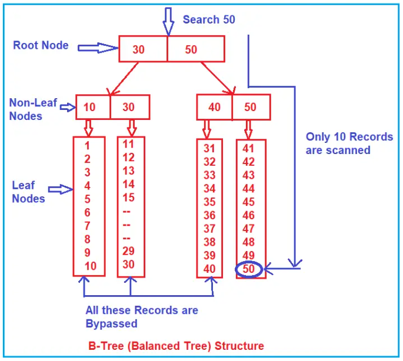

> What is need of Identity ?

> Explain transactions and how to implement it ?

> Can we have unequal columns in Union?

> Can column have different data types in Union ?

> Which Aggregate function have you used ?

> When to use Group by ?

> Can we select column which is not part of group by ?

> How can we sort records ?

> What’s the default sort ?

> How can we remove duplicates ?

> Select the first top X records ?

> How to handle NULLS ?

> What is use of wild cards ?

> What is the use of Alias ?

> How to write a case statement ?

> What is self-reference tables ?

> What is self-join ?

> Explain the between clause ?

> Can inner Subquery return multiple results ?

> What is Co-related Query ?

> Differentiate between Joins and Subquery ?

> Performance Joins vs Subquery?

> Find NTH Highest Salary in SQL.

> Select the top nth highest salary using correlated Queries?

> Select top nth using TSQL

> Performance comparison of all the methods.

> Normalization.

> types different operators available in SQL.

> user defined function in sql.

> Difference between Query and sub query.

> why we use the stored procedure in sql.
> Importance of view in a database.
> Type of application in a SQL server.
> One to many relationship in SQL database.

>  What is a database? 
- structured form of data storage in a computer or a collection of data in an organized manner and can be accessed in various ways. It is also the collection of schemas, tables, queries, views, etc. Databases help us with easily storing, accessing, and manipulating data held on a computer. The Database Management System allows a user to interact with the database.

> What is RDBMS:
- Relational Database Management Systems (RDBMS) are database management systems that maintain data records and indices in tables. Relationships may be created and maintained across and among the data and tables.
- In a relational database, relationships between data items are expressed by means of tables.
> Explain DML, DDL, DCL and, TCL:
- DML(Data Manipulation language) 
    - used to retrieve, insert, update, and delete data in a database.
    - These are basic operations we perform on data such as selecting a few records from a table, inserting new records, deleting unnecessary records, and updating/modifying existing records.
    - **SELECT** – select records from a table.
    - **INSERT** – insert new records.
    - **UPDATE** – update/Modify existing records.
    - **DELETE** – delete existing records.
- **DDL(Data Definition Language)**
    - DDL statements are used to alter/modify a database or table structure.
    - **CREATE** – create a new Table, database, schema.
    - **ALTER** – alter the existing table, column description.
    - **DROP** – delete existing objects from a database.
- **DCL(Data Control Language)**
    - we will use these commands to secure database objects by creating roles, permissions using GRANT, REVOKE operations.
    - **GRANT** – allows users to read/write on certain database objects.
    - **REVOKE** – keeps users from the read/write permission on database objects.
- **TCL(Transactional control language)**
    - TCL is used to manage transactions within a database.
    - Examples: COMMIT, ROLLBACK, Begin Transaction statements.
    - **BEGIN Transaction** – opens a transaction.
    - **COMMIT Transaction** – commits a transaction.
    - **ROLLBACK Transaction** – ROLLBACK a transaction in case of any error.
> Difference between Drop Delete and Truncate Statement in SQL Server:
   - Delete:
     - The DELETE command is used to remove some or all rows from a table.
     - A WHERE clause can be used with a DELETE command to remove some specific rows from a table.
     - If the WHERE condition is not specified, then all rows are removed.
     - Delete Command is slower than Truncate.
   - Truncate:
     - TRUNCATE removes all rows from a table, but the table structure and its columns, constraints, indexes, and so on remain.
     - It does not require a WHERE clause, so we cannot filter rows while Truncating.
   - Drop:
     - The DROP command removes a table from the database.
     - All the related Data, Indexes, Triggers, Constraints, and Permission specifications for the Table are dropped by this operation.
> Difference between Primary key and unique key.
   - A table can have only one primary key. On the other hand, a table can have more than one unique key.
   - The primary key column does not accept any null values whereas a unique key column accepts one null value.


> Char, Varchar, Nchar, Nvarchar
> Char
- CHAR stores fixed-length data.
- It will store the data type in the Non-Unicode mechanism that means it will occupy 1byte for 1 character.
- The maximum length of the char data type is from 1 to 8000 bytes.
> VarChar
- It is a variable-length data type (dynamic data type) and will store the character in a non-Unicode manner that means it will take 1 byte for 1 character.
- The maximum length of the varchar data type is from 1 to 8000 bytes
> Nchar
- It is a fixed-length data type and will stores the characters in the Unicode manner that means it will take 2bytes memory per single character.
- The maximum length of nchar data type is from up to 4000bytes.
> Nvarchar(size/max) data type:
- It is a variable-length data type and will store the data type in the Unicode manner that means it will occupy 2bytes of memory per single character.
- The maximum length of nvarchar data type is from up to 4000 bytes.


> Copy data from one table to another table:
- When we copy the data from one table to another table then the two tables should contain the same structure.
- When we copy the data from one table to another table we use insert and select query. Tables always independent objects that mean a table does not depend on other tables.
```SQL
INSERT <New table name> SELECT * FROM <Old Table Name>   
```

> By default, the primary key creates a unique clustered index on the column whereas a unique key creates a unique non clustered index.
> Normalization:
   - In relational database design the process of organizing data to minimize redundancy. Normalization usually involves dividing a database into two or more tables and defining relationships between the tables.
   - The objective is to isolate data so that additions, deletions, and modifications of a field can be made in just one table and then propagated through the rest of the database via the defined relationships.

> Different form of Normalization:
  1. **1NF (Eliminate repeating groups):** Make a separate table for each set of related attributes, and give each table a primary key. Each field contains at most one value from its attribute domain.
  2. **2NF (Eliminate Redundant Data):** If an attribute depends on only part of a multi-valued key, remove it to a separate table.
  3. **3NF (Eliminate Columns Not Dependent on Key):** If attributes do not contribute to a description of the key, remove them to a separate table. All attributes must be directly dependent on the primary key
  4. **BCNF (Boyce-Codd Normal Form):** If there are non-trivial dependencies between candidate key attributes, separate them out into distinct tables.
  5. **4NF (Isolate Independent Multiple Relationships):** No table may contain two or more 1:n or n:m relationships that are not directly related.


> denormalization:
- combining the data into one big table rather than going and fetching data from multiple tables.
- we are including data from one table to another table to reduce the number of joins in the query which helps in speeding up the performance.
- It is a database optimization technique where we can add redundant data to one or more tables and optimize the efficiency of the database.
> Disadvantages of Denormalization
- Due to data redundancy, it takes large storage.
- It is expensive to insert and update data in a table.
- It makes data inconsistency as data can be modified in several ways.


> Colation
- Set of rules that determine how data is stored and compared. Character data is sorted using rules that define the correct character sequence, with option for specifying case-sensitivity, accent marks, kana characters types, and character width.


> one-to-one, one-to-many and many-to-many relationships
1. The one-to-one relationship can be implemented as a single table and rarely as two tables with primary and foreign key relationships.
2. One-to-Many relationships are implemented by splitting the data into two tables with primary key and foreign key relationships.
3. Many-to-Many relationships are implemented using a junction table with the keys from both the tables forming the composite primary key of the junction table.

> NOLOCK:
- In SQL Server, NOLOCK is a table hint that allows you to read data without placing locks on the data you're reading. It’s like reading the data "as-is" without waiting for other transactions to finish, but with some risks.

> Real-life example:
- Imagine you're in a library, and someone is updating a book (maybe correcting a mistake in a page). Normally, you'd wait for the person to finish the update before reading the book so you get the correct, updated version.But if you're in a hurry, you could just grab the book and start reading while it's being updated. In this case, you might:See the old information before the update is done.Read a half-updated book (maybe one page is updated, but another isn't yet).
- This is what happens when you use NOLOCK in SQL Server. It reads the data "quickly," even if it's being updated. However, you might end up reading uncommitted or incomplete data, which can sometimes be incorrect.
```SQL
SELECT * FROM Employees WITH (NOLOCK);
```
> Using NOLOCK in this query means:
- You can read the Employees table without waiting for other people to finish their updates. But, you risk reading uncommitted or inconsistent data, which could lead to wrong results.
- When to use:NOLOCK can be useful when you need fast access to data, and you're okay with the possibility of reading data that may not be fully accurate (e.g., for quick reports or analytics that don’t need 100% precision).

> UPDATE_STATISTICS
- This command is basically used when a large processing of data has occurred. If a large number of deletions any modification or Bulk Copy into the tables has occurred, it has to update the indexes to take these changes into account. UPDATE_STATISTICS updates the indexes on these tables accordingly.

> Constraint:
- It is use to specify the rules for the data inside the table. Limit to type of the data that can go inti the table.
- Type of constraints
    - Primary Key- Uniquiely identuify each roow in a table.
    - not Null- This constrints tell that we can not store a null value
    - foreign key- Uniquely identify each row in an another table.
    - Check- Helps to validate the values of a column to meet a particular condition.
    - Default - Defalt value into the column when no value is specified by the user.
    - Unique - All the values inside the column must be unique.

> Difference b/w primary & unique key.
- Primary Key:
    - Can not accept Null values.
    - Create Clustered index
    - One primary key in a table is possible.
- Unique key
    - Can Accept only one null value.
    - Creates non-clustered index.
    - More than one unique key possible in a table.

> Triggers & type off triggers
- Triggers are nothing but they are logic’s like stored procedures that can be executed automatically before the Insert, Update or Delete happens in a table or after the Insert, Update, or Delete happens in a table.
- There are two types of triggers. They are as follows:
- Types of triggers:
    1. DML Triggers – Data Manipulation Language Triggers.
        - Instead of Triggers:(Insert, uodate, Delete) The Instead Of triggers are going to be executed instead of the corresponding DML operations. That means instead of the DML operations such as Insert, Update, and Delete, the Instead Of triggers are going to be executed.
        - After Triggers:(Insert, uodate, Delete) The After Triggers fires in SQL Server execute after the triggering action. That means once the DML statement (such as Insert, Update, and Delete) completes its execution, this trigger is going to be fired.
    2. DDL Triggers – Data Definition Language Triggers
    3. CLR triggers – Common Language Runtime Triggers
    4. Logon triggers
> Example to understand trigger.
- lets consider we have table and there are some data present inside the table but now i want no one can insert any new data in this table. in this particular scenario we can use the trigger.
```SQL 
CREATE TRIGGER trInsertEmployee 
ON Employee
FOR INSERT, UPDATE, DELETE
AS
BEGIN
  PRINT 'YOU CANNOT PERFORM THIS OPERATION'
  ROLLBACK TRANSACTION
END
```
- Now if any one try to insert a data into the Employee table he/she get a message 'YOU CANNOT PERFORM THIS OPERATION' like this.
- This trigger is for Insert we can also make trigger for UPDATE & DELETE.
- for remove the function of trigger you can simply delete the trigger from the table folder structure.

> View: 
- it is a virtual table which consist of a subset of a data contained in a table or more than one table.
- Views do not store any data physically by default.
```SQL
CREATE VIEW [IndiaEMPLOEE] AS
SELECT Name, MobileNo
FROM Employee
WHERE Country= 'INDIA'
```

> Differnce b/w Having & Where Clause.
- Where Clause
    - it is used before GROUP BY Clause
    - WHERE clause cannot be used with aggregate function
    - WHERE clause can be used with – Select, Insert, and Update statements
    ```SQL 
    SELECT Product, SUM(SaleAmount) AS TotalSales
    FROM Sales
    GROUP BY Product
    WHERE SUM(SaleAmount) > 1000
    ```
    - When we execute the above query it will give us the error as Incorrect syntax near the keyword ‘WHERE’. ,Here SUM is a Aggregate function.
- Having Clause
    - it is used after GROUP BY Clause
    - HAVING clause can be used with aggregate function
    - HAVING clause can only be used with the Select statement.

> Set Operatrs:
- The SET Operators in SQL Server are mainly used to combine the result of more than 1 select statement and return a single result set to the user.
    1. UNION: Combine two or more result sets into a single set, without duplicates.
    2. UNION ALL: Combine two or more result sets into a single set, including all duplicates.
    3. INTERSECT: Takes the data from both result sets which are in common.
    4. EXCEPT: Takes the data from the first result set, but not in the second result set (i.e. no matching to each other)

> Sub-Qurey/ Nested-Query/ Innner-Query
- Query within an another SQL query and embeded within the WHERE clause. 
```SQL
SELECT * FROM Employee WHERE name IN (SELECT name FROM UserDetails WHERE country='INDIA');
```

> Joins:
- used to combine two tables based on a related column between them.
> Types of join
- Inner Join
    - The Inner Join in SQL Server is used to return only the matching rows from both the tables involved in the join by removing the non-matching records.
    ```SQL
    SELECT Id as EmployeeID, Name, Department, City, Title as Project, ClientId
    FROM Employee 
    INNER JOIN Projects 
    ON Employee.Id = Projects.EmployeeId;
    ```
    we are using the EmployeeId column to check the similar values on the ON clause as both the tables having this column (Id in Employee table and EmployeeId in Projects table).

- Left Outer join
    - used to retrieve all the matching rows from both the tables involved in the join as well as non-matching rows from the left side table. In this case, the un-matching data will take a null value.
    - Left Outer Join will retrieve all the rows from the Left-hand side Table including the rows that have a null foreign key value in the right-hand side table.
    ```sql
    SELECT Id as EmployeeID, Name, Department, City, Title as Project, ClientId
    FROM Employee 
    LEFT OUTER JOIN Projects 
    ON Employee.Id = Projects.EmployeeId;
    ```
- LEFT JOIN
    ```SQL
    SELECT Id as EmployeeID, Name, Department, City, Title as Project, ClientId
    FROM Employee 
    LEFT JOIN Projects 
    ON Employee.Id = Projects.EmployeeId;
    ```
- Right Outer join:
  - used to retrieve all the matching rows from both the tables involved in the join as well as non-matching rows from the right-side table. In this case, the un-matching data will take NULL values.

> Index
- it is used to make search operation faster. retreive data very fast.
- they are similar to indexes at the start of the books, which purpose is to find a book quickly.
- Indexes make the search operation faster by creating something called a B-Tree (Balanced Tree) structure internally.
> Sequential Scan in Table:
- In Table Scan, the SQL Server Search Engine will search for the required information sequentially one by one from the start to the last record of the table. If the table has more rows, then it will take more time for searching the required data, so it is a time-consuming process.
- 
>  Balanced Tree (B-Tree) in SQL Server:
- Whenever you create an index (or indexes) on some column(s) of a table in SQL Server then what happens internally is, it creates a B-Tree structure. In the B-Tree structure, the data is divided into three sections i.e. Root Node, Non-Leaf Nodes, and Leaf Nodes.
- 
> Clustered Index
- The Clustered Index in SQL Server defines the order in which the data is physically stored in a table. In the case of a clustered index,  the leaf node store the actual data. As the leaf nodes store the actual data a table can have only one clustered index. The Clustered Index by default was created when we created the primary key constraint for that table. That means the primary key column creates a clustered index by default.

- When a table has a clustered index then that table is called a clustered table. If a table has no clustered index its data rows are stored in an unordered structure.

> Non-Clustered Index
- In SQL Server Non-Clustered Index, the arrangement of data in the index table will be different from the arrangement of data in the actual table. The data is stored in one place and the index is stored in another place. Moreover, the index will have pointers to the storage location of the actual data.

> StoredProcedure:
  - A SQL Server Stored Procedure is a database object which contains pre-compiled queries (a group of T-SQL Statements). In other words, we can say that the Stored Procedures are a block of code designed to perform a task whenever we called.
  - The stored procedure in SQL Server can accept both input and output parameters so that a single stored procedure can be used by several clients over the network by using different input data. The stored procedure will reduce network traffic and increase performance. If we modify the body of the stored procedure then all the clients who are using the stored procedure will get the updated stored procedure.
  - Whenever we execute a stored procedure in SQL Server, it always returns an integer status variable indicating the status, usually, zero indicates success, and non-zero indicates the failure.

> advantages of using a stored procedure in SQL Server
- Execution Plan Retention and Reusability
- Reduces the Network Traffic
- Code Reusability and Better Maintainability
- Better Security 


> Function:
- A function is a database object in SQL Server. Basically, it is a set of SQL statements that accept only input parameters, perform actions, and return the result. The function can return only a single value or a table. We can’t use the function to Insert, Update, and Delete records in the database table(s). 
- It is also a subprogram like a stored procedure that is defined for performing an action such as complex calculation and returns the result of the action as a value.
- These functions are created by the user or programmer.
- Functions are taking some parameters, do some processing, and returning some results back.
- Function can have the data is optional but function should return a value is mandatory.
> Types of user defined function:
- Scalar function
    - The functions which return a single value are known as scalar value function. The Scalar functions may or may not have parameters, but always return a single (scalar) value. The returned value can be of any data type, except text, ntext, image, cursor, and timestamp.
- Inline table-valued functions.
- Multi-statement table-valued functions.

> Difference between CHAR and VARCHAR data-types in SQL:
- CHAR is a fixed-length data type, while VARCHAR is a variable-length data type. 

> What is DDL (Data definition Language)
- used to define and manage all structures in a database. 
- DDL commands are primarily used to create, alter, and delete database objects such as tables, indexes, and schemas.

> What is DML (Data Manipulation Language):
- used for managing and manipulating data within database objects.
- Insert data or rows in a database
- Delete data from the database
- Retrieve or fetch data
- Update data in a database.

> 